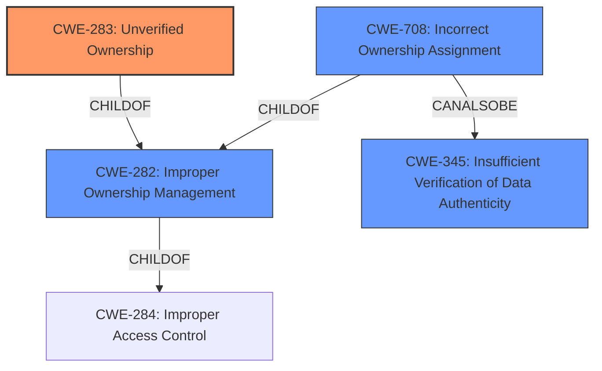

# Analysis for CVE-2021-38621

# Summary
| CWE ID | CWE Name | Confidence | CWE Abstraction Level | CWE Vulnerability Mapping Label | CWE-Vulnerability Mapping Notes |
|---|---|---|---|---|---|
| CWE-283 | Unverified Ownership | 0.9 | Base | Allowed | Primary CWE |
| CWE-708 | Incorrect Ownership Assignment | 0.7 | Base | Allowed | Secondary Candidate |
| CWE-282 | Improper Ownership Management | 0.6 | Class | Allowed-with-Review | Secondary Candidate |

## Evidence and Confidence

*   **Confidence Score:** 0.8
*   **Evidence Strength:** HIGH

## Relationship Analysis
The primary CWE, CWE-283 **Unverified Ownership**, is a child of CWE-282 **Improper Ownership Management**. CWE-282 itself falls under the higher-level category of CWE-284 **Improper Access Control**. The relationship highlights that the root cause involves a failure to adequately confirm ownership before performing an action. CWE-708 **Incorrect Ownership Assignment** is also a child of CWE-282, and can also be related to CWE-345 **Insufficient Verification of Data Authenticity**. The choice of CWE-283 as the primary CWE stems from the vulnerability description key phrases indicating **mishandles file ownership**, and the CVE reference link content summary explicitly mentioning insufficient file ownership validation. The base level of CWE-283 is preferred because the evidence directly supports the specific weakness of unverified ownership.

## Vulnerability Chain
The vulnerability chain begins with the **mishandling of file ownership**, specifically, the **lack of verification of file ownership** before deletion, leading to the potential for unauthorized data deletion and service disruption.

## Summary of Analysis
The initial assessment focused on identifying the core weakness in the Agora Flat Server vulnerability. The primary indicator was the description key phrase "**mishandles file ownership**" and the CVE reference links content summary which explicitly mentions "**insufficient file ownership validation**". This evidence strongly pointed towards a problem related to improper ownership management.

The Retriever Results highlighted CWE-283 **Unverified Ownership**, CWE-282 **Improper Ownership Management**, and CWE-708 **Incorrect Ownership Assignment** as potential candidates. After reviewing the complete CWE specifications, CWE-283 emerged as the most fitting primary CWE due to its specific focus on the **failure to verify ownership**. The code changes described in the CVE reference links summary clearly indicated that the fix involved adding a check to verify the file owner before allowing deletion, directly addressing the **unverified ownership** weakness.

While CWE-282 and CWE-708 were also considered, they were deemed less specific than CWE-283. CWE-282 is a class-level CWE, and the vulnerability details support the selection of a more specific base-level CWE. CWE-708 relates to assigning ownership to the wrong entity, which is not the core issue here; the core issue is the **lack of verification** before taking action.

The choice of CWE-283 is further supported by its "Allowed" usage in the mapping guidance and its base level of abstraction, which is preferred when the evidence supports it. The relationship analysis confirmed that CWE-283 is a child of CWE-282, fitting into the hierarchy of ownership-related weaknesses.

In summary, the decision to prioritize CWE-283 is based on the following evidence and rationale:

*   Direct evidence from the vulnerability description and CVE reference links content summary indicating **insufficient file ownership validation**.
*   The specific description of CWE-283 aligning with the weakness of **unverified ownership**.
*   The "Allowed" usage and base level of abstraction for CWE-283 in the MITRE mapping guidance.
*   The hierarchical relationship between CWE-283 and CWE-282, ensuring that the chosen CWE fits within the broader context of ownership management.

The vulnerability description "**The remove API... mishandles file ownership**" directly supports the classification of CWE-283 as the primary weakness.

CWEs considered but not used:

*   CWE-22 **Improper Limitation of a Pathname to a Restricted Directory ('Path Traversal')**: This CWE relates to path traversal vulnerabilities, which are not relevant to the described vulnerability.
*   CWE-78 **Improper Neutralization of Special Elements used in an OS Command ('OS Command Injection')**: This CWE relates to command injection, which is not relevant to the described vulnerability.
*   CWE-79 **Improper Neutralization of Input During Web Page Generation ('Cross-site Scripting')**: This CWE relates to cross-site scripting vulnerabilities, which are not relevant to the described vulnerability.
*   CWE-94 **Improper Control of Generation of Code ('Code Injection')**: This CWE relates to code injection, which is not relevant to the described vulnerability.
*   CWE-98 **Improper Control of Filename for Include/Require Statement in PHP Program ('PHP Remote File Inclusion')**: This CWE relates to remote file inclusion, which is not relevant to the described vulnerability.
*   CWE-20 **Improper Input Validation**: While related to security, this is a broad, class-level CWE. The evidence points to a more specific weakness (CWE-283).
*   CWE-41 **Improper Resolution of Path Equivalence**: This CWE relates to path equivalence, which is not relevant to the described vulnerability.
*   CWE-59 **Improper Link Resolution Before File Access ('Link Following')**: This CWE relates to link following, which is not relevant to the described vulnerability.
*   CWE-73 **External Control of File Name or Path**: This CWE relates to external control of file paths, which is not the direct issue in this vulnerability.
*   CWE-74 **Improper Neutralization of Special Elements in Output Used by a Downstream Component ('Injection')**: This CWE relates to injection vulnerabilities, which are not relevant to the described vulnerability.
*   CWE-88 **Improper Neutralization of Argument Delimiters in a Command ('Argument Injection')**: This CWE relates to argument injection vulnerabilities, which are not relevant to the described vulnerability.
*   CWE-138 **Improper Neutralization of Special Elements**: This is a class level CWE and other entries are a better fit.
*   CWE-184 **Incomplete List of Disallowed Inputs**: This CWE is not directly related to the described vulnerability.
*   CWE-212 **Improper Removal of Sensitive Information Before Storage or Transfer**: This CWE is not related to the vulnerability.
*   CWE-328 **Use of Weak Hash**: This CWE relates to usage of weak hashes, which is not relevant to the described vulnerability.
*   CWE-668 **Exposure of Resource to Wrong Sphere**: This is too high-level; the problem is specifically related to ownership verification.

# Enhanced Query for CVE-2021-38621

## Vulnerability Description
The remove API in v1/controller/cloudStorage/alibabaCloud/remove/index.ts in netless Agora Flat Server before 2021-07-30 **mishandles file ownership**.

### Vulnerability Description Key Phrases
- **rootcause:** **mishandles file ownership**
- **product:** netless Agora Flat Server
- **version:** before 2021-07-30
- **component:** remove API in v1/controller/cloudStorage/alibabaCloud/remove/index.ts

## CVE Reference Links Content Summary
Based on the provided content, here's an analysis related to potential vulnerabilities, focusing on the changes in the `src/v1/controller/cloudStorage/alibabaCloud/remove/index.ts` file:

**Root Cause of Vulnerability:**

The commit message "refactor(cloudStorage): improve file owner check in remove api" and the code changes highlight a vulnerability related to insufficient file ownership validation before deleting files in the cloud storage. The original code likely lacked a proper check to ensure that the user attempting to delete a file was indeed the owner of that file.

**Weaknesses/Vulnerabilities Present:**

- **Inadequate Authorization/Access Control:** The primary vulnerability is an inadequate check on file ownership before deletion. This means that a user could potentially attempt to delete files that belong to other users.
- **Potential for Unauthorized Data Deletion:** The lack of proper ownership verification could allow malicious or accidental deletion of data by users who are not authorized to do so.

**Impact of Exploitation:**

- **Data Loss:** If exploited, an attacker could delete files belonging to other users, leading to data loss.
- **Service Disruption:** If critical files are deleted, it could cause disruption to the service.
- **Unauthorized Access:** While this vulnerability is about deletion rather than reading, it highlights a flaw in access controls that could be part of a larger set of vulnerabilities related to insufficient authorization.

**Attack Vectors:**

- **API Endpoint:** The vulnerability would likely be exploited by making a request to the cloud storage remove file API endpoint. Specifically, by providing `fileUUIDs` in the request that belong to another user.
- **Direct API Access:** An attacker would need direct access to the API or would need to be logged in as a legitimate user.

**Required Attacker Capabilities/Position:**

- **Authentication:** The attacker would need to be authenticated with the application to make API calls.
- **Knowledge of File UUIDs:** To exploit the vulnerability, the attacker needs to know the `fileUUIDs` of files they wish to delete that belong to other users.

**Specific Code Changes and How They Address the Vulnerability**

The code diff shows the following key changes:

-   The addition of the `assertFilesOwnerIsCurrentUser()` method.
-   Inside this method, the code now fetches the `user_uuid` associated with the `fileUUIDs` to be deleted from the `CloudStorageUserFilesDAO`.
-   It iterates through the results and checks if `user_uuid !== this.userUUID`. If this is true, it throws a `ControllerError(ErrorCode.NotPermission)`, preventing the deletion.

**In essence, the vulnerability was present because there was no robust verification that the user attempting to delete files was authorized to do so (i.e. the owner of the file), and the fix adds this owner check before proceeding with the delete operation.**

## Retriever Results

### Top Combined Results

| Rank | CWE ID | Name | Abstraction | Usage  | Retrievers | Individual Scores |
|------|--------|------|-------------|-------|------------|-------------------|
| 1 | 283 | Unverified Ownership | Base | Allowed | sparse | 0.373 |
| 2 | 96 | Improper Neutralization of Directives in Statically Saved Code ('Static Code Injection') | Base | Allowed | sparse | 0.096 |
| 3 | 282 | Improper Ownership Management | Class | Allowed-with-Review | sparse | 0.094 |
| 4 | 708 | Incorrect Ownership Assignment | Base | Allowed | sparse | 0.091 |
| 5 | 328 | Use of Weak Hash | Base | Allowed | sparse | 0.087 |
| 6 | 277 | Insecure Inherited Permissions | Variant | Allowed | dense | 0.421 |
| 7 | 36 | Absolute Path Traversal | Base | Allowed | graph | 0.001 |
| 8 | 345 | Insufficient Verification of Data Authenticity | Class | Discouraged | sparse | 0.084 |
| 9 | 23 | Relative Path Traversal | Base | Allowed | sparse | 0.084 |
| 10 | 78 | Improper Neutralization of Special Elements used in an OS Command ('OS Command Injection') | Base | Allowed | sparse | 0.083 |

# Complete CWE Specifications

## CWE-283: Unverified Ownership
**Abstraction:** Base
**Status:** Draft

### Description
The product does not properly verify that a critical resource is owned by the proper entity.

### Extended Description
Not provided

### Alternative Terms
None

### Relationships
ChildOf -> CWE-282

### Mapping Guidance
**Usage:** Allowed
**Rationale:** This CWE entry is at the Base level of abstraction, which is a preferred level of abstraction for mapping to the root causes of vulnerabilities.
**Comments:** Carefully read both the name and description to ensure that this mapping is an appropriate fit. Do not try to 'force' a mapping to a lower-level Base/Variant simply to comply with this preferred level of abstraction.
**Reasons:**
- Acceptable-Use

### Additional Notes
**[Relationship]** This overlaps insufficient comparison, verification errors, permissions, and privileges.

### Observed Examples
- **CVE-2001-0178:** Program does not verify the owner of a UNIX socket that is used for sending a password.
- **CVE-2004-2012:** Owner of special device not checked, allowing root.

## CWE-96: Improper Neutralization of Directives in Statically Saved Code ('Static Code Injection')
**Abstraction:** Base
**Status:** Draft

### Description
The product receives input from an upstream component, but it does not neutralize or incorrectly neutralizes code syntax before inserting the input into an executable resource, such as a library, configuration file, or template.

### Extended Description
Not provided

### Alternative Terms
None

### Relationships
ChildOf -> CWE-94

### Mapping Guidance
**Usage:** Allowed
**Rationale:** This CWE entry is at the Base level of abstraction, which is a preferred level of abstraction for mapping to the root causes of vulnerabilities.
**Comments:** Carefully read both the name and description to ensure that this mapping is an appropriate fit. Do not try to 'force' a mapping to a lower-level Base/Variant simply to comply with this preferred level of abstraction.
**Reasons:**
- Acceptable-Use

### Additional Notes
**[Relationship]** "HTML injection" (see CWE-79: XSS) could be thought of as an example of this, but the code is injected and executed on the client side, not the server side. Server-Side Includes (SSI) are an example of direct static code injection.

### Observed Examples
- **CVE-2002-0495:** Perl code directly injected into CGI library file from parameters to another CGI program.
- **CVE-2005-1876:** Direct PHP code injection into supporting template file.
- **CVE-2005-1894:** Direct code injection into PHP script that can be accessed by attacker.

## CWE-282: Improper Ownership Management
**Abstraction:** Class
**Status:** Draft

### Description
The product assigns the wrong ownership, or does not properly verify the ownership, of an object or resource.

### Extended Description
Not provided

### Alternative Terms
None

### Relationships
ChildOf -> CWE-284

### Mapping Guidance
**Usage:** Allowed-with-Review
**Rationale:** This CWE entry is a Class and might have Base-level children that would be more appropriate
**Comments:** Examine children of this entry to see if there is a better fit
**Reasons:**
- Abstraction

### Additional Notes
**[Maintenance]** The relationships between privileges, permissions, and actors (e.g. users and groups) need further refinement within the Research view. One complication is that these concepts apply to two different pillars, related to control of resources (CWE-664) and protection mechanism failures (CWE-693).

### Observed Examples
- **CVE-1999-1125:** Program runs setuid root but relies on a configuration file owned by a non-root user.

## CWE-708: Incorrect Ownership Assignment
**Abstraction:** Base
**Status:** Incomplete

### Description
The product assigns an owner to a resource, but the owner is outside of the intended control sphere.

### Extended Description
This may allow the resource to be manipulated by actors outside of the intended control sphere.

### Alternative Terms
None

### Relationships
ChildOf -> CWE-282
CanAlsoBe -> CWE-345

### Mapping Guidance
**Usage:** Allowed
**Rationale:** This CWE entry is at the Base level of abstraction, which is a preferred level of abstraction for mapping to the root causes of vulnerabilities.
**Comments:** Carefully read both the name and description to ensure that this mapping is an appropriate fit. Do not try to 'force' a mapping to a lower-level Base/Variant simply to comply with this preferred level of abstraction.
**Reasons:**
- Acceptable-Use

### Additional Notes
**[Maintenance]** 

This overlaps verification errors, permissions, and privileges.

A closely related weakness is the incorrect assignment of groups to a resource. It is not clear whether it would fall under this entry or require a different entry.

### Observed Examples
- **CVE-2007-5101:** File system sets wrong ownership and group when creating a new file.
- **CVE-2007-4238:** OS installs program with bin owner/group, allowing modification.
- **CVE-2007-1716:** Manager does not properly restore ownership of a reusable resource when a user logs out, allowing privilege escalation.

## CWE-328: Use of Weak Hash
**Abstraction:** Base
**Status:** Draft

### Description
The product uses an algorithm that produces a digest (output value) that does not meet security expectations for a hash function that allows an adversary to reasonably determine the original input (preimage attack), find another input that can produce the same hash (2nd preimage attack), or find multiple inputs that evaluate to the same hash (birthday attack).

### Extended Description

A hash function is defined as an algorithm that maps arbitrarily sized data into a fixed-sized digest (output) such that the following properties hold:

  1. The algorithm is not invertible (also called "one-way" or "not reversible")

  1. The algorithm is deterministic; the same input produces the same digest every time

 Building on this definition, a cryptographic hash function must also ensure that a malicious actor cannot leverage the hash function to have a reasonable chance of success at determining any of the following:

  1. the original input (preimage attack), given only the digest

  1. another input that can produce the same digest (2nd preimage attack), given the original input

  1. a set of two or more inputs that evaluate to the same digest (birthday attack), given the actor can arbitrarily choose the inputs to be hashed and can do so a reasonable amount of times

What is regarded as "reasonable" varies by context and threat model, but in general, "reasonable" could cover any attack that is more efficient than brute force (i.e., on average, attempting half of all possible combinations). Note that some attacks might be more efficient than brute force but are still not regarded as achievable in the real world.

Any algorithm that does not meet the above conditions will generally be considered weak for general use in hashing.

In addition to algorithmic weaknesses, a hash function can be made weak by using the hash in a security context that breaks its security guarantees. For example, using a hash function without a salt for storing passwords (that are sufficiently short) could enable an adversary to create a "rainbow table" [REF-637] to recover the password under certain conditions; this attack works against such hash functions as MD5, SHA-1, and SHA-2.

### Alternative Terms
None

### Relationships
ChildOf -> CWE-326
ChildOf -> CWE-327

### Mapping Guidance
**Usage:** Allowed
**Rationale:** This CWE entry is at the Base level of abstraction, which is a preferred level of abstraction for mapping to the root causes of vulnerabilities.
**Comments:** Carefully read both the name and description to ensure that this mapping is an appropriate fit. Do not try to 'force' a mapping to a lower-level Base/Variant simply to comply with this preferred level of abstraction.
**Reasons:**
- Acceptable-Use

### Additional Notes
**[Maintenance]** Since CWE 4.4, various cryptography-related entries including CWE-328 have been slated for extensive research, analysis, and community consultation to define consistent terminology, improve relationships, and reduce overlap or duplication. As of CWE 4.6, this work is still ongoing.

### Observed Examples
- **CVE-2022-30320:** Programmable Logic Controller (PLC) uses a protocol with a cryptographically insecure hashing algorithm for passwords.
- **CVE-2005-4900:** SHA-1 algorithm is not collision-resistant.
- **CVE-2020-25685:** DNS product uses a weak hash (CRC32 or SHA-1) of the query name, allowing attacker to forge responses by computing domain names with the same hash.

## CWE-277: Insecure Inherited Permissions
**Abstraction:** Variant
**Status:** Draft

### Description
A product defines a set of insecure permissions that are inherited by objects that are created by the program.

### Extended Description
Not provided

### Alternative Terms
None

### Relationships
ChildOf -> CWE-732

### Mapping Guidance
**Usage:** Allowed
**Rationale:** This CWE entry is at the Variant level of abstraction, which is a preferred level of abstraction for mapping to the root causes of vulnerabilities.
**Comments:** Carefully read both the name and description to ensure that this mapping is an appropriate fit. Do not try to 'force' a mapping to a lower-level Base/Variant simply to comply with this preferred level of abstraction.
**Reasons:**
- Acceptable-Use

### Observed Examples
- **CVE-2005-1841:** User's umask is used when creating temp files.
- **CVE-2002-1786:** Insecure umask for core dumps [is the umask preserved or assigned?].

## CWE-36: Absolute Path Traversal
**Abstraction:** Base
**Status:** Draft

### Description
The product uses external input to construct a pathname that should be within a restricted directory, but it does not properly neutralize absolute path sequences such as "/abs/path" that can resolve to a location that is outside of that directory.

### Extended Description
This allows attackers to traverse the file system to access files or directories that are outside of the restricted directory.

### Alternative Terms
None

### Relationships
ChildOf -> CWE-22
ChildOf -> CWE-22
ChildOf -> CWE-22

### Mapping Guidance
**Usage:** Allowed
**Rationale:** This CWE entry is at the Base level of abstraction, which is a preferred level of abstraction for mapping to the root causes of vulnerabilities.
**Comments:** Carefully read both the name and description to ensure that this mapping is an appropriate fit. Do not try to 'force' a mapping to a lower-level Base/Variant simply to comply with this preferred level of abstraction.
**Reasons:**
- Acceptable-Use

### Observed Examples
- **CVE-2022-31503:** Python package constructs filenames using an unsafe os.path.join call on untrusted input, allowing absolute path traversal because os.path.join resets the pathname to an absolute path that is specified as part of the input.
- **CVE-2002-1345:** Multiple FTP clients write arbitrary files via absolute paths in server responses
- **CVE-2001-1269:** ZIP file extractor allows full path

## CWE-345: Insufficient Verification of Data Authenticity
**Abstraction:** Class
**Status:** Draft

### Description
The product does not sufficiently verify the origin or authenticity of data, in a way that causes it to accept invalid data.

### Extended Description
Not provided

### Alternative Terms
None

### Relationships
ChildOf -> CWE-693

### Mapping Guidance
**Usage:** Discouraged
**Rationale:** This CWE entry is a level-1 Class (i.e., a child of a Pillar). It might have lower-level children that would be more appropriate
**Comments:** Examine children of this entry to see if there is a better fit
**Reasons:**
- Abstraction

### Additional Notes
**[Relationship]** "origin validation" could fall under this.

**[Maintenance]** The specific ways in which the origin is not properly identified should be laid out as separate weaknesses. In some sense, this is more like a category.

### Observed Examples
- **CVE-2022-30260:** Distributed Control System (DCS) does not sign firmware images and only relies on insecure checksums for integrity checks
- **CVE-2022-30267:** Distributed Control System (DCS) does not sign firmware images and only relies on insecure checksums for integrity checks
- **CVE-2022-30272:** Remote Terminal Unit (RTU) does not use signatures for firmware images and relies on insecure checksums

## CWE-23: Relative Path Traversal
**Abstraction:** Base
**Status:** Draft

### Description
The product uses external input to construct a pathname that should be within a restricted directory, but it does not properly neutralize sequences such as ".." that can resolve to a location that is outside of that directory.

### Extended Description
This allows attackers to traverse the file system to access files or directories that are outside of the restricted directory.

### Alternative Terms
Zip Slip: "Zip slip" is an attack that uses file archives (e.g., ZIP, tar, rar, etc.) that contain filenames with path traversal sequences that cause the files to be written outside of the directory under which the archive is expected to be extracted [REF-1282]. It is most commonly used for relative path traversal (CWE-23) and link following (CWE-59).

### Relationships
ChildOf -> CWE-22
ChildOf -> CWE-22
ChildOf -> CWE-22

### Mapping Guidance
**Usage:** Allowed
**Rationale:** This CWE entry is at the Base level of abstraction, which is a preferred level of abstraction for mapping to the root causes of vulnerabilities.
**Comments:** Carefully read both the name and description to ensure that this mapping is an appropriate fit. Do not try to 'force' a mapping to a lower-level Base/Variant simply to comply with this preferred level of abstraction.
**Reasons:**
- Acceptable-Use

### Observed Examples
- **CVE-2024-37032:** Large language model (LLM) management tool does not validate the format of a digest value (CWE-1287) from a private, untrusted model registry, enabling relative path traversal (CWE-23), a.k.a. Probllama
- **CVE-2022-45918:** Chain: a learning management tool debugger uses external input to locate previous session logs (CWE-73) and does not properly validate the given path (CWE-20), allowing for filesystem path traversal using "../" sequences (CWE-24)
- **CVE-2019-20916:** Python package manager does not correctly restrict the filename specified in a Content-Disposition header, allowing arbitrary file read using path traversal sequences such as "../"

## CWE-78: Improper Neutralization of Special Elements used in an OS Command ('OS Command Injection')
**Abstraction:** Base
**Status:** Stable

### Description
The product constructs all or part of an OS command using externally-influenced input from an upstream component, but it does not neutralize or incorrectly neutralizes special elements that could modify the intended OS command when it is sent to a downstream component.

### Extended Description

This weakness can lead to a vulnerability in environments in which the attacker does not have direct access to the operating system, such as in web applications. Alternately, if the weakness occurs in a privileged program, it could allow the attacker to specify commands that normally would not be accessible, or to call alternate commands with privileges that the attacker does not have. The problem is exacerbated if the compromised process does not follow the principle of least privilege, because the attacker-controlled commands may run with special system privileges that increases the amount of damage.

There are at least two subtypes of OS command injection:

  - The application intends to execute a single, fixed program that is under its own control. It intends to use externally-supplied inputs as arguments to that program. For example, the program might use system("nslookup [HOSTNAME]") to run nslookup and allow the user to supply a HOSTNAME, which is used as an argument. Attackers cannot prevent nslookup from executing. However, if the program does not remove command separators from the HOSTNAME argument, attackers could place the separators into the arguments, which allows them to execute their own program after nslookup has finished executing.

  - The application accepts an input that it uses to fully select which program to run, as well as which commands to use. The application simply redirects this entire command to the operating system. For example, the program might use "exec([COMMAND])" to execute the [COMMAND] that was supplied by the user. If the COMMAND is under attacker control, then the attacker can execute arbitrary commands or programs. If the command is being executed using functions like exec() and CreateProcess(), the attacker might not be able to combine multiple commands together in the same line.

From a weakness standpoint, these variants represent distinct programmer errors. In the first variant, the programmer clearly intends that input from untrusted parties will be part of the arguments in the command to be executed. In the second variant, the programmer does not intend for the command to be accessible to any untrusted party, but the programmer probably has not accounted for alternate ways in which malicious attackers can provide input.

### Alternative Terms
Shell injection
Shell metacharacters
OS Command Injection

### Relationships
ChildOf -> CWE-77
ChildOf -> CWE-74
ChildOf -> CWE-77
ChildOf -> CWE-77
CanAlsoBe -> CWE-88

### Mapping Guidance
**Usage:** Allowed
**Rationale:** This CWE entry is at the Base level of abstraction, which is a preferred level of abstraction for mapping to the root causes of vulnerabilities.
**Comments:** Carefully read both the name and description to ensure that this mapping is an appropriate fit. Do not try to 'force' a mapping to a lower-level Base/Variant simply to comply with this preferred level of abstraction.
**Reasons:**
- Acceptable-Use

### Additional Notes
**[Terminology]** The "OS command injection" phrase carries different meanings to different people. For some people, it only refers to cases in which the attacker injects command separators into arguments for an application-controlled program that is being invoked. For some people, it refers to any type of attack that can allow the attacker to execute OS commands of their own choosing. This usage could include untrusted search path weaknesses (CWE-426) that cause the application to find and execute an attacker-controlled program. Further complicating the issue is the case when argument injection (CWE-88) allows alternate command-line switches or options to be inserted into the command line, such as an "-exec" switch whose purpose may be to execute the subsequent argument as a command (this -exec switch exists in the UNIX "find" command, for example). In this latter case, however, CWE-88 could be regarded as the primary weakness in a chain with CWE-78.

**[Research Gap]** More investigation is needed into the distinction between the OS command injection variants, including the role with argument injection (CWE-88). Equivalent distinctions may exist in other injection-related problems such as SQL injection.

### Observed Examples
- **CVE-2020-10987:** OS command injection in Wi-Fi router, as exploited in the wild per CISA KEV.
- **CVE-2020-10221:** Template functionality in network configuration management tool allows OS command injection, as exploited in the wild per CISA KEV.
- **CVE-2020-9054:** Chain: improper input validation (CWE-20) in username parameter, leading to OS command injection (CWE-78), as exploited in the wild per CISA KEV.

