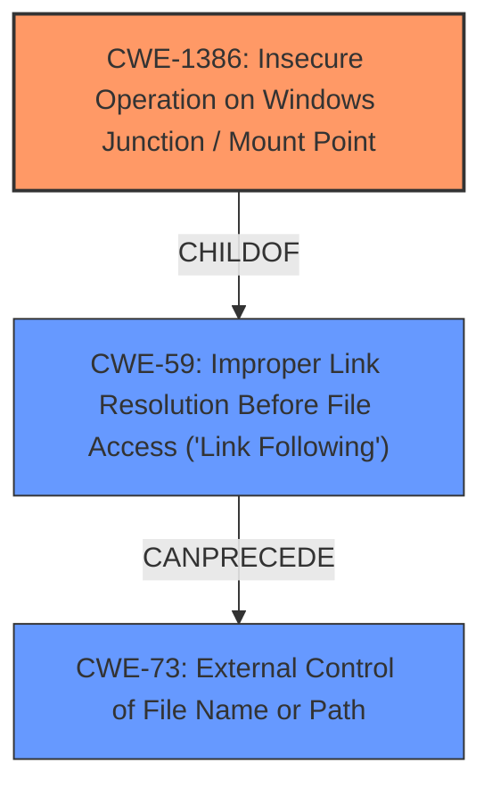

# Analysis Report for CVE-2021-38634

# Vulnerability Analysis Report: CVE-2021-38634

## Description


## Analysis (with Relationship Data)

# Summary
| CWE ID | CWE Name | Confidence | CWE Abstraction Level | CWE Vulnerability Mapping Label | CWE-Vulnerability Mapping Notes |
|---|---|---|---|---|---|
| CWE-1386 | Insecure Operation on Windows Junction / Mount Point | 1.0 | Base | Allowed | Primary CWE |
| CWE-59 | Improper Link Resolution Before File Access ('Link Following') | 0.7 | Base | Allowed | Secondary Candidate |
| CWE-73 | External Control of File Name or Path | 0.6 | Base | Allowed | Secondary Candidate |

## Evidence and Confidence

*   **Confidence Score:** 0.9
*   **Evidence Strength:** HIGH

## Relationship Analysis
The primary CWE, CWE-1386, is a child of CWE-59, indicating a specialized form of link-following vulnerability specific to Windows junctions/mount points. The vulnerability description aligns well with CWE-1386, making it the more specific and appropriate choice. CWE-73 is also related as it describes external control of file paths, which is a prerequisite for exploiting the junction/mount point vulnerability. The abstraction levels influenced the choice by favoring the more specific "Base" level CWE-1386 over the broader CWE-59.



## Vulnerability Chain
The vulnerability chain starts with the attacker's ability to create directory junctions (requiring local code execution). The **improper handling** of these junctions by the Windows Update Agent (**WEAKNESS**) (CWE-1386) leads to arbitrary file deletion, which ultimately results in **privilege escalation**.

## Summary of Analysis
The initial assessment identified CWE-1386 as the primary candidate based on the vulnerability description and CVE reference content summary. The vulnerability explicitly involves the improper handling of Windows directory junctions, which aligns directly with CWE-1386's description: "The product opens a file or directory, but it does not properly prevent the name from being associated with a junction or mount point to a destination that is outside of the intended control sphere." The CVE summary mentions "By creating a directory junction, an attacker can manipulate the agent to delete a file," which directly supports this classification.

CWE-59 was considered due to its relationship as a parent of CWE-1386, but CWE-1386 is more specific and accurately reflects the Windows-specific nature of the vulnerability. CWE-73 was also considered as the attacker requires external control over the file path to create the directory junction.

The final decision is based on the clear match between the vulnerability description and CWE-1386, as well as the evidence from the CVE summary. CWE-1386 is at the optimal level of specificity because it directly addresses the **insecure operation** on Windows junctions/mount points, which is the root cause of the vulnerability.

Relevant CWE Information:

# Enhanced Context (25 CWEs)

## CWE-59: Improper Link Resolution Before File Access ('Link Following')
**Abstraction Level**: Base
**Similarity Score**: 0.81
**Source**: dense

**Description**:
The product attempts to access a file based on the filename, but it does not properly prevent that filename from identifying a link or shortcut that resolves to an unintended resource.

**Mapping Guidance**:
- Usage: Allowed
- Rationale: This CWE entry is at the Base level of abstraction, which is a preferred level of abstraction for mapping to the root causes of vulnerabilities.

## CWE-73: External Control of File Name or Path
**Abstraction Level**: Base
**Similarity Score**: 0.80
**Source**: dense

**Description**:
The product allows user input to control or influence paths or file names that are used in filesystem operations.

**Mapping Guidance**:
- Usage: Allowed
- Rationale: This CWE entry is at the Base level of abstraction, which is a preferred level of abstraction for mapping to the root causes of vulnerabilities.

## CWE-1386: Insecure Operation on Windows Junction / Mount Point
**Abstraction Level:** Base
**Status:** Incomplete

### Description
The product opens a file or directory, but it does not properly prevent the name from being associated with a junction or mount point to a destination that is outside of the intended control sphere.

### Extended Description
Depending on the intended action being performed, this could allow an attacker to cause the product to read, write, delete, or otherwise operate on unauthorized files.

In Windows, NTFS5 allows for file system objects called reparse points. Applications can create a hard link from one directory to another directory, called a junction point. They can also create a mapping from a directory to a drive letter, called a mount point. If a file is used by a privileged program, but it can be replaced with a hard link to a sensitive file (e.g., AUTOEXEC.BAT), an attacker could excalate privileges. When the process opens the file, the attacker can assume the privileges of that process, tricking the privileged process to read, modify, or delete the sensitive file, preventing the program from accurately processing data. Note that one can also point to registries and semaphores.


## CWE Relationship Analysis

Current CWEs represent these abstraction levels: .


### Vulnerability Chain Analysis

**Chain starting from CWE-1386:**
- 1386 (Insecure Operation on Windows Junction / Mount Point) - ROOT


**Chain starting from CWE-59:**
- 59 (Improper Link Resolution Before File Access ('Link Following')) - ROOT


### CWE Relationship Diagram

```mermaid
graph TD
    classDef primary fill:#f96,stroke:#333,stroke-width:2px
    classDef secondary fill:#69f,stroke:#333
    classDef tertiary fill:#9e9,stroke:#333
```


*Report generated on 2025-04-02 13:58:44*
