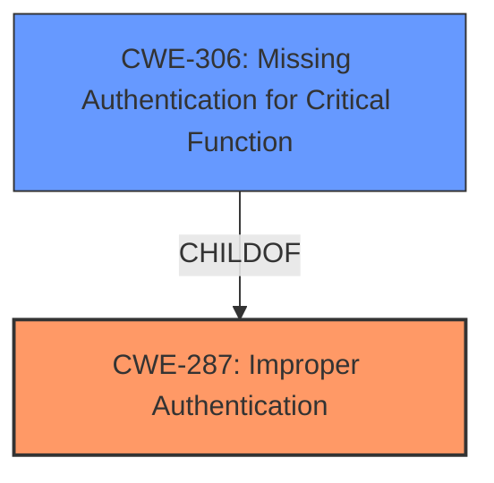

# Analysis for CVE-2021-38679

# Summary
| CWE ID | CWE Name | Confidence | CWE Abstraction Level | CWE Vulnerability Mapping Label | CWE-Vulnerability Mapping Notes |
|---|---|---|---|---|---|
| CWE-287 | Improper Authentication | 0.8 | Class | Primary | Discouraged |
| CWE-306 | Missing Authentication for Critical Function | 0.7 | Base | Secondary | Allowed |

## Evidence and Confidence

*   **Confidence Score:** 0.8
*   **Evidence Strength:** HIGH

## Relationship Analysis
The primary CWE is CWE-287, Improper Authentication (Class). CWE-306, Missing Authentication for Critical Function (Base), is a child of CWE-287 and a more specific case. Given the information available, it's difficult to definitively say if authentication is completely missing (CWE-306) or just improperly implemented (CWE-287). Therefore, CWE-287 is selected as the primary, and CWE-306 is considered as a secondary candidate.

## Vulnerability Chain
The vulnerability chain starts with **improper authentication**, which leads to a compromise of the system's security.

## Summary of Analysis
The vulnerability description clearly states an **improper authentication** issue within QNAP NAS running Kazoo Server. The "Vulnerability Description Key Phrases" section confirms this with the entry "**rootcause:** **improper authentication**". The "CVE Reference Links Content Summary" section also highlights "**Root cause of vulnerability**: Improper authentication in Kazoo Server."

CWE-287 (Improper Authentication) aligns with this description. It is a Class-level CWE. The mapping guidance for CWE-287 is "Discouraged" because more specific CWEs might be applicable. The suggested alternative is CWE-306 (Missing Authentication for Critical Function), which is a Base-level CWE and a child of CWE-287.

While the provided information indicates a flaw in authentication, it doesn't explicitly state whether authentication is completely missing or just improperly implemented. Since the description uses the term "**improper authentication**," it suggests that some form of authentication exists but is flawed. If authentication were entirely absent for a critical function, CWE-306 would be the more accurate choice. Given the ambiguity, CWE-287 is selected as the primary, acknowledging its discouraged usage but appropriateness given the information, and CWE-306 is recorded as a secondary candidate that might be applicable.

Relevant CWE Information:

# Enhanced Context (25 CWEs)

## CWE-280: Improper Handling of Insufficient Permissions or Privileges
**Abstraction Level**: Base
**Similarity Score**: 0.75
**Source**: dense
*Not Selected*: This CWE does not relate to the **improper authentication** issue.

## CWE-73: External Control of File Name or Path
**Abstraction Level**: Base
**Similarity Score**: 0.75
**Source**: dense
*Not Selected*: This CWE does not relate to the **improper authentication** issue.

## CWE-274: Improper Handling of Insufficient Privileges
**Abstraction Level**: Base
**Similarity Score**: 0.75
**Source**: dense
*Not Selected*: This CWE does not relate to the **improper authentication** issue.

## CWE-807: Reliance on Untrusted Inputs in a Security Decision
**Abstraction Level**: Base
**Similarity Score**: 0.75
**Source**: dense
*Not Selected*: While untrusted inputs might be a factor in the exploit, the primary issue is the **improper authentication**, not the reliance on untrusted inputs in a security decision.

## CWE-639: Authorization Bypass Through User-Controlled Key
**Abstraction Level**: Base
**Similarity Score**: 0.75
**Source**: dense
*Not Selected*: This CWE is related to authorization bypass using user-controlled keys, which is not the core issue described in the vulnerability. The vulnerability focuses on **improper authentication**.

## CWE-41: Improper Resolution of Path Equivalence
**Abstraction Level**: Base
**Similarity Score**: 0.75
**Source**: dense
*Not Selected*: This CWE does not relate to the **improper authentication** issue.

## CWE-74: Improper Neutralization of Special Elements in Output Used by a Downstream Component ('Injection')
**Abstraction Level**: Class
**Similarity Score**: 0.75
**Source**: dense
*Not Selected*: This CWE does not relate to the **improper authentication** issue.

## CWE-653: Improper Isolation or Compartmentalization
**Abstraction Level**: Class
**Similarity Score**: 0.75
**Source**: dense
*Not Selected*: This CWE does not relate to the **improper authentication** issue.

## CWE-23: Relative Path Traversal
**Abstraction Level**: Base
**Similarity Score**: 0.75
**Source**: dense
*Not Selected*: This CWE does not relate to the **improper authentication** issue.

## CWE-668: Exposure of Resource to Wrong Sphere
**Abstraction Level**: Class
**Similarity Score**: 0.74
**Source**: dense
*Not Selected*: This CWE does not relate to the **improper authentication** issue.

## CWE-22: Improper Limitation of a Pathname to a Restricted Directory ('Path Traversal')
**Abstraction Level**: Base
**Similarity Score**: 7124.18
**Source**: sparse
*Not Selected*: This CWE does not relate to the **improper authentication** issue.

## CWE-23: Relative Path Traversal
**Abstraction Level**: Base
**Similarity Score**: 6910.27
**Source**: sparse
*Not Selected*: This CWE does not relate to the **improper authentication** issue.

## CWE-59: Improper Link Resolution Before File Access ('Link Following')
**Abstraction Level**: Base
**Similarity Score**: 6626.01
**Source**: sparse
*Not Selected*: This CWE does not relate to the **improper authentication** issue.

## CWE-73: External Control of File Name or Path
**Abstraction Level**: Base
**Similarity Score**: 6524.47
**Source**: sparse
*Not Selected*: This CWE does not relate to the **improper authentication** issue.

## CWE-184: Incomplete List of Disallowed Inputs
**Abstraction Level**: Base
**Similarity Score**: 6471.51
**Source**: sparse
*Not Selected*: This CWE does not relate to the **improper authentication** issue.

## CWE-22: Improper Limitation of a Pathname to a Restricted Directory ('Path Traversal')
**Abstraction Level**: base
**Similarity Score**: 4.33
**Source**: graph
*Not Selected*: This CWE does not relate to the **improper authentication** issue.

## CWE-120: Buffer Copy without Checking Size of Input ('Classic Buffer Overflow')
**Abstraction Level**: base
**Similarity Score**: 4.33
**Source**: graph
*Not Selected*: This CWE does not relate to the **improper authentication** issue.

## CWE-123: Write-what-where Condition
**Abstraction Level**: base
**Similarity Score**: 4.33
**Source**: graph
*Not Selected*: This CWE does not relate to the **improper authentication** issue.

## CWE-131: Incorrect Calculation of Buffer Size
**Abstraction Level**: base
**Similarity Score**: 4.33
**Source**: graph
*Not Selected*: This CWE does not relate to the **improper authentication** issue.

## CWE-434: Unrestricted Upload of File with Dangerous Type
**Abstraction Level**: base
**Similarity Score**: 4.33
**Source**: graph
*Not Selected*: This CWE does not relate to the **improper authentication** issue.

## CWE-78: Improper Neutralization of Special Elements used in an OS Command ('OS Command Injection')
**Abstraction Level**: base
**Similarity Score**: 4.33
**Source**: graph
*Not Selected*: This CWE does not relate to the **improper authentication** issue.

## CWE-59: Improper Link Resolution Before File Access ('Link Following')
**Abstraction Level**: base
**Similarity Score**: 4.33
**Source**: graph
*Not Selected*: This CWE does not relate to the **improper authentication** issue.

## CWE-125: Out-of-bounds Read
**Abstraction Level**: base
**Similarity Score**: 3.89
**Source**: graph
*Not Selected*: This CWE does not relate to the **improper authentication** issue.

## CWE-98: Improper Control of Filename for Include/Require Statement in PHP Program ('PHP Remote File Inclusion')
**Abstraction Level**: variant
**Similarity Score