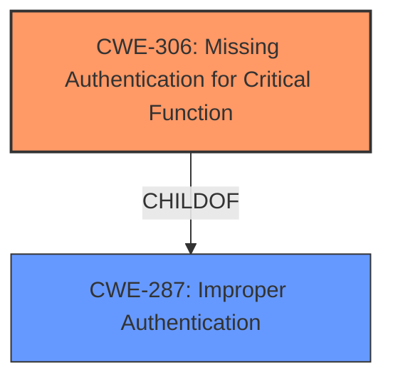

# Enhanced Analysis for CVE-2021-38686

# Summary
| CWE ID  | CWE Name                                                                           | Confidence | CWE Abstraction Level | CWE Vulnerability Mapping Label | CWE-Vulnerability Mapping Notes |
| :-------- | :----------------------------------------------------------------------------------- | :---------- | :---------------------- | :------------------------------ | :------------------------------ |
| CWE-306 | Missing Authentication for Critical Function                                   | 1.0         | Base                    | Primary CWE                      | Allowed                       |
| CWE-287 | Improper Authentication                                                              | 0.7         | Class                   | Secondary Candidate            | Discouraged                    |

## Evidence and Confidence

*   **Confidence Score:** 0.9
*   **Evidence Strength:** HIGH

## Relationship Analysis

The primary relationship influencing the decision is the child-parent relationship between CWE-306 (Missing Authentication for Critical Function) and CWE-287 (Improper Authentication). CWE-306 is a more specific case of CWE-287, where authentication is completely missing for a critical function. Since the vulnerability description indicates an **improper authentication** issue, and the "CVE Reference Links Content Summary" highlights a flaw in how the system verifies user identity or permissions, CWE-306 is a more precise classification.



## Vulnerability Chain

The vulnerability chain starts with the **improper authentication** (**ROOT CAUSE**), which leads to the impact of compromising the security of the system. The chain is relatively direct.

## Summary of Analysis

The initial analysis focused on identifying the root cause of the vulnerability, which is clearly stated as **improper authentication** in both the vulnerability description and the CVE summary. The retriever results suggested CWE-306, CWE-287, and other related CWEs.

The decision to select CWE-306 as the primary CWE and CWE-287 as a secondary candidate is based on the following:

*   **Evidence:** The vulnerability description explicitly states "**improper authentication**" as the root cause. The CVE Reference Links Content Summary confirms this by stating: "Root cause of vulnerability: Improper authentication in QVR," and "The vulnerability is categorized as improper authentication, indicating a flaw in how the system verifies user identity or permissions."
*   **Relationship Analysis:** CWE-306 is a child of CWE-287, making it a more specific classification when authentication is completely missing for a critical function. Given the information, it's plausible that authentication is either missing entirely or severely flawed for certain critical functions.
*   **Mapping Guidance:** CWE-287 is discouraged because lower-level CWEs are likely applicable. CWE-306 is allowed and is at the Base level of abstraction, which is preferred.
*   **Specificity:** CWE-306 is the most specific CWE that accurately represents the vulnerability based on the available information.

Other considered CWEs and why they were not chosen:

*   CWE-120, CWE-121 (Buffer Overflow): These are not relevant as the vulnerability is related to authentication, not memory management.
*   CWE-77, CWE-78 (Command Injection): These are not relevant as the vulnerability is related to authentication, not command execution.

The final selection of CWE-306 is at the optimal level of specificity because it directly addresses the **missing authentication** aspect of the vulnerability.

Relevant CWE Information:

# Enhanced Context (25 CWEs)

## CWE-280: Improper Handling of Insufficient Permissions or Privileges 
**Abstraction Level**: Base
**Similarity Score**: 0.76
**Source**: dense

**Description**:
The product does not handle or incorrectly handles when it has insufficient privileges to access resources or functionality as specified by their permissions. This may cause it to follow unexpected code paths that may leave the product in an invalid state.

**Mapping Guidance**:
- Usage: Allowed
- Rationale: This CWE entry is at the Base level of abstraction, which is a preferred level of abstraction for mapping to the root causes of vulnerabilities.

**Why not chosen**: This CWE is about handling insufficient permissions, while the described vulnerability is about **improper authentication**.

## CWE-274: Improper Handling of Insufficient Privileges
**Abstraction Level**: Base
**Similarity Score**: 0.75
**Source**: dense

**Description**:
The product does not handle or incorrectly handles when it has insufficient privileges to perform an operation, leading to resultant weaknesses.

**Mapping Guidance**:
- Usage: Discouraged
- Rationale: This CWE entry could be deprecated in a future version of CWE.

**Why not chosen**: This CWE is about handling insufficient privileges, while the described vulnerability is about **improper authentication**.

## CWE-653: Improper Isolation or Compartmentalization
**Abstraction Level**: Class
**Similarity Score**: 0.75
**Source**: dense

**Description**:
The product does not properly compartmentalize or isolate functionality, processes, or resources that require different privilege levels, rights, or permissions.

**Mapping Guidance**:
- Usage: Allowed
- Rationale: This CWE entry is at the Base level of abstraction, which is a preferred level of abstraction for mapping to the root causes of vulnerabilities.

**Why not chosen**: This CWE is about improper isolation, while the described vulnerability is about **improper authentication**.

## CWE-74: Improper Neutralization of Special Elements in Output Used by a Downstream Component ('Injection')
**Abstraction Level**: Class
**Similarity Score**: 0.75
**Source**: dense

**Description**:
The product constructs all or part of a command, data structure, or record using externally-influenced input from an upstream component, but it does not neutralize or incorrectly neutralizes special elements that could modify how it is parsed or interpreted when it is sent to a downstream component.

**Mapping Guidance**:
- Usage: Discouraged
- Rationale: CWE-74 is high-level and often misused when lower-level weaknesses are more appropriate.

**Why not chosen**: This CWE is about improper neutralization of special elements and injection, while the described vulnerability is about **improper authentication**.

## CWE-807: Reliance on Untrusted Inputs in a Security Decision
**Abstraction Level**: Base
**Similarity Score**: 0.75
**Source**: dense

**Description**:
The product uses a protection mechanism that relies on the existence or values of an input, but the input can be modified by an untrusted actor in a way that bypasses the protection mechanism.

**Mapping Guidance**:
- Usage: Allowed
- Rationale: This CWE entry is at the Base level of abstraction, which is a preferred level of abstraction for mapping to the root causes of vulnerabilities.

**Why not chosen**: This CWE is about reliance on untrusted inputs in a security decision, while the described vulnerability is about **improper authentication**.

## CWE-639: Authorization Bypass Through User-Controlled Key
**Abstraction Level**: Base
**Similarity Score**: 0.75
**Source**: dense

**Description**:
The system's authorization functionality does not prevent one user from gaining access to another user's data or record by modifying the key value identifying the data.

**Mapping Guidance**:
- Usage: Allowed
- Rationale: This CWE entry is at the Base level of abstraction, which is a preferred level of abstraction for mapping to the root causes of vulnerabilities.

**Why not chosen**: This CWE is about authorization bypass through a user-controlled key, while the described vulnerability is about **improper authentication**.

## CWE-303: Incorrect Implementation of Authentication Algorithm
**Abstraction Level**: Base
**Similarity Score**: 0.74
**Source**: dense

**Description**:
The requirements for the product dictate the use of an established authentication algorithm, but the implementation of the algorithm is incorrect.

**Mapping Guidance**:
- Usage: Allowed
- Rationale: This CWE entry is at the Base level of abstraction, which is a preferred level of abstraction for mapping to the root causes of vulnerabilities.

**Why not chosen**: This CWE is about incorrect implementation of an authentication algorithm, while the provided information does not indicate any specific algorithm implementation. It just specifies "**improper authentication**".

## CWE-1289: Improper Validation of Unsafe Equivalence in Input
**Abstraction Level**: Base
**Similarity Score**: 0.74
**Source**: dense

**Description**:
The product receives an input value that is used as a resource identifier or other type of reference, but it does not validate or incorrectly validates that the input is equivalent to a potentially-unsafe value.

**Mapping Guidance**:
- Usage: Allowed
- Rationale: This CWE entry is at the Base level of abstraction, which is a preferred level of abstraction for mapping to the root causes of vulnerabilities.

**Why not chosen**: This CWE is about improper validation of unsafe equivalence in input, while the described vulnerability is about **improper authentication**.

## CWE-1220: Insufficient Granularity of Access Control
**Abstraction Level**: Base
**Similarity Score**: 0.


## CWE Relationship Analysis

Current CWEs represent these abstraction levels: .


### Vulnerability Chain Analysis

**Chain starting from CWE-121:**
- 121 (Stack-based Buffer Overflow) - ROOT


**Chain starting from CWE-306:**
- 306 (Missing Authentication for Critical Function) - ROOT


### CWE Relationship Diagram

```mermaid
graph TD
    classDef primary fill:#f96,stroke:#333,stroke-width:2px
    classDef secondary fill:#69f,stroke:#333
    classDef tertiary fill:#9e9,stroke:#333
```