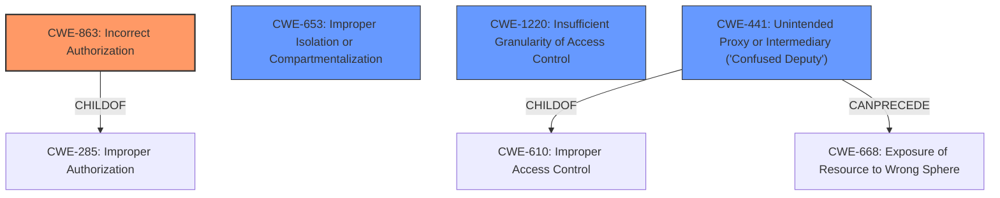

# Analysis Report for CVE-2021-38698

# Vulnerability Analysis Report: CVE-2021-38698

## Description


## Analysis (with Relationship Data)

# Summary
| CWE ID | CWE Name | Confidence | CWE Abstraction Level | CWE Vulnerability Mapping Label | CWE-Vulnerability Mapping Notes |
|---|---|---|---|---|---|
| CWE-863 | Incorrect Authorization | 0.9 | Class | Primary | Allowed-with-Review |
| CWE-653 | Improper Isolation or Compartmentalization | 0.7 | Class | Secondary | Allowed |
| CWE-1220 | Insufficient Granularity of Access Control | 0.6 | Base | Secondary | Allowed |
| CWE-441 | Unintended Proxy or Intermediary ('Confused Deputy') | 0.5 | Class | Secondary | Allowed-with-Review |

## Evidence and Confidence

*   **Confidence Score:** 0.8
*   **Evidence Strength:** HIGH

## Relationship Analysis
The primary relationship influencing the choice of CWE-863 is its child-of relationship with CWE-285 (Improper Authorization), suggesting a more specific authorization flaw. While CWE-285 is discouraged, CWE-863 is a more suitable child. CWE-653 describes issues related to isolation of functionality which is related to the service proxying in the description. CWE-1220 is another candidate because the access control is too broad, allowing unauthorized access. CWE-441, which is a Class-level CWE, has a chaining relationship with CWE-668 (Exposure of Resource to Wrong Sphere).



## Vulnerability Chain
The vulnerability chain starts with the **missing authorization** check in the `Txn.Apply` endpoint. This leads to **insufficient authorization**, allowing users with `service:write` permissions for *any* service to register a proxy for *any other* service. This further leads to **ACL bypass**, which gives the attacker the ability to **masquerade** as another service. The final impact is **traffic interception/redirection**, leading to potential data exfiltration, man-in-the-middle attacks, or denial-of-service.

## Summary of Analysis
The analysis indicates that the primary weakness is related to **incorrect authorization**, specifically in the `Txn.Apply` endpoint, where the system **fails to properly enforce ACL token policies** when registering service proxies. This **allows a user with `service:write` permissions for *any* service to register a proxy for *any other* service**, which represents a clear case of **incorrect authorization**. The "CVE Reference Links Content Summary" section provides evidence of this.

CWE-863 (Incorrect Authorization) is selected as the primary CWE. It is a Class-level CWE. The description of CWE-863 states: "The product performs an authorization check when an actor attempts to access a resource or perform an action, but it does not correctly perform the check." This aligns directly with the vulnerability, where the authorization check for registering service proxies is not correctly implemented.

CWE-653 (Improper Isolation or Compartmentalization) is considered because the vulnerability allows one service to improperly act as a proxy for another, violating the intended isolation.

CWE-1220 (Insufficient Granularity of Access Control) is a good fit because the access controls lack the required granularity, as a user with `service:write` for any service can register a proxy for any other service.

CWE-441 (Unintended Proxy or Intermediary ('Confused Deputy')) is considered because the vulnerable system acts as an unintended proxy, forwarding traffic to a malicious service. The extended description of CWE-441 notes, "The product receives a request, message, or directive from an upstream component, but the product does not sufficiently preserve the original source of the request before forwarding the request to an external actor that is outside of the product's control sphere." This aligns with the ability of an attacker to register a proxy and intercept traffic.

CWE-285 (Improper Authorization) and CWE-862 (Missing Authorization) were considered but not chosen because they are more general. The specific problem is that the authorization check is performed, but it is performed incorrectly, making CWE-863 a better fit than CWE-862. CWE-285 is discouraged and is higher-level than CWE-863, making CWE-863 a better choice.

Other CWEs such as CWE-201, CWE-306, CWE-923, and CWE-184 were not chosen because they do not directly relate to the root cause of the vulnerability, which is an authorization issue.

The final selection of CWE-863 is based on the evidence of **incorrect authorization** in the provided text. This is at the appropriate level of specificity, given the information provided.


## CWE Relationship Analysis

Current CWEs represent these abstraction levels: .


### Vulnerability Chain Analysis

**Chain starting from CWE-306:**
- 306 (Missing Authentication for Critical Function) - ROOT


**Chain starting from CWE-862:**
- 862 (Missing Authorization) - ROOT


### CWE Relationship Diagram

```mermaid
graph TD
    classDef primary fill:#f96,stroke:#333,stroke-width:2px
    classDef secondary fill:#69f,stroke:#333
    classDef tertiary fill:#9e9,stroke:#333
```


*Report generated on 2025-04-02 02:10:40*
