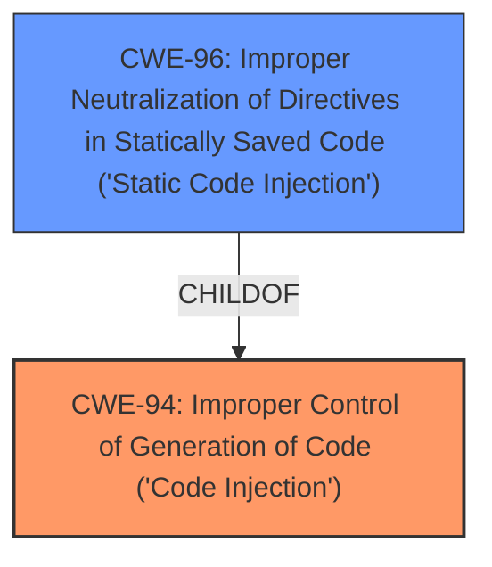

# Analysis for CVE-2021-38745

# Summary
| CWE ID | CWE Name | Confidence | CWE Abstraction Level | CWE Vulnerability Mapping Label | CWE-Vulnerability Mapping Notes |
|---|---|---|---|---|---|
| CWE-94 | Improper Control of Generation of Code ('Code Injection') | 0.9 | Base | Allowed-with-Review | Primary CWE |
| CWE-96 | Improper Neutralization of Directives in Statically Saved Code ('Static Code Injection') | 0.7 | Base | Allowed | Secondary Candidate |

## Evidence and Confidence

*   **Confidence Score:** 0.8
*   **Evidence Strength:** MEDIUM

## Relationship Analysis
The primary relationship influencing the decision is that CWE-96 is a ChildOf CWE-94. While both are relevant, CWE-94 is slightly more general. Given the limited information, it's difficult to definitively say the code is being injected into a statically saved code file. Therefore, the more general CWE-94 is chosen as the primary, with CWE-96 as a secondary candidate.

## Vulnerability Chain
The vulnerability chain starts with the **code injection** vulnerability, which allows attackers to execute arbitrary code.

## Summary of Analysis
The initial assessment identified **code injection** as the primary issue. The retriever results and CWE specifications support this assessment. The final decision is based on the provided evidence, focusing on the **weakness** and its potential impact. CWE-94 is selected as the primary CWE because it accurately describes the vulnerability, where the product constructs a code segment using externally-influenced input without proper neutralization. CWE-96 is considered as a secondary candidate due to the possibility of the injected code residing in a statically saved file but there is not enough evidence to support it.

Relevant CWE Information:

# Enhanced Context (25 CWEs)

## CWE-94: Improper Control of Generation of Code ('Code Injection')
**Abstraction:** Base
**Status:** Draft

### Description
The product constructs all or part of a code segment using externally-influenced input from an upstream component, but it does not neutralize or incorrectly neutralizes special elements that could modify the syntax or behavior of the intended code segment.

### Extended Description
When a product allows a user's input to contain code syntax, it might be possible for an attacker to craft the code in such a way that it will alter the intended control flow of the product. Such an alteration could lead to arbitrary code execution.

### Mapping Guidance
**Usage:** Allowed-with-Review
**Rationale:** This entry is frequently misused for vulnerabilities with a technical impact of "code execution," which does not by itself indicate a root cause weakness, since dozens of weaknesses can enable code execution.
**Comments:** This weakness only applies when the product's functionality intentionally constructs all or part of a code segment. It could be that executing code could be the result of other weaknesses that do not involve the construction of code segments.

**How the vulnerability's details match the CWE's characteristics:** The vulnerability description states that the Chamilo LMS v1.11.14 has a **code injection** vulnerability which allows attackers to execute arbitrary code via a crafted plugin. This aligns with the CWE-94 description, which states that the product constructs all or part of a code segment using externally-influenced input.
**The security implications and potential impact:** The security implication is that attackers can execute arbitrary code on the server.
**Any parent-child relationships or chain patterns that influenced your mapping:** CWE-94 is a base-level CWE.
**Whether the weakness is primary or secondary in the vulnerability:** This is the primary **weakness**.
**How the official MITRE mapping guidance influenced your decision:** The mapping guidance recommends reviewing this entry carefully because it's frequently misused. However, in this case, the vulnerability clearly involves the construction of a code segment using external input, making CWE-94 a suitable match.

## CWE-96: Improper Neutralization of Directives in Statically Saved Code ('Static Code Injection')
**Abstraction:** Base
**Status:** Draft

### Description
The product receives input from an upstream component, but it does not neutralize or incorrectly neutralizes code syntax before inserting the input into an executable resource, such as a library, configuration file, or template.

### Extended Description
Not provided

### Mapping Guidance
**Usage:** Allowed
**Rationale:** This CWE entry is at the Base level of abstraction, which is a preferred level of abstraction for mapping to the root causes of vulnerabilities.
**Comments:** Carefully read both the name and description to ensure that this mapping is an appropriate fit. Do not try to 'force' a mapping to a lower-level Base/Variant simply to comply with this preferred level of abstraction.

**How the vulnerability's details match the CWE's characteristics:** This could potentially be the case if the plugin directly injects code into a static file, but this is not clear from the description.
**The security implications and potential impact:** The security implication is that attackers can modify the behavior of the application by injecting code into static files.
**Any parent-child relationships or chain patterns that influenced your mapping:** CWE-96 is a child of CWE-94.
**Whether the weakness is primary or secondary in the vulnerability:** This is a secondary candidate because the description does not confirm that the code is injected into a static file.
**How the official MITRE mapping guidance influenced your decision:** The mapping guidance recommends ensuring that this mapping is an appropriate fit, and not forcing it. Since it's not explicitly clear that the code is injected into a static file, this is a secondary candidate.

## Considered but not used:

*   **CWE-78: Improper Neutralization of Special Elements used in an OS Command ('OS Command Injection')**: This CWE was considered but not selected because the vulnerability description does not specifically mention OS command injection. While code execution is possible, it's not necessarily through OS commands.
*   **CWE-79: Improper Neutralization of Input During Web Page Generation ('Cross-site Scripting')**: This CWE was considered but not selected because the description focuses on **code injection**, not necessarily script injection for web page generation.
*   **CWE-502: Deserialization of Untrusted Data**: This CWE was considered but not selected because the description does not mention deserialization of untrusted data.
*   **CWE-1336: Improper Neutralization of Special Elements Used in a Template Engine**: While plugins might use templates, the root cause is more directly related to **code injection** rather than template engine specific issues.
*   **CWE-184: Incomplete List of Disallowed Inputs**: This is a possible contributing factor, but is not the main **weakness**, which is **code injection**.
*   **CWE-116: Improper Encoding or Escaping of Output**: This CWE was considered but not selected because the description is focused on the **code injection** aspect and not specifically on encoding or escaping issues.
*   **CWE-434: Unrestricted Upload of File with Dangerous Type**: This CWE was considered, as it relates to plugins but the **code injection** is the root cause.