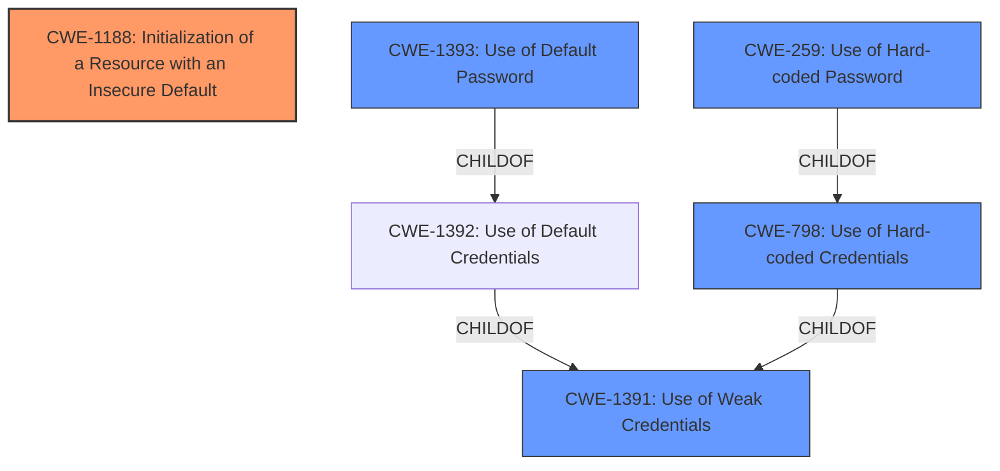

# Raw Analyzer Response for CVE-2021-38759

# Summary
| CWE ID | CWE Name | Confidence | CWE Abstraction Level | CWE Vulnerability Mapping Label | CWE-Vulnerability Mapping Notes |
|---|---|---|---|---|---|
| CWE-1188 | Initialization of a Resource with an Insecure Default | 0.9 | Base | Allowed | Primary CWE |
| CWE-1393 | Use of Default Password | 0.8 | Base | Allowed | Secondary Candidate |
| CWE-798 | Use of Hard-coded Credentials | 0.7 | Base | Allowed | Secondary Candidate |
| CWE-259 | Use of Hard-coded Password | 0.6 | Variant | Allowed | Secondary Candidate |

## Evidence and Confidence

*   **Confidence Score:** 0.9
*   **Evidence Strength:** HIGH

## Relationship Analysis
The primary relationship influencing the CWE selection is the hierarchical relationship between CWE-1391 (Use of Weak Credentials), CWE-1392 (Use of Default Credentials), CWE-1393 (Use of Default Password), CWE-798 (Use of Hard-coded Credentials), and CWE-259 (Use of Hard-coded Password). The vulnerability stems from the Raspberry Pi OS using a **default password** for the "pi" account, which can be exploited to gain administrator privileges.

CWE-1188 (Initialization of a Resource with an Insecure Default) captures the root cause where the system is initialized with a **default password** that's insecure.

CWE-1393 (Use of Default Password) is a child of CWE-1392 (Use of Default Credentials), which is a child of CWE-1391 (Use of Weak Credentials). Similarly, CWE-259 (Use of Hard-coded Password) is a child of CWE-798 (Use of Hard-coded Credentials) which is a child of CWE-1391 (Use of Weak Credentials).
The abstraction levels also influenced the selection. CWE-1188 and CWE-1393 are at the Base level, which is preferred.

## Vulnerability Chain
The vulnerability chain starts with the **initialization of a resource with an insecure default (CWE-1188)**, specifically the "pi" account's **default password**. This leads to the **use of a default password (CWE-1393)**. If the **default password** is not changed, attackers can exploit this to gain administrator privileges, leading to potential system compromise.

## Summary of Analysis
The initial assessment indicated that the vulnerability is due to the Raspberry Pi OS using a **default password** for the "pi" account.

The retriever results and the vulnerability description key phrases both point to the **default password** as the weakness.
The graph relationships and abstraction levels influenced the final selection. CWE-1188 is selected as the primary CWE because it accurately represents the root cause of the vulnerability, which is the insecure default configuration.

The evidence from the vulnerability description is: "Raspberry Pi OS through 5.10 has the raspberry **default password** for the pi account. If not changed, attackers can gain administrator privileges."

CWE-1188 accurately represents the **root cause** because the Raspberry Pi OS is initialized with an insecure **default password**, which is intended to be changed by the administrator but often is not. This aligns perfectly with the CWE's description: "The product initializes or sets a resource with a default that is intended to be changed by the administrator, but the default is not secure."

The selected CWEs are at the optimal level of specificity because they accurately describe the **root cause** and the specific type of weakness (use of a **default password**). While CWE-1391 (Use of Weak Credentials) is a broader class, CWE-1188, CWE-1393, CWE-798, and CWE-259 provide more specific details about the nature of the vulnerability.

Relevant CWE Information:

# Enhanced Context (25 CWEs)
The following CWEs were identified as potentially relevant to this vulnerability:

## CWE-1391: Use of Weak Credentials
**Abstraction Level**: Class
**Similarity Score**: 0.79
**Source**: dense

**Description**:
The product uses weak credentials (such as a default key or hard-coded password) that can be calculated, derived, reused, or guessed by an attacker.

**Mapping Guidance**:
- Usage: Allowed-with-Review
- Rationale: This CWE entry is a Class and might have Base-level children that would be more appropriate

## CWE-183: Permissive List of Allowed Inputs
**Abstraction Level**: Base
**Similarity Score**: 0.78
**Source**: dense

**Description**:
The product implements a protection mechanism that relies on a list of inputs (or properties of inputs) that are explicitly allowed by policy because the inputs are assumed to be safe, but the list is too permissive - that is, it allows an input that is unsafe, leading to resultant weaknesses.

**Mapping Guidance**:
- Usage: Allowed
- Rationale: This CWE entry is at the Base level of abstraction, which is a preferred level of abstraction for mapping to the root causes of vulnerabilities.

## CWE-184: Incomplete List of Disallowed Inputs
**Abstraction Level**: Base
**Similarity Score**: 0.77
**Source**: dense

**Description**:
The product implements a protection mechanism that relies on a list of inputs (or properties of inputs) that are not allowed by policy or otherwise require other action to neutralize before additional processing takes place, but the list is incomplete.

**Mapping Guidance**:
- Usage: Allowed
- Rationale: This CWE entry is at the Base level of abstraction, which is a preferred level of abstraction for mapping to the root causes of vulnerabilities.

## CWE-807: Reliance on Untrusted Inputs in a Security Decision
**Abstraction Level**: Base
**Similarity Score**: 0.77
**Source**: dense

**Description**:
The product uses a protection mechanism that relies on the existence or values of an input, but the input can be modified by an untrusted actor in a way that bypasses the protection mechanism.

**Mapping Guidance**:
- Usage: Allowed
- Rationale: This CWE entry is at the Base level of abstraction, which is a preferred level of abstraction for mapping to the root causes of vulnerabilities.

## CWE-798: Use of Hard-coded Credentials
**Abstraction Level**: Base
**Similarity Score**: 0.77
**Source**: dense

**Description**:
The product contains hard-coded credentials, such as a password or cryptographic key.

**Mapping Guidance**:
- Usage: Allowed
- Rationale: This CWE entry is at the Base level of abstraction, which is a preferred level of abstraction for mapping to the root causes of vulnerabilities.

## CWE-1188: Initialization of a Resource with an Insecure Default
**Abstraction Level**: Base
**Similarity Score**: 0.76
**Source**: dense

**Description**:
The product initializes or sets a resource with a default that is intended to be changed by the administrator, but the default is not secure.

**Mapping Guidance**:
- Usage: Allowed
- Rationale: This CWE entry is at the Base level of abstraction, which is a preferred level of abstraction for mapping to the root causes of vulnerabilities.

## CWE-312: Cleartext Storage of Sensitive Information
**Abstraction Level**: Base
**Similarity Score**: 0.76
**Source**: dense

**Description**:
The product stores sensitive information in cleartext within a resource that might be accessible to another control sphere.

**Mapping Guidance**:
- Usage: Allowed
- Rationale: This CWE entry is at the Base level of abstraction, which is a preferred level of abstraction for mapping to the root causes of vulnerabilities.

## CWE-1392: Use of Default Credentials
**Abstraction Level**: Base
**Similarity Score**: 0.76
**Source**: dense

**Description**:
The product uses default