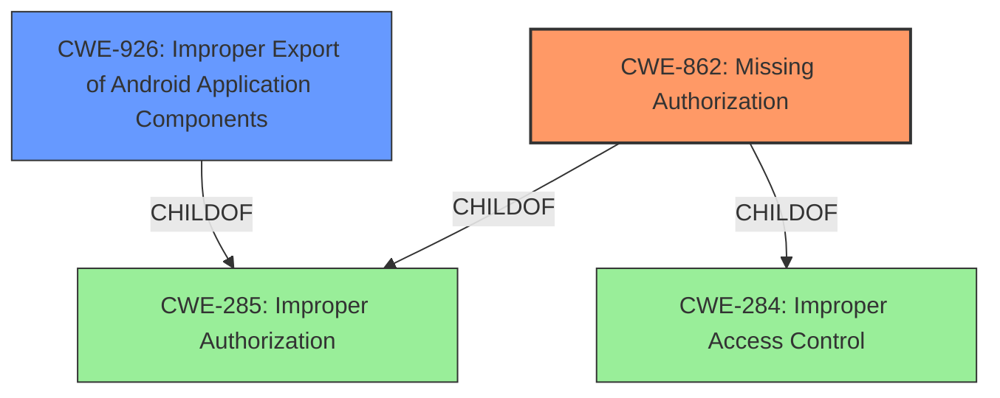

# Raw Analyzer Response for CVE-2021-38789

# Summary
| CWE ID | CWE Name | Confidence | CWE Abstraction Level | CWE Vulnerability Mapping Label | CWE-Vulnerability Mapping Notes |
|---|---|---|---|---|---|
| CWE-862 | Missing Authorization | 0.9 | Class | Allowed-with-Review | Primary CWE |
| CWE-926 | Improper Export of Android Application Components | 0.6 | Variant | Allowed | Secondary Candidate |

## Evidence and Confidence

*   **Confidence Score:** 0.9
*   **Evidence Strength:** HIGH

## Relationship Analysis
The primary relationship that impacted my decision was the ChildOf relationship. CWE-862 is a child of CWE-285 (Improper Authorization) and CWE-284 (Improper Access Control). Although the description mentions "incorrect access control", the root cause is that the authorization check is **missing** in the code.
CWE-926 is a variant of CWE-285, which indicates a potential secondary classification based on the specific context of an Android application.

## Vulnerability Chain
The vulnerability chain starts with the **missing authorization** check, which allows a third-party app to bypass security measures and ultimately change system settings.
  - **Root Cause:** CWE-862 Missing Authorization
  - **Impact:** Change system settings

## Summary of Analysis
The initial assessment focused on identifying the root cause of the vulnerability, which is the **incorrect access control**. The key phrase in the vulnerability description is "**incorrect access control**" which is related to authorization. The vulnerability description states that the **incorrect access control** results in a third-party app being able to change system settings.

The Retriever Results provided several candidate CWEs, with CWE-862 (Missing Authorization) and CWE-863 (Incorrect Authorization) being top contenders. Given that the vulnerability description explicitly mentions the **incorrect access control** **does not check the callers permission**, it indicates that the authorization check is **missing**. Therefore, CWE-862 (Missing Authorization) is more appropriate.

CWE-862 is a Class, and the guidance suggests examining children of this entry to see if there is a better fit. However, none of the children provide a more specific description that is relevant.

CWE-926 (Improper Export of Android Application Components) is another relevant CWE, as it addresses vulnerabilities related to exported components in Android applications. Since the vulnerability affects an Android SDK, it is possible that the **missing authorization** is due to an improperly exported component. Therefore, CWE-926 is considered as a secondary candidate.

The final decision is based on the evidence that the authorization check is **missing**, making CWE-862 the primary CWE. The context of the vulnerability being in an Android SDK makes CWE-926 a secondary candidate.

Relevant CWE Information:

# Enhanced Context (25 CWEs)

## CWE-1220: Insufficient Granularity of Access Control
**Abstraction Level**: Base
**Similarity Score**: 0.76
**Source**: dense

**Description**:
The product implements access controls via a policy or other feature with the intention to disable or restrict accesses (reads and/or writes) to assets in a system from untrusted agents. However, implemented access controls lack required granularity, which renders the control policy too broad because it allows accesses from unauthorized agents to the security-sensitive assets.

**Mapping Guidance**:
- Usage: Allowed
- Rationale: This CWE entry is at the Base level of abstraction, which is a preferred level of abstraction for mapping to the root causes of vulnerabilities.

*Not selected because the description focuses on missing checks, not insufficient granularity.*

## CWE-668: Exposure of Resource to Wrong Sphere
**Abstraction Level**: Class
**Similarity Score**: 0.75
**Source**: dense

**Description**:
The product exposes a resource to the wrong control sphere, providing unintended actors with inappropriate access to the resource.

**Mapping Guidance**:
- Usage: Discouraged
- Rationale: CWE-668 is high-level and is often misused as a catch-all when lower-level CWE IDs might be applicable. It is sometimes used for low-information vulnerability reports [REF-1287]. It is a level-1 Class (i.e., a child of a Pillar). It is not useful for trend analysis.

*Not selected because CWE-668 is too high-level and there are more specific CWEs available.*

## CWE-345: Insufficient Verification of Data Authenticity
**Abstraction Level**: Class
**Similarity Score**: 0.75
**Source**: dense

**Description**:
The product does not sufficiently verify the origin or authenticity of data, in a way that causes it to accept invalid data.

**Mapping Guidance**:
- Usage: Discouraged
- Rationale: This CWE entry is a level-1 Class (i.e., a child of a Pillar). It might have lower-level children that would be more appropriate

*Not selected because the vulnerability focuses on access control issues rather than data authenticity.*

## CWE-280: Improper Handling of Insufficient Permissions or Privileges
**Abstraction Level**: Base
**Similarity Score**: 0.75
**Source**: dense

**Description**:
The product does not handle or incorrectly handles when it has insufficient privileges to access resources or functionality as specified by their permissions. This may cause it to follow unexpected code paths that may leave the product in an invalid state.

**Mapping Guidance**:
- Usage: Allowed
- Rationale: This CWE entry is at the Base level of abstraction, which is a preferred level of abstraction for mapping to the root causes of vulnerabilities.

*Not selected because the root cause is that the authorization check is missing, not that the product incorrectly handles insufficient permissions.*

## CWE-274: Improper Handling of Insufficient Privileges
**Abstraction Level**: Base
**Similarity Score**: 0.75
**Source**: dense

**Description**:
The product does not handle or incorrectly handles when it has insufficient privileges to perform an operation, leading to resultant weaknesses.

**Mapping Guidance**:
- Usage: Discouraged
- Rationale: This CWE entry could be deprecated in a future version of CWE.

*Not selected because the root cause is that the authorization check is missing, not that the product incorrectly handles insufficient privileges.*

## CWE-653: Improper Isolation or Compartmentalization
**Abstraction Level**: Class
**Similarity Score**: 0.75
**Source**: dense

**Description**:
The product does not properly compartmentalize or isolate functionality, processes, or resources that require different privilege levels, rights, or permissions.

**Mapping Guidance**:
- Usage: Allowed
- Rationale: This CWE entry is at the Base level of abstraction, which is a preferred level of abstraction for mapping to the root causes of vulnerabilities.

*Not selected because the vulnerability is related to missing authorization checks, not improper isolation or compartmentalization.*

## CWE-639: Authorization Bypass Through User-Controlled Key
**Abstraction Level**: Base
**Similarity Score**: 0.75
**Source**: dense

**Description**:
The system's authorization functionality does not prevent one user from gaining access to another user's data or record by modifying the key value identifying the data.

**Mapping Guidance**:
- Usage: Allowed
- Rationale: This CWE entry is at the Base level of abstraction, which is a preferred level of abstraction for mapping to the root causes of vulnerabilities.

*Not selected because the vulnerability focuses on missing authorization checks, not a user-controlled key bypass.*

## CWE-1390: Weak Authentication
**Abstraction Level**: Class
**Similarity Score**: 0.74
**Source**: dense

**Description**:
The product uses an authentication mechanism to restrict access to specific users or identities, but the mechanism does not sufficiently prove that the claimed identity is correct.

**Mapping Guidance**:
- Usage: Allowed-with-Review
- Rationale: This CWE entry is a Class and might have Base-level children that would be more appropriate

*Not selected because the vulnerability is related to missing authorization checks, not weak authentication.*

## CWE-203: Observable Discrepancy
**Abstraction Level**: Base
**Similarity Score**: 0.74
**Source**: dense

**Description**:
The product behaves differently or sends different responses under different circumstances in a way that is observable to an unauthorized actor, which exposes security-relevant information about the state of the product, such as whether a