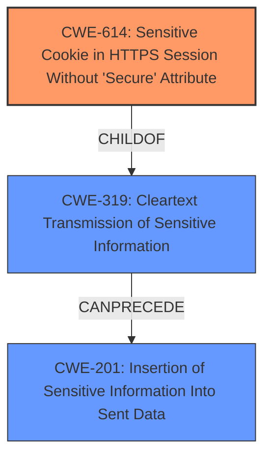

# Analysis for CVE-2021-3882

# Summary
| CWE ID  | CWE Name                                                           | Confidence | CWE Abstraction Level | CWE Vulnerability Mapping Label | CWE-Vulnerability Mapping Notes |
| :-------- | :----------------------------------------------------------------- | :--------- | :---------------------- | :------------------------------ | :------------------------------ |
| CWE-614 | Sensitive Cookie in HTTPS Session Without 'Secure' Attribute     | 1.0        | Variant               | Primary                         | Allowed                       |
| CWE-319 | Cleartext Transmission of Sensitive Information                | 0.7        | Base                  | Secondary                       | Allowed                       |
| CWE-201 | Insertion of Sensitive Information Into Sent Data | 0.5        | Base                  | Secondary                       | Allowed                       |

## Evidence and Confidence

*   **Confidence Score:** 0.8
*   **Evidence Strength:** HIGH

## Relationship Analysis
The primary CWE is CWE-614, which is a Variant of CWE-319. This means that CWE-614 is a more specific case of transmitting sensitive information in cleartext. The vulnerability description clearly states that the **rootcause** is the **missing 'Secure' attribute on the session cookie**. This directly aligns with CWE-614.

## Vulnerability Chain
The vulnerability chain starts with the **missing 'Secure' attribute on the session cookie** (CWE-614), leading to the potential **cleartext transmission of the cookie** (CWE-319) when a user is tricked into using an unencrypted connection. This can result in the **exposure of sensitive information** (the session cookie) (CWE-201) to an attacker.

## Summary of Analysis
The initial analysis identified CWE-614 as the primary weakness due to the direct match with the vulnerability description, which highlights the **missing 'Secure' attribute on the session authorization cookie**. This is supported by the "CVE Reference Links Content Summary" section: "*The primary vulnerability is the absence of the 'Secure' attribute on the session cookie. This attribute is crucial for ensuring that cookies are only transmitted over HTTPS, preventing them from being intercepted over HTTP connections.*"

CWE-319 is considered a secondary weakness as it describes the potential consequence of the missing 'Secure' attribute, which is the cleartext transmission of the cookie.

CWE-201 is a tertiary consideration since the cookie itself is sensitive information.

The graph relationships confirm that CWE-614 is a specific case of CWE-319 and that CWE-319 can lead to CWE-201.

The selected CWEs are at the optimal level of specificity because CWE-614 directly addresses the **rootcause** of the vulnerability.

Relevant CWE Information:

# Enhanced Context (25 CWEs)
The following CWEs were identified as potentially relevant to this vulnerability:

## CWE-614: Sensitive Cookie in HTTPS Session Without 'Secure' Attribute
**Abstraction:** Variant
**Similarity Score**: 7352.28
**Source**: sparse

**Description**:
The Secure attribute for sensitive cookies in HTTPS sessions is not set, which could cause the user agent to send those cookies in plaintext over an HTTP session.

**Mapping Guidance**:
- Usage: Allowed
- Rationale: This CWE entry is at the Variant level of abstraction, which is a preferred level of abstraction for mapping to the root causes of vulnerabilities.

## CWE-319: Cleartext Transmission of Sensitive Information
**Abstraction:** Base
**Similarity Score**: 7056.83
**Source**: sparse

**Description**:
The product transmits sensitive or security-critical data in cleartext in a communication channel that can be sniffed by unauthorized actors.

**Mapping Guidance**:
- Usage: Allowed
- Rationale: This CWE entry is at the Base level of abstraction, which is a preferred level of abstraction for mapping to the root causes of vulnerabilities.

## CWE-201: Insertion of Sensitive Information Into Sent Data
**Abstraction:** Base
**Similarity Score**: 6920.03
**Source**: sparse

**Description**:
The code transmits data to another actor, but a portion of the data includes sensitive information that should not be accessible to that actor.

**Mapping Guidance**:
- Usage: Allowed
- Rationale: This CWE entry is at the Base level of abstraction, which is a preferred level of abstraction for mapping to the root causes of vulnerabilities.

### CWE Considerations and Justifications:

*   **CWE-614: Sensitive Cookie in HTTPS Session Without 'Secure' Attribute**
    *   **Justification:** This is the most specific and accurate CWE. The vulnerability description explicitly states that the LedgerSMB application **does not set the Secure attribute on the session authorization cookie**. The 'Secure' attribute is crucial for ensuring that cookies are only transmitted over HTTPS.
    *   **Relationship:** ChildOf -> CWE-319
    *   **Mapping Guidance:** Usage: Allowed. Rationale: This CWE entry is at the Variant level of abstraction, which is a preferred level of abstraction for mapping to the root causes of vulnerabilities.
    *   **Confidence:** 1.0
*   **CWE-319: Cleartext Transmission of Sensitive Information**
    *   **Justification:** The absence of the 'Secure' attribute can lead to the transmission of the session cookie in cleartext over HTTP, making it vulnerable to interception.
    *   **Relationship:** ParentOf -> CWE-614
    *   **Mapping Guidance:** Usage: Allowed. Rationale: This CWE entry is at the Base level of abstraction, which is a preferred level of abstraction for mapping to the root causes of vulnerabilities.
    *   **Confidence:** 0.7
*   **CWE-201: Insertion of Sensitive Information Into Sent Data**
    *   **Justification:** The session cookie itself is considered sensitive information. If transmitted, it could lead to unauthorized access.
    *   **Relationship:** CanFollow -> CWE-319
    *   **Mapping Guidance:** Usage: Allowed. Rationale: This CWE entry is at the Base level of abstraction, which is a preferred level of abstraction for mapping to the root causes of vulnerabilities.
    *   **Confidence:** 0.5
*   **CWE-284: Improper Access Control**
    *   **Justification:** While the vulnerability can lead to improper access, it's more directly related to the insecure handling of the session cookie. CWE-284 is too high-level.
    *   **Mapping Guidance:** Usage: Discouraged. Rationale: CWE-284 is extremely high-level, a Pillar. Its name, "Improper Access Control," is often misused in low-information vulnerability reports.
    *   **Decision:** Not selected due to high abstraction level.
*   **CWE-287: Improper Authentication**
    *   **Justification:** Similar to CWE-284, this is a potential impact, but the **rootcause** is the cookie handling.
    *   **Mapping Guidance:** Usage: Discouraged. Rationale: This CWE entry might be misused when lower-level CWE entries are likely to be applicable.
    *   **Decision:** Not selected due to higher abstraction level.
*   **CWE-1004: Sensitive Cookie Without 'HttpOnly' Flag**
    *   **Justification:** The vulnerability description focuses on the absence of the 'Secure' attribute, not the 'HttpOnly' flag.
    *   **Decision:** Not selected because the 'Secure' attribute is the specific issue.