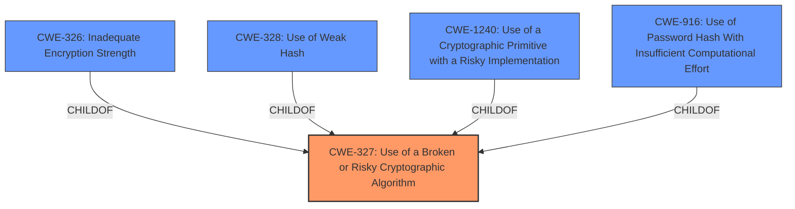

# Analysis for CVE-2021-38862

# Summary
| CWE ID | CWE Name | Confidence | CWE Abstraction Level | CWE Vulnerability Mapping Label | CWE-Vulnerability Mapping Notes |
|---|---|---|---|---|---|
| CWE-327 | Use of a Broken or Risky Cryptographic Algorithm | 0.9 | Class | Allowed-with-Review | Primary CWE |
| CWE-326 | Inadequate Encryption Strength | 0.7 | Class | Allowed-with-Review | Secondary Candidate |

## Evidence and Confidence

*   **Confidence Score:** 0.9
*   **Evidence Strength:** MEDIUM

## Relationship Analysis
The primary CWE identified is CWE-327, which is a Class-level CWE. The retriever results also suggested other cryptographic related CWEs such as CWE-326, CWE-328, CWE-1240, and CWE-916. These CWEs are often related to each other, with CWE-327 acting as a parent to some of them. The analysis considered the descriptions of the suggested CWEs.

## Vulnerability Chain
The vulnerability chain involves the use of **weak cryptographic algorithms** (root cause) which leads to the ability for an attacker to **decrypt highly sensitive information** (impact).

## Summary of Analysis
The initial analysis focused on the **rootcause** of the vulnerability, which is the use of **weak cryptographic algorithms**. The vulnerability description clearly states this.

The primary CWE match suggested by the provided information is CWE-327 (Use of a Broken or Risky Cryptographic Algorithm). This aligns well with the vulnerability description. The retriever results also list CWE-326 (Inadequate Encryption Strength), CWE-1391 (Use of Weak Credentials), CWE-338 (Use of Cryptographically Weak Pseudo-Random Number Generator (PRNG)), CWE-1240 (Use of a Cryptographic Primitive with a Risky Implementation), CWE-311 (Missing Encryption of Sensitive Data), CWE-208 (Observable Timing Discrepancy), CWE-916 (Use of Password Hash With Insufficient Computational Effort), CWE-203 (Observable Discrepancy), and CWE-328 (Use of Weak Hash).

Given the information, CWE-327 seems like the best fit as a primary weakness. The description for CWE-327 includes, "The product uses a **broken or risky cryptographic algorithm** or protocol." This is the closest match to the vulnerability description, which states the system uses "weaker than expected cryptographic algorithms."

CWE-326 (Inadequate Encryption Strength) could be considered, as the use of "weaker than expected cryptographic algorithms" implies the encryption strength is inadequate. However, the description for CWE-327 is a more direct match.

CWE-1391 (Use of Weak Credentials) is less relevant, as the vulnerability is about the strength of the cryptographic algorithm, not the credentials themselves. CWE-338 (Use of Cryptographically Weak Pseudo-Random Number Generator (PRNG)) is not appropriate because the vulnerability description doesn't specifically mention PRNGs. CWE-1240 (Use of a Cryptographic Primitive with a Risky Implementation) is a possibility, as the **weak cryptographic algorithms** could be considered risky implementations of cryptographic primitives. However, CWE-327 is a more general and direct match. CWE-311 (Missing Encryption of Sensitive Data) is not appropriate, as the issue is with the strength of the encryption, not the absence of it. CWE-208 (Observable Timing Discrepancy) and CWE-203 (Observable Discrepancy) are unrelated to the cryptographic algorithm itself. CWE-916 (Use of Password Hash With Insufficient Computational Effort) is specific to password hashing, which is not the focus of this vulnerability. CWE-328 (Use of Weak Hash) is similar to CWE-916, but more general; however, again, the focus is on general cryptographic algorithms, not just hashing.

Therefore, CWE-327 is the most appropriate primary CWE. CWE-326 is added as a secondary candidate to capture the notion of inadequate encryption strength.

# Vulnerability Description
IBM Data Risk Manager (iDNA) 2.0.6 uses weaker than expected cryptographic algorithms that could allow an attacker to decrypt highly sensitive information. IBM X-Force ID 207980.

### Vulnerability Description Key Phrases
- **rootcause:** **weak cryptographic algorithms**
- **impact:** decrypt highly sensitive information
- **attacker:** attacker
- **product:** IBM Data Risk Manager (iDNA)
- **version:** 2.0.6

### CWE for similar CVE Descriptions
### Primary CWE Match
CWE-327

#### Top CWEs
- CWE-327 (Count: 63)
- CWE-326 (Count: 25)
- CWE-319 (Count: 3)

## CVE Reference Links Content Summary
The provided document discusses a security bulletin for IBM Data Risk Manager, but it **does not contain information about CVE-2021-38862.**

The bulletin addresses **CVE-2021-20227** and provides remediation steps for IBM Data Risk Manager versions 2.0.6 through 2.0.6.8.

Therefore, the response is:

**UNRELATED**

## Retriever Results

### Top Combined Results

| Rank | CWE ID | Name | Abstraction | Usage  | Retrievers | Individual Scores |
|------|--------|------|-------------|-------|------------|-------------------|
| 1 | 326 | Inadequate Encryption Strength | Class | Allowed-with-Review | sparse | 0.360 |
| 2 | 327 | Use of a Broken or Risky Cryptographic Algorithm | Class | Allowed-with-Review | sparse | 0.322 |
| 3 | 1391 | Use of Weak Credentials | Class | Allowed-with-Review | sparse | 0.169 |
| 4 | 338 | Use of Cryptographically Weak Pseudo-Random Number Generator (PRNG) | Base | Allowed | sparse | 0.166 |
| 5 | 1240 | Use of a Cryptographic Primitive with a Risky Implementation | Base | Allowed | sparse | 0.163 |
| 6 | 311 | Missing Encryption of Sensitive Data | Class | Discouraged | dense | 0.540 |
| 7 | 208 | Observable Timing Discrepancy | Base | Allowed | graph | 0.002 |
| 8 | 916 | Use of Password Hash With Insufficient Computational Effort | Base | Allowed | sparse | 0.148 |
| 9 | 203 | Observable Discrepancy | Base | Allowed | sparse | 0.144 |
| 10 | 328 | Use of Weak Hash | Base | Allowed | sparse | 0.144 |