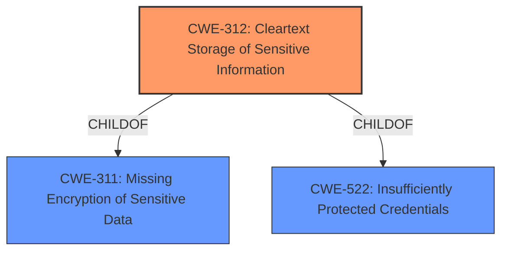

# Raw Analyzer Response for CVE-2021-38863

# Summary
| CWE ID | CWE Name | Confidence | CWE Abstraction Level | CWE Vulnerability Mapping Label | CWE-Vulnerability Mapping Notes |
|---|---|---|---|---|---|
| CWE-312 | Cleartext Storage of Sensitive Information | 1 | Base | Allowed | Primary CWE |
| CWE-522 | Insufficiently Protected Credentials | 0.7 | Class | Allowed-with-Review | Secondary Candidate |

## Evidence and Confidence

*   **Confidence Score:** 1
*   **Evidence Strength:** HIGH

## Relationship Analysis
The primary CWE is CWE-312, which is a child of CWE-311. CWE-522 is a class-level CWE that represents the more general case of credentials not being adequately protected. The relationship between CWE-312 and CWE-522 is that CWE-312 can be considered a more specific type of insufficient credential protection.

## Vulnerability Chain
The vulnerability chain is simple: the **weakness** is that the application **stores user credentials in plain clear text**. The impact is that a locally authenticated user can read these credentials.

## Summary of Analysis
The primary **weakness** is that the application **stores user credentials in plain clear text**.

The vulnerability description explicitly states that IBM Security Verify Bridge 1.0.5.0 **stores user credentials in plain clear text**. This aligns directly with the description of CWE-312 (Cleartext Storage of Sensitive Information), which states: "The product stores sensitive information in cleartext within a resource that might be accessible to another control sphere." The vulnerability description also identifies a locally authenticated user as the attacker, which satisfies the "accessible to another control sphere" requirement of CWE-312.

CWE-522 (Insufficiently Protected Credentials) was considered as a potential candidate, but it is a more general class of weakness. Since the vulnerability description specifically mentions that the credentials are stored in "plain clear text", CWE-312 is a more precise and appropriate mapping. Also, the mapping guidance for CWE-522 suggests examining its children for a better fit.

The retriever results also show CWE-312 with a high score, further supporting its selection as the primary CWE.

The analysis is based on the explicit statement in the vulnerability description. The relationship analysis showed that CWE-312 is a specific case of CWE-522. The retriever results provided additional confidence in the selection of CWE-312.

CWE-319 (Cleartext Transmission of Sensitive Information) was considered, but it is not applicable because the vulnerability involves storage, not transmission, of sensitive information.
CWE-256 (Plaintext Storage of a Password) was considered, but the description indicates that the application stores *user credentials* which may encompass more than just passwords.
CWE-532 (Insertion of Sensitive Information into Log File) was not considered because the credentials are not being logged.

The selected CWEs are at the optimal level of specificity because CWE-312 directly reflects the stated **weakness** of storing sensitive information in cleartext, while acknowledging that a more generalized class of vulnerability exists in CWE-522.