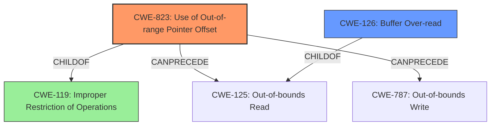

# Analysis Report for CVE-2021-3888

# Vulnerability Analysis Report: CVE-2021-3888

## Description


## Analysis (with Relationship Data)

# Summary
| CWE ID | CWE Name | Confidence | CWE Abstraction Level | CWE Vulnerability Mapping Label | CWE-Vulnerability Mapping Notes |
|---|---|---|---|---|---|
| CWE-823 | Use of Out-of-range Pointer Offset | 0.9 | Base | Allowed | Primary CWE |
| CWE-126 | Buffer Over-read | 0.7 | Variant | Allowed | Secondary Candidate |
| CWE-119 | Improper Restriction of Operations Within the Bounds of a Memory Buffer | 0.6 | Class | Allowed-with-Review | Secondary Candidate |

## Evidence and Confidence

*   **Confidence Score:** 0.9
*   **Evidence Strength:** HIGH

## Relationship Analysis
The primary CWE is CWE-823, which is a base-level CWE. It has a child-of relationship with CWE-119, which is a class-level CWE. CWE-823 can precede CWE-125 (out-of-bounds read) and CWE-787 (out-of-bounds write). CWE-126 is a variant of CWE-125, so it can also be a consequence of CWE-823.



## Vulnerability Chain
The vulnerability chain starts with the **use of an out-of-range pointer offset** (CWE-823), which leads to an **out-of-bounds read** (CWE-126).

## Summary of Analysis
The initial analysis identified a **Use of Out-of-range Pointer Offset** vulnerability. The primary CWE match from similar CVE descriptions was CWE-119 (Improper Restriction of Operations Within the Bounds of a Memory Buffer). However, the vulnerability description key phrases clearly indicate that the root cause is the **Use of Out-of-range Pointer Offset**, which maps directly to CWE-823. The CVE Reference Links Content Summary confirms this, stating that the vulnerability is a potential out-of-bounds read in the `mobi_parse_huffdic` function due to an index mismatch. The patch adds a check to prevent this condition.

CWE-823 is the most specific and accurate representation of the vulnerability. It describes the **root cause** of the vulnerability, where pointer arithmetic with an out-of-range offset leads to memory access outside the intended boundaries.

CWE-126 is a secondary candidate because the out-of-range pointer offset can lead to reading data outside the buffer.

CWE-119 is a more general weakness, and while it's related, CWE-823 provides a more precise characterization of the vulnerability.

Therefore, the final selection is CWE-823, as it accurately reflects the **root cause** of the vulnerability.

Relevant CWE Information:

# Enhanced Context (25 CWEs)

## CWE-823: Use of Out-of-range Pointer Offset
**Abstraction Level**: Base
**Similarity Score**: 0.77
**Source**: dense

**Description**:
The product performs pointer arithmetic on a valid pointer, but it uses an offset that can point outside of the intended range of valid memory locations for the resulting pointer.

**Mapping Guidance**:
- Usage: Allowed
- Rationale: This CWE entry is at the Base level of abstraction, which is a preferred level of abstraction for mapping to the root causes of vulnerabilities.

## CWE-126: Buffer Over-read
**Abstraction Level**: variant
**Similarity Score**: 3.88
**Source**: graph

**Description**:
CWE-126: Buffer Over-read

**Mapping Guidance**:
- Usage: Allowed
- Rationale: This CWE entry is at the Variant level of abstraction, which is a preferred level of abstraction for mapping to the root causes of vulnerabilities.

## CWE-119: Improper Restriction of Operations Within the Bounds of a Memory Buffer
**Abstraction Level**: Class
**Similarity Score**: N/A
**Source**: N/A

**Description**:
The product performs an operation that reads or writes to memory outside of the intended buffer.

**Mapping Guidance**:
- Usage: Allowed-with-Review
- Rationale: This CWE entry is a Class and might have Base-level children that would be more appropriate


## CWE Relationship Analysis

Current CWEs represent these abstraction levels: .


### Vulnerability Chain Analysis

**Chain starting from CWE-823:**
- 823 (Use of Out-of-range Pointer Offset) - ROOT


**Chain starting from CWE-787:**
- 787 (Out-of-bounds Write) - ROOT


### CWE Relationship Diagram

```mermaid
graph TD
    classDef primary fill:#f96,stroke:#333,stroke-width:2px
    classDef secondary fill:#69f,stroke:#333
    classDef tertiary fill:#9e9,stroke:#333
```


*Report generated on 2025-04-02 11:46:44*
