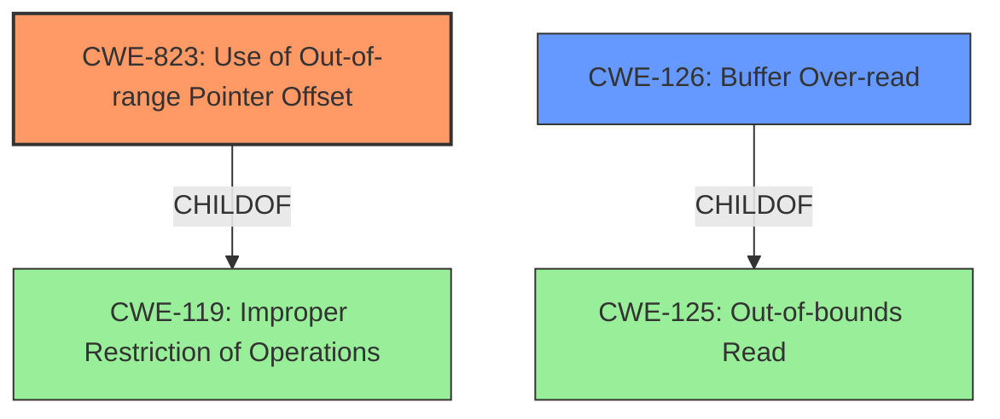

# Enhanced Analysis for CVE-2021-3889

# Summary

| CWE ID | CWE Name | Confidence | CWE Abstraction Level | CWE Vulnerability Mapping Label | CWE-Vulnerability Mapping Notes |
|---|---|---|---|---|---|
| CWE-823 | Use of Out-of-range Pointer Offset | 0.9 | Base | Allowed | Primary CWE |
| CWE-126 | Buffer Over-read | 0.6 | Variant | Allowed | Secondary CWE |

## Evidence and Confidence

*   **Confidence Score:** 0.8
*   **Evidence Strength:** HIGH

## Relationship Analysis
The primary CWE is CWE-823, which is a base level CWE. CWE-823 is child of CWE-119 (Improper Restriction of Operations Within the Bounds of a Memory Buffer). CWE-126 (Buffer Over-read) is also a secondary CWE. CWE-126 is a child of CWE-125 (Out-of-bounds Read). The relationships between CWE-823, CWE-119, and CWE-126 help define the scope and impact of the vulnerability.



## Vulnerability Chain
The vulnerability chain involves an out-of-range pointer offset leading to a potential buffer over-read. This means the initial flaw is the **Use of Out-of-range Pointer Offset**, which then leads to reading beyond the buffer's intended boundaries.

## Summary of Analysis
Initially, the provided information suggested CWE-119 (Improper Restriction of Operations Within the Bounds of a Memory Buffer) as the primary CWE based on similar CVE descriptions. However, after a thorough review of the vulnerability details and the available CWE specifications, it became clear that CWE-823 (Use of Out-of-range Pointer Offset) is a more precise and accurate representation of the **root cause**.

The "CVE Reference Links Content Summary" clearly states that the vulnerability stems from an **out-of-bounds read** during Huffman decompression. The code uses `code_length` as an index into tables without proper validation, leading to a potential **out-of-bounds read**.

> The vulnerability stems from an out-of-bounds read during Huffman decompression in the `libmobi` library. Specifically, the code iterates through a table (`huffcdic->mincode_table`) using the `code_length` variable as an index, without properly validating if the index exceeds the table size.

This aligns directly with the description of CWE-823:

> The product performs pointer arithmetic on a valid pointer, but it uses an offset that can point outside of the intended range of valid memory locations for the resulting pointer.

While CWE-119 is a parent CWE, selecting it would be less specific and fail to capture the precise nature of the weakness, which is the **use of an out-of-range offset** in pointer arithmetic.

Additionally, CWE-126 (Buffer Over-read) is considered as a secondary CWE due to the potential impact of the out-of-range pointer offset. If the offset leads to reading beyond the buffer's boundaries, it results in a buffer over-read.

The decision to use CWE-823 as the primary CWE is based on a detailed analysis of the vulnerability description, supporting evidence from the CVE reference links, and a thorough understanding of the CWE specifications. The selection is at the optimal level of specificity, as it captures the exact flaw in the code that leads to the vulnerability.

Relevant CWE Information:

# Enhanced Context (25 CWEs)

## CWE-823: Use of Out-of-range Pointer Offset
**Abstraction Level**: Base
**Similarity Score**: 0.77
**Source**: dense

**Description**:
The product performs pointer arithmetic on a valid pointer, but it uses an offset that can point outside of the intended range of valid memory locations for the resulting pointer.

**Mapping Guidance**:
- Usage: Allowed
- Rationale: This CWE entry is at the Base level of abstraction, which is a preferred level of abstraction for mapping to the root causes of vulnerabilities.

## CWE-126: Buffer Over-read
**Abstraction Level**: variant
**Similarity Score**: 3.88
**Source**: graph

**Description**:
CWE-126: Buffer Over-read

**Mapping Guidance**:
- Usage: Allowed
- Rationale: This CWE entry is at the Variant level of abstraction, which is a preferred level of abstraction for mapping to the root causes of vulnerabilities.

**Relationships**:
- CANFOLLOW -> CWE-170
- CHILDOF -> CWE-788
- CHILDOF -> CWE-125
- PARENTOF -> CWE-126
- CANPRECEDE -> CWE-126


## CWE Relationship Analysis

Current CWEs represent these abstraction levels: .


### Vulnerability Chain Analysis

**Chain starting from CWE-823:**
- 823 (Use of Out-of-range Pointer Offset) - ROOT


**Chain starting from CWE-170:**
- 170 (Improper Null Termination) - ROOT


### CWE Relationship Diagram

```mermaid
graph TD
    classDef primary fill:#f96,stroke:#333,stroke-width:2px
    classDef secondary fill:#69f,stroke:#333
    classDef tertiary fill:#9e9,stroke:#333
```