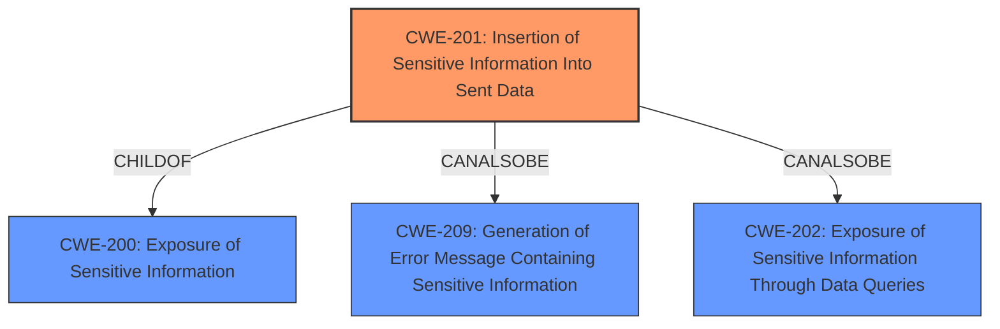

# Analysis for CVE-2021-38956

# Summary
| CWE ID | CWE Name | Confidence | CWE Abstraction Level | CWE Vulnerability Mapping Label | CWE-Vulnerability Mapping Notes |
|---|---|---|---|---|---|
| CWE-201 | Insertion of Sensitive Information Into Sent Data | 0.9 | Base | Allowed | Primary CWE |

## Evidence and Confidence

*   **Confidence Score:** 0.9
*   **Evidence Strength:** HIGH

## Relationship Analysis
The primary CWE, CWE-201, is a Base-level weakness that is a child of CWE-200 (Exposure of Sensitive Information) and can also be related to CWE-209 (Generation of Error Message Containing Sensitive Information) and CWE-202 (Exposure of Sensitive Information Through Data Queries). The relationship suggests that the vulnerability involves the inclusion of sensitive data in a transmitted message, aligning well with the description. The choice of CWE-201 is at the appropriate level of specificity, providing a clear and actionable categorization of the vulnerability.

## Vulnerability Chain
The vulnerability chain involves the **disclosure of sensitive version information** via **HTTP response headers**. The chain starts with the application **inserting sensitive data into sent data (CWE-201)**, which leads to the **exposure of information that could aid in further attacks.**

## Summary of Analysis
The analysis is based on the vulnerability description which indicates that sensitive version information is disclosed in HTTP response headers. The vulnerability description key phrases highlight that the **impact** is the **disclosure of sensitive version information** and the **vector** is via **HTTP response headers**. This aligns well with the description of CWE-201, which involves the insertion of sensitive information into sent data.

The retriever results also support this choice, with CWE-201 being the top combined result. While other CWEs were considered, such as CWE-209 (Generation of Error Message Containing Sensitive Information) and CWE-598 (Use of GET Request Method With Sensitive Query Strings), they did not fit as well as CWE-201. CWE-209 is more specific to error messages, and CWE-598 is specific to GET requests. The vulnerability is about version information in HTTP response headers which could be in GET or POST requests, making CWE-201 the most appropriate and general fit.

The selection of CWE-201 is at the optimal level of specificity, as it directly addresses the root cause of the vulnerability, which is the inclusion of sensitive information in the sent data (HTTP response headers).