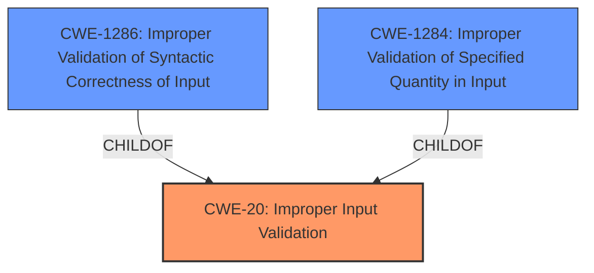

# Analysis for CVE-2021-38973

# Summary
| CWE ID | CWE Name | Confidence | CWE Abstraction Level | CWE Vulnerability Mapping Label | CWE-Vulnerability Mapping Notes |
|---|---|---|---|---|---|
| CWE-20 | Improper Input Validation | 0.9 | Class | Primary | Discouraged |
| CWE-1286 | Improper Validation of Syntactic Correctness of Input | 0.7 | Base | Secondary | Allowed |
| CWE-1284 | Improper Validation of Specified Quantity in Input | 0.6 | Base | Secondary | Allowed |

## Evidence and Confidence

*   **Confidence Score:** 0.9
*   **Evidence Strength:** HIGH

## Relationship Analysis
The primary relationship influencing the CWE selection is the hierarchical structure, with CWE-20 as a class and CWE-1286 and CWE-1284 as base CWEs which are children of CWE-20. Although CWE-20 is discouraged, the vulnerability description is too generic to select a more specific CWE.

## Vulnerability Chain
The vulnerability chain starts with the **improper input validation** (CWE-20), which can lead to various impacts depending on the nature of the input and how it's processed. The description doesn't specify what the impacts are.

## Summary of Analysis
The initial analysis identified the root cause as **improper input validation**. The vulnerability description states that the product "**does not validate or incorrectly validates input**". The CVE Reference Links Content Summary confirms this by stating the root cause is "Hazardous input validation" and the weakness/vulnerability present is "Input validation vulnerability."

The Retriever Results identified CWE-20 as the top candidate. Although CWE-20 is discouraged, the description does not contain enough information to map to a more specific Base CWE. The description is too generic to determine the specific type of input that is not validated or incorrectly validated.

Other CWEs like CWE-1286 (Improper Validation of Syntactic Correctness of Input) and CWE-1284 (Improper Validation of Specified Quantity in Input) could potentially be present, but there is not enough information in the description to support these.

Therefore, the final selection is CWE-20 (Improper Input Validation) as the primary CWE, with CWE-1286 and CWE-1284 as secondary candidates that could be present.

Relevant CWE Information:

# Enhanced Context (25 CWEs)

## CWE-1286: Improper Validation of Syntactic Correctness of Input
**Technical Explanation:** The product receives input that is expected to be well-formed according to a certain syntax, but it does not validate or incorrectly validates that the input complies with the syntax. This can lead to parsing failures or unexpected errors.
**Security Implications:** Attackers could cause parsing failures, trigger unexpected errors, or expose latent vulnerabilities that might not be directly exploitable if the input had conformed to the syntax.
**Relationship Analysis:** This is a child of CWE-20.
**Mapping Guidance Analysis:** Usage is Allowed, and it is at the Base level of abstraction.

## CWE-1284: Improper Validation of Specified Quantity in Input
**Technical Explanation:** The product receives input that is expected to specify a quantity (such as size or length), but it does not validate or incorrectly validates that the quantity has the required properties.
**Security Implications:** Attackers can specify malicious quantities to cause excessive resource allocation, trigger unexpected failures, or enable buffer overflows.
**Relationship Analysis:** This is a child of CWE-20.
**Mapping Guidance Analysis:** Usage is Allowed, and it is at the Base level of abstraction.

## CWE-20: Improper Input Validation
**Technical Explanation:** The product receives input or data, but it does not validate or incorrectly validates that the input has the properties that are required to process the data safely and correctly.
**Security Implications:** An attacker is able to craft the input in a form that is not expected by the rest of the application. This will lead to parts of the system receiving unintended input, which may result in altered control flow, arbitrary control of a resource, or arbitrary code execution.
**Relationship Analysis:** This is a class level CWE.
**Mapping Guidance Analysis:** Usage is discouraged, but the vulnerability description is too generic to select a more specific CWE.

## Other CWEs Considered and Rejected:
*   CWE-759: Use of a One-Way Hash without a Salt - This CWE is not relevant as the vulnerability description doesn't mention anything about hashing or cryptography.
*   CWE-295: Improper Certificate Validation - This CWE is not relevant as the vulnerability description doesn't mention anything about certificate validation.
*   CWE-347: Improper Verification of Cryptographic Signature - This CWE is not relevant as the vulnerability description doesn't mention anything about cryptographic signatures.
*   CWE-116: Improper Encoding or Escaping of Output - This CWE is not relevant as the vulnerability description doesn't mention output encoding.
*   CWE-1288: Improper Validation of Consistency within Input - This CWE could be present, but there is not enough information in the description to support this.
*   CWE-179: Incorrect Behavior Order: Early Validation - This CWE is not relevant as the vulnerability description doesn't mention anything about the order of operations.
*   CWE-1289: Improper Validation of Unsafe Equivalence in Input - This CWE could be present, but there is not enough information in the description to support this.