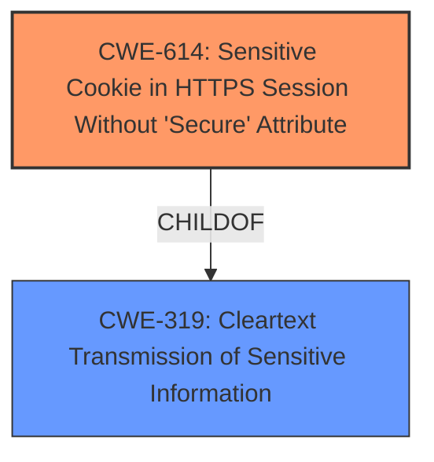

# Analysis Report for CVE-2021-38977

# Vulnerability Analysis Report: CVE-2021-38977

## Description


## Analysis (with Relationship Data)

# Summary
| CWE ID | CWE Name | Confidence | CWE Abstraction Level | CWE Vulnerability Mapping Label | CWE-Vulnerability Mapping Notes |
|---|---|---|---|---|---|
| CWE-614 | Sensitive Cookie in HTTPS Session Without 'Secure' Attribute | 1.0 | Variant | Allowed | Primary CWE |
| CWE-319 | Cleartext Transmission of Sensitive Information | 0.7 | Base | Allowed | Secondary Candidate |

## Evidence and Confidence

*   **Confidence Score:** 0.9
*   **Evidence Strength:** HIGH

## Relationship Analysis
The primary CWE selected is CWE-614, which is a Variant of CWE-319. This parent-child relationship indicates that CWE-614 is a more specific case of transmitting sensitive information in cleartext. The analysis focused on the explicit detail that the secure attribute was not set on the cookie, leading to the selection of the more specific variant.



## Vulnerability Chain
The vulnerability chain starts with the **failure to set the secure attribute** on authorization tokens and session cookies (CWE-614). This leads to the possibility of an attacker intercepting the cookie values when transmitted over HTTP (CWE-319). The impact is potential unauthorized access or impersonation.

## Summary of Analysis
The initial analysis focused on the **weakness** of the application **not setting the secure attribute on cookies**. The retriever results highlighted CWE-614 as the top candidate, which aligns perfectly with the vulnerability description and the CVE Reference Links Content Summary. The relationship analysis confirmed that CWE-614 is a Variant of CWE-319, making it a more specific and accurate classification.

The final decision is based on the explicit evidence: "IBM Tivoli Key Lifecycle Manager 3.0, 3.0.1, 4.0, and 4.1 **does not set the secure attribute on authorization tokens or session cookies**." The CVE Reference Links Content Summary also states: "**Root cause of vulnerability:** Missing "secure" attribute in cookies."

CWE-614 is at the optimal level of specificity because it directly addresses the **root cause** of the vulnerability.

Relevant CWE Information:

# Enhanced Context (25 CWEs)
The following CWEs were identified as potentially relevant to this vulnerability:

## CWE-807: Reliance on Untrusted Inputs in a Security Decision
**Abstraction Level**: Base
**Similarity Score**: 0.77
**Source**: dense

**Description**:
The product uses a protection mechanism that relies on the existence or values of an input, but the input can be modified by an untrusted actor in a way that bypasses the protection mechanism.
**NOT USED:** This is not the root cause. The root cause is the missing secure attribute not the reliance on untrusted inputs.

## CWE-319: Cleartext Transmission of Sensitive Information
**Abstraction Level**: Base
**Similarity Score**: 0.77
**Source**: dense

**Description**:
The product transmits sensitive or security-critical data in cleartext in a communication channel that can be sniffed by unauthorized actors.
**CONSIDERED:** This is a parent of CWE-614, and represents a broader class of vulnerability where sensitive information is transmitted without encryption. While applicable as a secondary weakness, the more specific CWE-614 is preferred.

## CWE-1391: Use of Weak Credentials
**Abstraction Level**: Class
**Similarity Score**: 0.76
**Source**: dense

**Description**:
The product uses weak credentials (such as a default key or hard-coded password) that can be calculated, derived, reused, or guessed by an attacker.
**NOT USED:** This is not the root cause. The vulnerability is about cookies and not related to the usage of weak credentials.

## CWE-303: Incorrect Implementation of Authentication Algorithm
**Abstraction Level**: Base
**Similarity Score**: 0.76
**Source**: dense

**Description**:
The requirements for the product dictate the use of an established authentication algorithm, but the implementation of the algorithm is incorrect.
**NOT USED:** This is not the root cause. The vulnerability is about cookies and not related to authentication algorithm implementation.

## CWE-614: Sensitive Cookie in HTTPS Session Without 'Secure' Attribute
**Abstraction Level**: Variant
**Similarity Score**: 0.76
**Source**: dense

**Description**:
The Secure attribute for sensitive cookies in HTTPS sessions is not set, which could cause the user agent to send those cookies in plaintext over an HTTP session.
**USED:** This CWE matches the vulnerability description. The vulnerability is about the secure attribute not being set for session cookies.

## CWE-312: Cleartext Storage of Sensitive Information
**Abstraction Level**: Base
**Similarity Score**: 0.76
**Source**: dense

**Description**:
The product stores sensitive information in cleartext within a resource that might be accessible to another control sphere.
**NOT USED:** The vulnerability is about transmission of cookies, not about cleartext storage.

## CWE-345: Insufficient Verification of Data Authenticity
**Abstraction Level**: Class
**Similarity Score**: 0.75
**Source**: dense

**Description**:
The product does not sufficiently verify the origin or authenticity of data, in a way that causes it to accept invalid data.
**NOT USED:** The vulnerability is about cookies and not about data authenticity.

## CWE-226: Sensitive Information in Resource Not Removed Before Reuse
**Abstraction Level**: Base
**Similarity Score**: 0.75
**Source**: dense

**Description**:
The product releases a resource such as memory or a file so that it can be made available for reuse, but it does not clear or "zeroize" the information contained in the resource before the product performs a critical state transition or makes the resource available for reuse by other entities.
**NOT USED:** The vulnerability is about cookies and not about the resource lifecycle.

## CWE-1240: Use of a Cryptographic Primitive with a Risky Implementation
**Abstraction Level**: Base
**Similarity Score**: 0.75
**Source**: dense

**Description**:
To fulfill the need for a cryptographic primitive, the product implements a cryptographic algorithm using a non-standard, unproven, or disallowed/non-compliant cryptographic implementation.
**NOT USED:** The vulnerability is about cookies and not about cryptographic algorithm implementation.

## CWE-1390: Weak Authentication
**Abstraction Level**: Class
**Similarity Score**: 0.75
**Source**: dense

**Description**:
The product uses an authentication mechanism to restrict access to specific users or identities, but the mechanism does not sufficiently prove that the claimed identity is correct.
**NOT USED:** The vulnerability is about cookies and not about authentication mechanism.

## CWE-319: Cleartext Transmission of Sensitive Information
**Abstraction Level**: Base
**Similarity Score**: 6270.52
**Source**: sparse

**Description**:
The product transmits sensitive or security-critical data in cleartext in a communication channel that can be sniffed by unauthorized actors.
**CONSIDERED:** This is a parent of CWE-614, and represents a broader class of vulnerability where sensitive information is transmitted without encryption. While applicable, the more specific CWE-614 is preferred.

## CWE-327: Use of a Broken or Risky Cryptographic Algorithm
**Abstraction Level**: Class
**Similarity Score**: 6193.59
**Source**: sparse

**Description**:
The product uses a broken or risky cryptographic algorithm or protocol.
**NOT USED:** The vulnerability is about cookies and not about cryptographic algorithms.

## CWE-614: Sensitive Cookie in HTTPS Session Without 'Secure' Attribute
**Abstraction Level**: Variant
**Similarity Score**: 6177.74
**Source**: sparse

**Description**:
The Secure attribute for sensitive cookies in HTTPS sessions is not set, which could cause the user agent to send those cookies in plaintext over an HTTP session.
**USED:** This CWE matches the vulnerability description. The vulnerability is about the secure attribute not being set for session cookies.

## CWE-1390: Weak Authentication
**Abstraction Level**: Class
**Similarity Score**: 6109.01
**Source**: sparse

**Description**:
The product uses an authentication mechanism to restrict access to specific users or identities, but the mechanism does not sufficiently prove that the claimed identity is correct.
**NOT USED:** The vulnerability is about cookies and not about authentication mechanisms.

## CWE-863: Incorrect Authorization
**Abstraction Level**: Class
**Similarity Score**: 6106.76
**Source**: sparse

**Description**:
The product performs an authorization check when an actor attempts to access a resource or perform an action, but it does not correctly perform the check.
**NOT USED:** The vulnerability is about cookies and not authorization checks.

## CWE-201: Insertion


## CWE Relationship Analysis

Current CWEs represent these abstraction levels: .


### Vulnerability Chain Analysis

**Chain starting from CWE-303:**
- 303 (Incorrect Implementation of Authentication Algorithm) - ROOT


**Chain starting from CWE-614:**
- 614 (Sensitive Cookie in HTTPS Session Without 'Secure' Attribute) - ROOT


### CWE Relationship Diagram

```mermaid
graph TD
    classDef primary fill:#f96,stroke:#333,stroke-width:2px
    classDef secondary fill:#69f,stroke:#333
    classDef tertiary fill:#9e9,stroke:#333
```


*Report generated on 2025-04-02 02:53:19*
