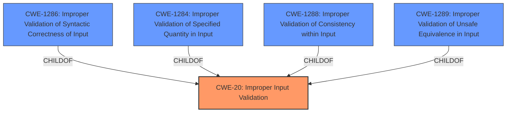

# Enhanced Analysis for CVE-2021-38985

# Summary
| CWE ID | CWE Name | Confidence | CWE Abstraction Level | CWE Vulnerability Mapping Label | CWE-Vulnerability Mapping Notes |
|---|---|---|---|---|---|
| CWE-20 | Improper Input Validation | 1.0 | Class | Primary | Discouraged |
| CWE-1286 | Improper Validation of Syntactic Correctness of Input | 0.7 | Base | Secondary | Allowed |
| CWE-1284 | Improper Validation of Specified Quantity in Input | 0.6 | Base | Secondary | Allowed |
| CWE-1288 | Improper Validation of Consistency within Input | 0.6 | Base | Secondary | Allowed |
| CWE-1289 | Improper Validation of Unsafe Equivalence in Input | 0.6 | Base | Secondary | Allowed |

## Evidence and Confidence

*   **Confidence Score:** 0.8
*   **Evidence Strength:** MEDIUM

## Relationship Analysis
The primary CWE is CWE-20, which is a class-level CWE. Several base-level CWEs are children of CWE-20 and represent more specific types of input validation issues. The retriever results also point towards several base-level CWEs like CWE-1286, CWE-1284, CWE-1288, and CWE-1289, all of which are children of CWE-20. These represent different aspects of improper input validation, such as syntactic correctness, specified quantity, consistency, and unsafe equivalence. Choosing the most specific CWE requires more context about the exact nature of the validation error, which is not available in the provided description.



## Vulnerability Chain
The vulnerability chain starts with the product receiving input. The **root cause** is the **failure to validate or the incorrect validation of this input**. The potential impact is a security vulnerability due to the mishandling of unsafe or incorrect data. However, the description lacks specifics, so a more detailed chain cannot be constructed.

## Summary of Analysis
The initial assessment pointed towards CWE-20 as the primary weakness, based on the vulnerability description key phrases indicating **improper input validation**. The retriever results and the CWE specifications further support this. However, CWE-20 is discouraged as a primary mapping because it is a class-level CWE. However, without more information, it's difficult to pinpoint the exact type of input validation issue. The retriever results suggest several child CWEs of CWE-20, such as CWE-1286, CWE-1284, CWE-1288, and CWE-1289. While these provide more specific classifications, there is insufficient evidence to definitively choose one over the others.

The vulnerability description explicitly states: "IBM Tivoli Key Lifecycle Manager 3.0, 3.0.1, 4.0, and 4.1 receives input or data, but it **does not validate or incorrectly validates** that the input has the properties that are required to process the data safely and correctly." This statement directly aligns with the description of CWE-20: "The product receives input or data, but it does not validate or incorrectly validates that the input has the properties that are required to process the data safely and correctly."

Given the lack of specific details about the type of input and the validation error, I'm selecting CWE-20 as the primary CWE with a confidence of 1.0, but acknowledging that a more specific CWE could be assigned if more information was available. The secondary CWEs (CWE-1286, CWE-1284, CWE-1288, and CWE-1289) are included as possible candidates if more information becomes available and have lower confidence scores.

Relevant CWE Information:

# Enhanced Context (25 CWEs)

## CWE-1286: Improper Validation of Syntactic Correctness of Input
**Abstraction Level**: Base
**Similarity Score**: 0.75
**Source**: sparse

**Description**:
The product receives input that is expected to be well-formed - i.e., to comply with a certain syntax - but it does not validate or incorrectly validates that the input complies with the syntax.
**Rationale**: This CWE entry is at the Base level of abstraction, which is a preferred level of abstraction for mapping to the root causes of vulnerabilities.
**Comments:** Carefully read both the name and description to ensure that this mapping is an appropriate fit. Do not try to 'force' a mapping to a lower-level Base/Variant simply to comply with this preferred level of abstraction.

*   **Why Not Chosen:** This CWE describes a situation where the input is expected to be well-formed and comply with a certain syntax, but the product **does not validate or incorrectly validates** that the input complies with the syntax. Without additional information, it's unclear if the validation error is specifically related to syntactic correctness.

## CWE-1284: Improper Validation of Specified Quantity in Input
**Abstraction Level**: Base
**Similarity Score**: 6573.11
**Source**: sparse

**Description**:
The product receives input that is expected to specify a quantity (such as size or length), but it **does not validate or incorrectly validates** that the quantity has the required properties.

*   **Why Not Chosen:** This CWE describes a situation where the input is expected to specify a quantity (such as size or length), but the product **does not validate or incorrectly validates** that the quantity has the required properties. Without additional information, it's unclear if the validation error is specifically related to specified quantity.

## CWE-1288: Improper Validation of Consistency within Input
**Abstraction Level**: Base
**Similarity Score**: 0.80
**Source**: dense

**Description**:
The product receives a complex input with multiple elements or fields that must be consistent with each other, but it **does not validate or incorrectly validates** that the input is actually consistent.
**Rationale**: This CWE entry is at the Base level of abstraction, which is a preferred level of abstraction for mapping to the root causes of vulnerabilities.
**Comments:** Carefully read both the name and description to ensure that this mapping is an appropriate fit. Do not try to 'force' a mapping to a lower-level Base/Variant simply to comply with this preferred level of abstraction.

*   **Why Not Chosen:** This CWE describes a situation where the product receives a complex input with multiple elements or fields that must be consistent with each other, but it **does not validate or incorrectly validates** that the input is actually consistent. Without additional information, it's unclear if the validation error is specifically related to consistency.

## CWE-1289: Improper Validation of Unsafe Equivalence in Input
**Abstraction Level**: Base
**Similarity Score**: 0.82
**Source**: dense

**Description**:
The product receives an input value that is used as a resource identifier or other type of reference, but it **does not validate or incorrectly validates** that the input is equivalent to a potentially-unsafe value.
**Rationale**: This CWE entry is at the Base level of abstraction, which is a preferred level of abstraction for mapping to the root causes of vulnerabilities.
**Comments:** Carefully read both the name and description to ensure that this mapping is an appropriate fit. Do not try to 'force' a mapping to a lower-level Base/Variant simply to comply with this preferred level of abstraction.

*   **Why Not Chosen:** This CWE describes a situation where the product receives an input value that is used as a resource identifier or other type of reference, but it **does not validate or incorrectly validates** that the input is equivalent to a potentially-unsafe value. Without additional information, it's unclear if the validation error is specifically related to unsafe equivalence.


## CWE Relationship Analysis

Current CWEs represent these abstraction levels: .


### Vulnerability Chain Analysis

**Chain starting from CWE-1289:**
- 1289 (Improper Validation of Unsafe Equivalence in Input) - ROOT


**Chain starting from CWE-1286:**
- 1286 (Improper Validation of Syntactic Correctness of Input) - ROOT


### CWE Relationship Diagram

```mermaid
graph TD
    classDef primary fill:#f96,stroke:#333,stroke-width:2px
    classDef secondary fill:#69f,stroke:#333
    classDef tertiary fill:#9e9,stroke:#333
```