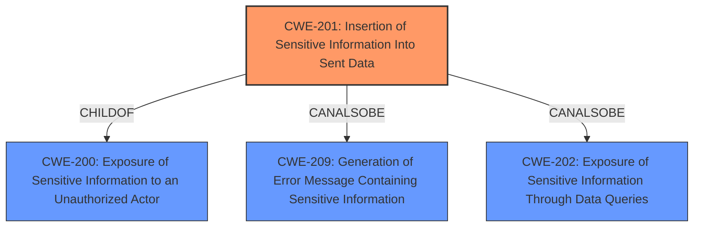

# Analysis for CVE-2021-38999

# Summary
| CWE ID | CWE Name | Confidence | CWE Abstraction Level | CWE Vulnerability Mapping Label | CWE-Vulnerability Mapping Notes |
|---|---|---|---|---|---|
| CWE-201 | Insertion of Sensitive Information Into Sent Data | 0.8 | Base | Allowed | Primary CWE |
| CWE-200 | Exposure of Sensitive Information to an Unauthorized Actor | 0.5 | Class | Discouraged | Secondary Candidate |

## Evidence and Confidence

*   **Confidence Score:** 0.8
*   **Evidence Strength:** MEDIUM

## Relationship Analysis
The primary CWE, CWE-201 (Insertion of Sensitive Information Into Sent Data), is a child of CWE-200 (Exposure of Sensitive Information to an Unauthorized Actor), indicating a hierarchical relationship where CWE-201 is a more specific type of CWE-200. CWE-201 also has peer relationships (CanAlsoBe) with CWE-209 (Generation of Error Message Containing Sensitive Information) and CWE-202 (Exposure of Sensitive Information Through Data Queries), suggesting alternative classifications. The Base abstraction level of CWE-201, as opposed to the Class level of CWE-200, was a key factor in selecting the more specific CWE-201.

## Vulnerability Chain
The vulnerability chain starts with the **inclusion of sensitive data within trace**, leading to the **impact** of a local attacker being able to **obtain sensitive information**. The root cause is the **inclusion of sensitive data** in the trace files, and the impact is the **exposure of sensitive information** to an unauthorized actor.

## Summary of Analysis
Initially, the vulnerability description indicates that the IBM MQ Appliance includes sensitive data within trace files, which allows a local attacker to obtain sensitive information.

The key phrase "inclusion of sensitive data within trace" suggests that sensitive information is being inserted into the trace data, which is then sent or made available. This aligns well with CWE-201 (Insertion of Sensitive Information Into Sent Data).

The "CVE Reference Links Content Summary" confirms the presence of a sensitive information disclosure vulnerability.

The Retriever Results also identify CWE-201 as a potential match, along with other related CWEs such as CWE-200, CWE-209, and CWE-319.

Based on the evidence, relationship analysis, and mapping guidance, the primary CWE is determined to be CWE-201 (Insertion of Sensitive Information Into Sent Data). This is because the vulnerability involves the insertion of sensitive data into trace files, which are then exposed.

CWE-200 (Exposure of Sensitive Information to an Unauthorized Actor) was considered but is a more general class. While applicable, CWE-201 provides a more specific description of the vulnerability.

CWE-209 (Generation of Error Message Containing Sensitive Information) was also considered, but the vulnerability does not specifically involve error messages.

CWE-319 (Cleartext Transmission of Sensitive Information) was considered, but the vulnerability does not specifically involve cleartext transmission.

The decision to select CWE-201 is based on the direct evidence of sensitive information being inserted into sent data (trace files), aligning with the CWE's description and usage. The Base level of abstraction is optimal for this vulnerability.

Relevant CWE Information:

# Enhanced Context (25 CWEs)

## CWE-201: Insertion of Sensitive Information Into Sent Data
**Abstraction:** Base
**Status:** Draft

### Description
The code transmits data to another actor, but a portion of the data includes sensitive information that should not be accessible to that actor.

### Extended Description
Not provided

### Alternative Terms
None

### Relationships
ChildOf -> CWE-200
CanAlsoBe -> CWE-209
CanAlsoBe -> CWE-202

### Mapping Guidance
**Usage:** Allowed
**Rationale:** This CWE entry is at the Base level of abstraction, which is a preferred level of abstraction for mapping to the root causes of vulnerabilities.
**Comments:** Carefully read both the name and description to ensure that this mapping is an appropriate fit. Do not try to 'force' a mapping to a lower-level Base/Variant simply to comply with this preferred level of abstraction.
**Reasons:**
- Acceptable-Use

### Additional Notes
**[Other]** Sensitive information could include data that is sensitive in and of itself (such as credentials or private messages), or otherwise useful in the further exploitation of the system (such as internal file system structure).
### Observed Examples
- **CVE-2022-0708:** Collaboration platform does not clear team emails in a response, allowing leak of email addresses