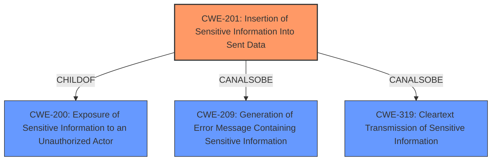

# Analysis Report for CVE-2021-39013

# Vulnerability Analysis Report: CVE-2021-39013

## Description


## Analysis (with Relationship Data)

# Summary
| CWE ID | CWE Name | Confidence | CWE Abstraction Level | CWE Vulnerability Mapping Label | CWE-Vulnerability Mapping Notes |
|---|---|---|---|---|---|
| CWE-201 | Insertion of Sensitive Information Into Sent Data | 0.9 | Base | Allowed | Primary CWE |
| CWE-209 | Generation of Error Message Containing Sensitive Information | 0.7 | Base | Allowed | Secondary Candidate |
| CWE-319 | Cleartext Transmission of Sensitive Information | 0.6 | Base | Allowed | Secondary Candidate |

## Evidence and Confidence

*   **Confidence Score:** 0.8
*   **Evidence Strength:** MEDIUM

## Relationship Analysis
The primary CWE selected is CWE-201 (**Insertion of Sensitive Information Into Sent Data**), a Base level CWE. It is a child of CWE-200 (**Exposure of Sensitive Information to an Unauthorized Actor**). CWE-209 (**Generation of Error Message Containing Sensitive Information**) and CWE-319 (**Cleartext Transmission of Sensitive Information**) are peer CWEs, and were considered as secondary mappings. The Retriever results also suggest CWE-319. The choice of CWE-201 as primary is influenced by the vulnerability description indicating that the sensitive information is being "obtained in HTTP responses," which suggests it's being sent as part of the data.



## Vulnerability Chain
The vulnerability chain starts with the application's **failure to properly sanitize or filter sensitive information** before including it in HTTP responses. This leads to the **exposure of sensitive information** to an authenticated user.

## Summary of Analysis
The initial assessment was to identify the most specific CWE that captures the root cause of the vulnerability. The **Vulnerability Description** mentions that an authenticated user can "obtain sensitive information in HTTP responses." The **CVE Reference Links Content Summary** confirms that the vulnerability allows an authenticated user to obtain "additional information in HTTP responses." This evidence strongly suggests that sensitive information is being included in the data being sent back to the user.

CWE-201 (**Insertion of Sensitive Information Into Sent Data**) directly addresses this scenario, as its description states: "The code transmits data to another actor, but a portion of the data includes sensitive information that should not be accessible to that actor." The **Retriever Results** also list CWE-201 with a good score.

CWE-209 (**Generation of Error Message Containing Sensitive Information**) was considered, but it is more specific to error messages, which is not the primary issue here.
CWE-319 (**Cleartext Transmission of Sensitive Information**) was also considered, but it focuses on the transmission channel being unencrypted, rather than the content itself being sensitive.

The decision to select CWE-201 is based on the direct evidence from the vulnerability description and the alignment of CWE-201's description with the observed behavior. The vulnerability involves the **insertion of sensitive information** into the data being sent, rather than just the transmission being insecure or the generation of error messages.

The selected CWE is at the optimal level of specificity because it directly addresses the **root cause of the vulnerability**: the **inclusion of sensitive information** in sent data (HTTP responses).


## CWE Relationship Analysis

Current CWEs represent these abstraction levels: .


### Vulnerability Chain Analysis

**Chain starting from CWE-200:**
- 200 (Exposure of Sensitive Information to an Unauthorized Actor) - ROOT


**Chain starting from CWE-209:**
- 209 (Generation of Error Message Containing Sensitive Information) - ROOT


### CWE Relationship Diagram

```mermaid
graph TD
    classDef primary fill:#f96,stroke:#333,stroke-width:2px
    classDef secondary fill:#69f,stroke:#333
    classDef tertiary fill:#9e9,stroke:#333
```


*Report generated on 2025-04-02 07:35:56*
