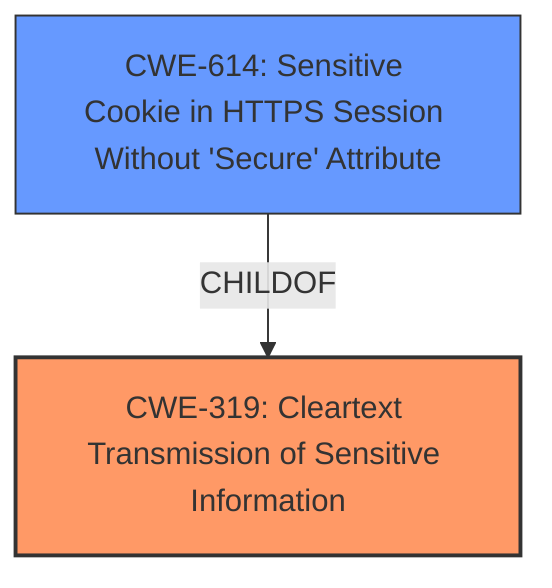

# Analysis for CVE-2021-39026

# Summary
| CWE ID | CWE Name | Confidence | CWE Abstraction Level | CWE Vulnerability Mapping Label | CWE-Vulnerability Mapping Notes |
|---|---|---|---|---|---|
| CWE-319 | Cleartext Transmission of Sensitive Information | 1.0 | Base | Allowed | Primary CWE |
| CWE-614 | Sensitive Cookie in HTTPS Session Without 'Secure' Attribute | 0.7 | Variant | Allowed | Secondary Candidate |

## Evidence and Confidence

*   **Confidence Score:** 0.9
*   **Evidence Strength:** HIGH

## Relationship Analysis
The primary relationship that influenced the CWE selection is the ChildOf relationship between CWE-614 and CWE-319. CWE-614 is a more specific case of CWE-319, however, the vulnerability description focuses on the **failure to properly enable HTTP Strict Transport Security**, which directly prevents cleartext transmission. Thus, CWE-319 is the better fit as the root cause.

## Vulnerability Chain
The vulnerability chain starts with the **failure to properly enable HTTP Strict Transport Security**, leading to potential cleartext transmission of sensitive information. This exposes the system to man-in-the-middle attacks, ultimately resulting in unauthorized access to sensitive data.

## Summary of Analysis
The initial analysis identified CWE-319 as the primary candidate due to the explicit mention of the **failure to properly enable HTTP Strict Transport Security**, which directly relates to cleartext transmission.

The vulnerability description states that the **failure to properly enable HTTP Strict Transport Security** could allow a remote attacker to obtain sensitive information. The CVE Reference Links Content Summary reinforces this by stating that the root cause is an information exposure.

CWE-319 (Cleartext Transmission of Sensitive Information) is a Base level CWE that perfectly aligns with the vulnerability. The relationship analysis and retriever results support this selection. The Retriever Results listed CWE-319 as the top combined result.

CWE-614 (Sensitive Cookie in HTTPS Session Without 'Secure' Attribute) was considered because it is a variant of CWE-319 and also relevant, especially if cookies are involved. However, since the description doesn't specifically mention cookies, but rather the general **failure to properly enable HSTS**, CWE-319 is the more accurate and generalizable root cause. If HSTS was enabled, the cookies would be protected even if they are marked with the secure flag or not.

Therefore, CWE-319 is the optimal level of specificity.

Relevant CWE Information:

# Enhanced Context (25 CWEs)

## CWE-614: Sensitive Cookie in HTTPS Session Without 'Secure' Attribute
**Abstraction Level**: Variant
**Similarity Score**: 0.82
**Source**: dense

**Description**:
The Secure attribute for sensitive cookies in HTTPS sessions is not set, which could cause the user agent to send those cookies in plaintext over an HTTP session.

**Mapping Guidance**:
- Usage: Allowed
- Rationale: This CWE entry is at the Variant level of abstraction, which is a preferred level of abstraction for mapping to the root causes of vulnerabilities.

## CWE-319: Cleartext Transmission of Sensitive Information
**Abstraction Level**: Base
**Similarity Score**: 0.78
**Source**: dense

**Description**:
The product transmits sensitive or security-critical data in cleartext in a communication channel that can be sniffed by unauthorized actors.

**Mapping Guidance**:
- Usage: Allowed
- Rationale: This CWE entry is at the Base level of abstraction, which is a preferred level of abstraction for mapping to the root causes of vulnerabilities.