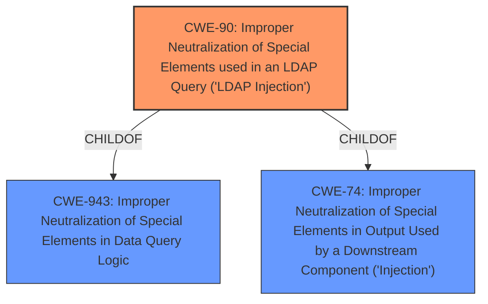

# Enhanced Analysis for CVE-2021-39031

# Summary
| CWE ID | CWE Name | Confidence | CWE Abstraction Level | CWE Vulnerability Mapping Label | CWE-Vulnerability Mapping Notes |
|---|---|---|---|---|---|
| CWE-90 | Improper Neutralization of Special Elements used in an LDAP Query ('LDAP Injection') | 1.0 | Base | Allowed | Primary CWE |
| CWE-74 | Improper Neutralization of Special Elements in Output Used by a Downstream Component ('Injection') | 0.5 | Class | Discouraged | Secondary Candidate |

## Evidence and Confidence

*   **Confidence Score:** 1.0
*   **Evidence Strength:** HIGH

## Relationship Analysis
The primary relationship impacting the decision is the hierarchical one. CWE-90 is a child of CWE-943 (Improper Neutralization of Special Elements in Data Query Logic) which is a Class, while CWE-90 is a Base. The selection of CWE-90 is preferred because it is a more specific description of the vulnerability than its parent. CWE-74 is a high level class that contains many types of injection, making CWE-90 a more specific option.



## Vulnerability Chain
The vulnerability chain involves the IBM WebSphere Application Server Liberty failing to neutralize special elements within an LDAP query, leading to an **LDAP injection** (**ROOT CAUSE**). This allows a remote authenticated attacker to send a specially crafted request, potentially granting unauthorized access to resources (**IMPACT**).

## Summary of Analysis
The initial analysis strongly points to CWE-90 as the primary weakness. The vulnerability description explicitly mentions **LDAP injection**, and the CVE Reference Links Content Summary confirms this as the root cause. The Retriever Results also rank CWE-90 as the top candidate.

CWE-90 directly addresses the **weakness** of **improper neutralization** in LDAP queries. The description of CWE-90, "The product constructs all or part of an LDAP query using externally-influenced input from an upstream component, but it does not neutralize or incorrectly neutralizes special elements that could modify the intended LDAP query when it is sent to a downstream component," aligns perfectly with the vulnerability description.

The mapping guidance for CWE-90 recommends its use, stating that it is at the Base level of abstraction, which is preferred.

CWE-74, while relevant as a general injection category, is less specific than CWE-90. The mapping guidance for CWE-74 discourages its use when lower-level weaknesses are more appropriate. Given the explicit mention of **LDAP injection**, CWE-90 provides a more accurate and granular representation of the vulnerability.

Therefore, based on the evidence, relationship analysis, and mapping guidance, CWE-90 is the most appropriate classification.

Relevant CWE Information:

# Enhanced Context (25 CWEs)

## CWE-90: Improper Neutralization of Special Elements used in an LDAP Query ('LDAP Injection')
**Abstraction:** Base
**Status:** Draft

### Description
The product constructs all or part of an LDAP query using externally-influenced input from an upstream component, but it does not neutralize or incorrectly neutralizes special elements that could modify the intended LDAP query when it is sent to a downstream component.

### Extended Description
Not provided

### Alternative Terms
None

### Relationships
ChildOf -> CWE-943

### Mapping Guidance
**Usage:** Allowed
**Rationale:** This CWE entry is at the Base level of abstraction, which is a preferred level of abstraction for mapping to the root causes of vulnerabilities.
**Comments:** Carefully read both the name and description to ensure that this mapping is an appropriate fit. Do not try to 'force' a mapping to a lower-level Base/Variant simply to comply with this preferred level of abstraction.
**Reasons:**
- Acceptable-Use

### Additional Notes
**[Relationship]** Factors: resultant to special character mismanagement, MAID, or denylist/allowlist problems. Can be primary to authentication and verification errors.

### Observed Examples
- **CVE-2021-41232:** Chain: authentication routine in Go-based agile development product does not escape user name (CWE-116), allowing LDAP injection (CWE-90)
- **CVE-2005-2301:** Server does not properly escape LDAP queries, which allows remote attackers to cause a DoS and possibly conduct an LDAP injection attack.


## CWE Relationship Analysis

Current CWEs represent these abstraction levels: .


### Vulnerability Chain Analysis

**Chain starting from CWE-90:**
- 90 (Improper Neutralization of Special Elements used in an LDAP Query ('LDAP Injection')) - ROOT


**Chain starting from CWE-116:**
- 116 (Improper Encoding or Escaping of Output) - ROOT


### CWE Relationship Diagram

```mermaid
graph TD
    classDef primary fill:#f96,stroke:#333,stroke-width:2px
    classDef secondary fill:#69f,stroke:#333
    classDef tertiary fill:#9e9,stroke:#333
```