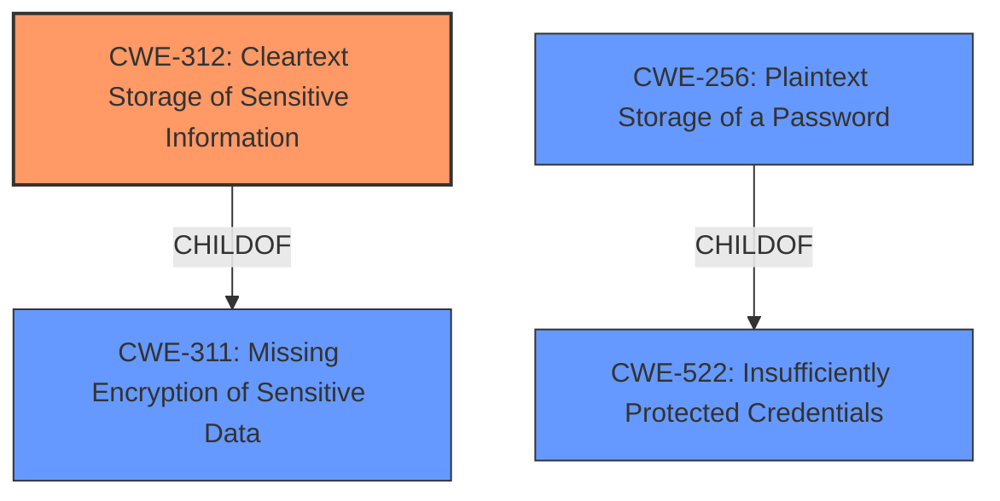

# Raw Analyzer Response for CVE-2021-39046

# Summary
| CWE ID | CWE Name | Confidence | CWE Abstraction Level | CWE Vulnerability Mapping Label | CWE-Vulnerability Mapping Notes |
|---|---|---|---|---|---|
| CWE-312 | Cleartext Storage of Sensitive Information | 1 | Base | Allowed | Primary CWE |
| CWE-256 | Plaintext Storage of a Password | 0.8 | Base | Allowed | Secondary Candidate |
| CWE-522 | Insufficiently Protected Credentials | 0.7 | Class | Allowed-with-Review | Secondary Candidate |

## Evidence and Confidence

*   **Confidence Score:** 0.9
*   **Evidence Strength:** HIGH

## Relationship Analysis
The primary CWE is CWE-312 **Cleartext Storage of Sensitive Information**, which is a Base level CWE. CWE-312 is a child of CWE-311 **Missing Encryption of Sensitive Data**. CWE-256 **Plaintext Storage of a Password** is a child of CWE-522 **Insufficiently Protected Credentials**.
The relationship analysis shows a hierarchical relationship, where the Class level CWEs (CWE-522, CWE-311) have more specific Base level CWEs (CWE-312, CWE-256) as children.

## Vulnerability Chain
The vulnerability chain starts with the **weakness** of **storing user credentials in plain clear text**. The impact of this is that a privileged user can read the credentials, leading to potential unauthorized access.

## Summary of Analysis
The vulnerability description clearly states that the IBM products **store user credentials in plain clear text**. The **Vulnerability Description Key Phrases** section also highlights this **weakness**. The **CVE Reference Links Content Summary** confirms that the root cause is an unspecified flaw leading to information disclosure.

The Retriever Results list CWE-312 **Cleartext Storage of Sensitive Information** as the top match based on dense retrieval, and #6 overall. The vulnerability description aligns directly with the description of CWE-312, "The product stores sensitive information in cleartext within a resource that might be accessible to another control sphere." This makes it the most appropriate primary CWE.

CWE-256 **Plaintext Storage of a Password** is also a good match, and is a more specific type of CWE-312, but since the vulnerability description refers to user credentials in general and not specifically passwords, CWE-312 is a slightly better fit.

CWE-522 **Insufficiently Protected Credentials** is a Class level CWE that can be considered because it is a parent of CWE-256. However, since the credentials are not just insufficiently protected, but stored in cleartext, a more specific Base level CWE is preferred.

I am overriding the general mapping guidance to prefer CWE-312 over CWE-256, due to the vulnerability description referring to more than just passwords.
CWE-319 **Cleartext Transmission of Sensitive Information**, CWE-209 **Generation of Error Message Containing Sensitive Information**, CWE-532 **Insertion of Sensitive Information into Log File**, CWE-756 **Missing Custom Error Page**, CWE-613 **Insufficient Session Expiration**, CWE-614 **Sensitive Cookie in HTTPS Session Without 'Secure' Attribute**, and CWE-326 **Inadequate Encryption Strength** do not accurately describe the **weakness** of **storing user credentials in plain clear text**, so they are not considered.

Relevant CWE Information:

# Enhanced Context (25 CWEs)

## CWE-312: Cleartext Storage of Sensitive Information
**Abstraction Level**: Base
**Similarity Score**: 0.80
**Source**: dense

**Description**:
The product stores sensitive information in cleartext within a resource that might be accessible to another control sphere.

**Mapping Guidance**:
- Usage: Allowed
- Rationale: This CWE entry is at the Base level of abstraction, which is a preferred level of abstraction for mapping to the root causes of vulnerabilities.

## CWE-256: Plaintext Storage of a Password
**Abstraction Level**: base
**Similarity Score**: 2.47
**Source**: graph

**Description**:
CWE-256: Plaintext Storage of a Password

**Mapping Guidance**:
- Usage: Allowed
- Rationale: This CWE entry is at the Base level of abstraction, which is a preferred level of abstraction for mapping to the root causes of vulnerabilities.

## CWE-522: Insufficiently Protected Credentials
**Abstraction:** Class
**Status:** Incomplete

### Description
The product transmits or stores authentication credentials, but it uses an insecure method that is susceptible to unauthorized interception and/or retrieval.

### Mapping Guidance
**Usage:** Allowed-with-Review
**Rationale:** This CWE entry is a Class and might have Base-level children that would be more appropriate