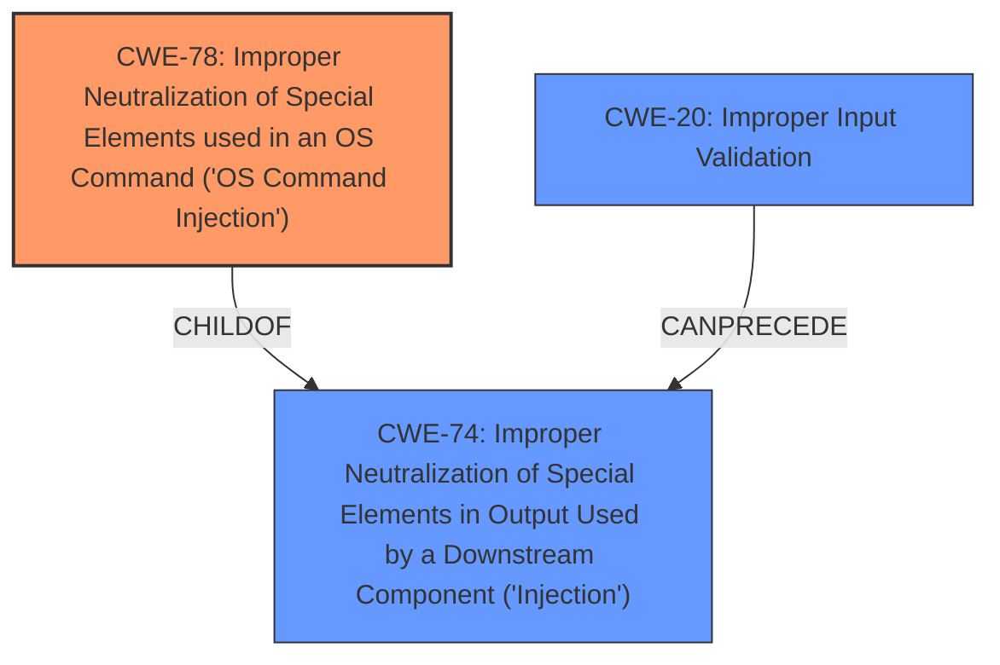

# Enhanced Analysis for CVE-2021-39065

# Summary
| CWE ID | CWE Name | Confidence | CWE Abstraction Level | CWE Vulnerability Mapping Label | CWE-Vulnerability Mapping Notes |
|---|---|---|---|---|---|
| CWE-78 | Improper Neutralization of Special Elements used in an OS Command ('OS Command Injection') | 1.0 | Base | Allowed | Primary CWE |
| CWE-20 | Improper Input Validation | 0.7 | Class | Discouraged | Secondary Candidate |

## Evidence and Confidence

*   **Confidence Score:** 0.85
*   **Evidence Strength:** HIGH

## Relationship Analysis
The primary relationship that influenced my decision was that CWE-78 [Improper Neutralization of Special Elements used in an OS Command ('OS Command Injection')] is a child of CWE-74 [Improper Neutralization of Special Elements in Output Used by a Downstream Component ('Injection')]. CWE-78 is at the Base level of abstraction, which is preferred. CWE-20 [Improper Input Validation] is a Class level of abstraction and is too general.



## Vulnerability Chain
The vulnerability chain starts with **improper validation of user-supplied input** (CWE-20) leading to the ability to inject arbitrary shell commands, which then results in arbitrary command execution (CWE-78).

## Summary of Analysis
The initial assessment identified that the **improper validation of user-supplied input** leads to arbitrary command execution. The key phrase from the vulnerability description is "**improper validation of user-supplied input** by the Spectrum Copy Data Management Admin Console login and uploadcertificate function . A remote attacker could inject arbitrary shell commands which would be executed on the affected system."

The Retriever Results suggest CWE-20 [Improper Input Validation] and CWE-78 [Improper Neutralization of Special Elements used in an OS Command ('OS Command Injection')].

CWE-20 [Improper Input Validation] is a Class, and the Mapping Guidance states it is Discouraged. The guidance also says, "CWE-20 is commonly misused in low-information vulnerability reports when lower-level CWEs could be used instead, or when more details about the vulnerability are available [REF-1287]. It is not useful for trend analysis. It is also a level-1 Class (i.e., a child of a Pillar)." The description provides enough detail to select the more specific CWE-78 [Improper Neutralization of Special Elements used in an OS Command ('OS Command Injection')], since the attacker can inject shell commands.

CWE-78 [Improper Neutralization of Special Elements used in an OS Command ('OS Command Injection')] is a Base level of abstraction, which is preferred. The description matches, "The product constructs all or part of an OS command using externally-influenced input from an upstream component, but it does not neutralize or incorrectly neutralizes special elements that could modify the intended OS command when it is sent to a downstream component."

CWE-78 is at the optimal level of specificity because it directly addresses the root cause of the vulnerability: the failure to properly neutralize special elements in user-supplied input when constructing OS commands. This allows for command injection and subsequent execution of arbitrary commands. The evidence from the vulnerability description and the CWE specifications strongly supports this classification.


## CWE Relationship Analysis

Current CWEs represent these abstraction levels: .


### Vulnerability Chain Analysis

**Chain starting from CWE-78:**
- 78 (Improper Neutralization of Special Elements used in an OS Command ('OS Command Injection')) - ROOT


**Chain starting from CWE-74:**
- 74 (Improper Neutralization of Special Elements in Output Used by a Downstream Component ('Injection')) - ROOT


### CWE Relationship Diagram

```mermaid
graph TD
    classDef primary fill:#f96,stroke:#333,stroke-width:2px
    classDef secondary fill:#69f,stroke:#333
    classDef tertiary fill:#9e9,stroke:#333
```