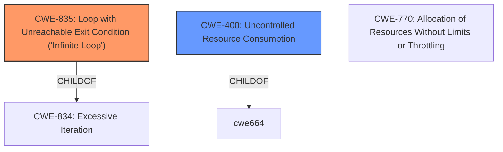

# Analysis Report for CVE-2021-3908

# Vulnerability Analysis Report: CVE-2021-3908

## Description


## Analysis (with Relationship Data)

# Summary
| CWE ID  | CWE Name                                                    | Confidence | CWE Abstraction Level | CWE Vulnerability Mapping Label | CWE-Vulnerability Mapping Notes |
| :-------- | :---------------------------------------------------------- | :--------- | :---------------------- | :------------------------------ | :------------------------------ |
| CWE-835   | Loop with Unreachable Exit Condition ('Infinite Loop')       | 0.9        | Base                    | Primary CWE                     | Allowed                       |
| CWE-400   | Uncontrolled Resource Consumption                           | 0.7        | Class                   | Secondary Candidate             | Discouraged                   |

## Evidence and Confidence

*   **Confidence Score:** 0.8
*   **Evidence Strength:** HIGH

## Relationship Analysis
The primary CWE selected is CWE-835, which represents the **infinite loop** condition caused by the lack of depth limitation in certificate chain processing. This is directly linked to the vulnerability description, making it the most accurate representation of the **root cause**. CWE-835 is a child of CWE-834 (Excessive Iteration), indicating that the infinite loop is a specific type of excessive iteration. CWE-400 is a parent to CWE-770 (Allocation of Resources Without Limits or Throttling), which could be a more specific child.



## Vulnerability Chain
The vulnerability chain starts with the **lack of a depth limit** in certificate chain processing, leading to an **infinite loop**, which then results in **resource exhaustion** and ultimately a **denial-of-service (DoS)**.

## Summary of Analysis
Initially, CWE-400 (Uncontrolled Resource Consumption) seemed like a good fit, especially since the CVE Reference Links Content Summary explicitly mentions it. However, upon closer inspection, the **root cause** is the **infinite loop** caused by the **failure to limit certificate chain depth**. Therefore, CWE-835 (Loop with Unreachable Exit Condition ('Infinite Loop')) is the more precise and accurate classification.

The evidence supporting this decision is:

*   Vulnerability Description: "OctoRPKI does not limit the depth of a certificate chain, allowing for a CA to create children in an ad-hoc fashion, thereby making tree traversal never end."
*   CVE Reference Links Content Summary: "Infinite Loop/Resource Exhaustion: The core issue is the lack of a depth limit in certificate chain traversal within OctoRPKI. This can cause the program to enter an infinite loop when processing a crafted chain, leading to resource exhaustion and a denial-of-service (DoS) condition."

CWE-835 is at the Base level of abstraction, which is the preferred level. While CWE-400 is also relevant as it describes the impact, it's a higher-level class and less specific to the **root cause** of the vulnerability.

# Relevant CWE Information:

The following CWEs were identified as potentially relevant to this vulnerability:

## CWE-610: Externally Controlled Reference to a Resource in Another Sphere
**Abstraction Level**: Class
**Similarity Score**: 0.77
**Source**: dense
**Description**: The product uses an externally controlled name or reference that resolves to a resource that is outside of the intended control sphere.
**Mapping Guidance**:
- Usage: Discouraged
- Rationale: This CWE entry is a level-1 Class (i.e., a child of a Pillar). It might have lower-level children that would be more appropriate

*Not Selected*: This CWE doesn't directly describe the **infinite loop** condition caused by the lack of depth limitation in certificate chain processing.

## CWE-668: Exposure of Resource to Wrong Sphere
**Abstraction Level**: Class
**Similarity Score**: 0.76
**Source**: dense
**Description**: The product exposes a resource to the wrong control sphere, providing unintended actors with inappropriate access to the resource.
**Mapping Guidance**:
- Usage: Discouraged
- Rationale: CWE-668 is high-level and is often misused as a catch-all when lower-level CWE IDs might be applicable. It is sometimes used for low-information vulnerability reports [REF-1287]. It is a level-1 Class (i.e., a child of a Pillar). It is not useful for trend analysis.

*Not Selected*: This CWE is too general and doesn't describe the specific weakness.

## CWE-1289: Improper Validation of Unsafe Equivalence in Input
**Abstraction Level**: Base
**Similarity Score**: 0.76
**Source**: dense
**Description**: The product receives an input value that is used as a resource identifier or other type of reference, but it does not validate or incorrectly validates that the input is equivalent to a potentially-unsafe value.
**Mapping Guidance**:
- Usage: Allowed
- Rationale: This CWE entry is at the Base level of abstraction, which is a preferred level of abstraction for mapping to the root causes of vulnerabilities.

*Not Selected*: This CWE doesn't describe the **infinite loop** condition caused by the lack of depth limitation in certificate chain processing.

## CWE-404: Improper Resource Shutdown or Release
**Abstraction Level**: Class
**Similarity Score**: 0.76
**Source**: dense
**Description**: The product does not release or incorrectly releases a resource before it is made available for re-use.
**Mapping Guidance**:
- Usage: Allowed-with-Review
- Rationale: This CWE entry is a Class and might have Base-level children that would be more appropriate

*Not Selected*: This CWE doesn't describe the **infinite loop** condition caused by the lack of depth limitation in certificate chain processing.

## CWE-41: Improper Resolution of Path Equivalence
**Abstraction Level**: Base
**Similarity Score**: 0.76
**Source**: dense
**Description**: The product is vulnerable to file system contents disclosure through path equivalence. Path equivalence involves the use of special characters in file and directory names. The associated manipulations are intended to generate multiple names for the same object.
**Mapping Guidance**:
- Usage: Allowed
- Rationale: This CWE entry is at the Base level of abstraction, which is a preferred level of abstraction for mapping to the root causes of vulnerabilities.

*Not Selected*: This CWE is not relevant to the vulnerability.

## CWE-664: Improper Control of a Resource Through its Lifetime
**Abstraction Level**: Pillar
**Similarity Score**: 0.76
**Source**: dense
**Description**: The product does not maintain or incorrectly maintains control over a resource throughout its lifetime of creation, use, and release.
**Mapping Guidance**:
- Usage: Discouraged
- Rationale: This CWE entry is high-level when lower-level children are available.

*Not Selected*: This CWE is too abstract.

## CWE-807: Reliance on Untrusted Inputs in a Security Decision
**Abstraction Level**: Base
**Similarity Score**: 0.76
**Source**: dense
**Description**: The product uses a protection mechanism that relies on the existence or values of an input, but the input can be modified by an untrusted actor in a way that bypasses the protection mechanism.
**Mapping Guidance**:
- Usage: Allowed
- Rationale: This CWE entry is at the Base level of abstraction, which is a preferred level of abstraction for mapping to the root causes of vulnerabilities.

*Not Selected*: This CWE is not relevant to the vulnerability.

## CWE-345: Insufficient Verification of Data Authenticity
**Abstraction Level**: Class
**Similarity Score**: 0.75
**Source**: dense
**Description**: The product does not sufficiently verify the origin or authenticity of data, in a way that causes it to accept invalid data.
**Mapping Guidance**:
- Usage: Discouraged
- Rationale: This CWE entry is a level-1 Class (i.e., a child of a Pillar). It might have lower-level children that would be more appropriate

*Not Selected*: This CWE doesn't describe the **infinite loop** condition caused by the lack of depth limitation in certificate chain processing.

## CWE-923: Improper Restriction of Communication Channel to Intended Endpoints
**Abstraction Level**: Class
**Similarity Score**: 0.75
**Source**: dense
**Description**: The product establishes a communication channel to (or from) an endpoint for privileged or protected operations, but it does not properly ensure that it is communicating with the correct endpoint.
**Mapping Guidance**:
- Usage: Allowed-with-Review
- Rationale: This CWE entry is a Class and might have Base-level children that would be more appropriate

*Not Selected*: This CWE is not relevant to the vulnerability.

##


## CWE Relationship Analysis

Current CWEs represent these abstraction levels: .


### Vulnerability Chain Analysis

**Chain starting from CWE-664:**
- 664 (Improper Control of a Resource Through its Lifetime) - ROOT


**Chain starting from CWE-404:**
- 404 (Improper Resource Shutdown or Release) - ROOT


### CWE Relationship Diagram

```mermaid
graph TD
    classDef primary fill:#f96,stroke:#333,stroke-width:2px
    classDef secondary fill:#69f,stroke:#333
    classDef tertiary fill:#9e9,stroke:#333
```


*Report generated on 2025-04-02 08:01:21*
