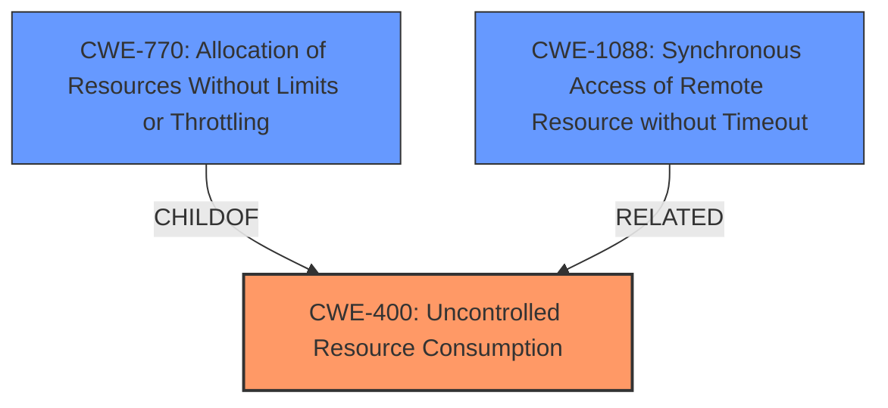

# Enhanced Analysis for CVE-2021-3909

# Summary
| CWE ID | CWE Name | Confidence | CWE Abstraction Level | CWE Vulnerability Mapping Label | CWE-Vulnerability Mapping Notes |
|---|---|---|---|---|---|
| CWE-400 | Uncontrolled Resource Consumption | 0.8 | Class | Primary | Allowed-with-Review |
| CWE-770 | Allocation of Resources Without Limits or Throttling | 0.7 | Base | Secondary | Allowed |
| CWE-1088 | Synchronous Access of Remote Resource without Timeout | 0.6 | Base | Secondary | Allowed |

## Evidence and Confidence

*   **Confidence Score:** 0.8
*   **Evidence Strength:** HIGH

## Relationship Analysis
The primary CWE selected is CWE-400, which is a Class-level CWE. While CWE-400 is discouraged for direct mapping due to its high-level nature, in this case, the vulnerability description directly discusses uncontrolled resource consumption as the core issue. CWE-770, a child of CWE-400, provides more specific detail about the lack of limits or throttling on resource allocation. CWE-1088 describes the specific case of a synchronous access of remote resources without a timeout. These relationships help to refine the understanding of the vulnerability from a general resource consumption issue to a more specific allocation problem and finally to the specific lack of timeouts.



## Vulnerability Chain
The vulnerability chain starts with the **lack of connection limits** in OctoRPKI. This leads to the ability for an attacker to perform a **slowloris DOS attack** which leads to **uncontrolled resource consumption**, specifically where OctoRPKI will **wait forever** for a response from a repository. The chain can be summarized as: **Lack of Connection Limit** -> **Slowloris Attack** -> **Uncontrolled Resource Consumption** -> **Denial of Service**.

## Summary of Analysis
The initial analysis pointed towards CWE-400 due to the clear indication of resource exhaustion in both the vulnerability description and the CVE reference summary. The CVE summary explicitly mentions "Resource exhaustion" and "Denial of Service" as impacts. The key phrase "OctoRPKI does not limit the length of a connection" indicates a **lack of control over resource allocation**.

The Retriever results also highlighted CWE-400 as the top candidate, albeit with a discouraged usage. However, the rationale for discouragement of CWE-400 is that it's often misused as a catch-all. In this specific case, the description clearly details a scenario of uncontrolled resource consumption, making it more appropriate.

CWE-770 and CWE-1088 were also considered. CWE-770, a child of CWE-400, is "Allocation of Resources Without Limits or Throttling," which aligns with the **lack of connection limits** in OctoRPKI. CWE-1088, "Synchronous Access of Remote Resource without Timeout," is relevant given the **slowloris attack** keeps connections open indefinitely.

The final decision is to map to CWE-400 as the primary, with CWE-770 and CWE-1088 as secondary mappings to provide greater specificity. The abstraction levels of Class and Base respectively make these suitable to describe the **uncontrolled resource consumption**.

Relevant CWE Information:

# Enhanced Context (25 CWEs)
The following CWEs were identified as potentially relevant to this vulnerability:

## CWE-668: Exposure of Resource to Wrong Sphere
**Abstraction Level**: Class
**Similarity Score**: 0.77
**Source**: dense

**Description**:
The product exposes a resource to the wrong control sphere, providing unintended actors with inappropriate access to the resource.

**Mapping Guidance**:
- Usage: Discouraged
- Rationale: CWE-668 is high-level and is often misused as a catch-all when lower-level CWE IDs might be applicable. It is sometimes used for low-information vulnerability reports [REF-1287]. It is a level-1 Class (i.e., a child of a Pillar). It is not useful for trend analysis.

*Not selected*: This is too generic and doesn't fit the specific context of resource exhaustion due to lack of connection limits.

## CWE-405: Asymmetric Resource Consumption (Amplification)
**Abstraction Level**: Class
**Similarity Score**: 0.77
**Source**: dense

**Description**:
The product does not properly control situations in which an adversary can cause the product to consume or produce excessive resources without requiring the adversary to invest equivalent work or otherwise prove authorization, i.e., the adversary's influence is "asymmetric."

**Mapping Guidance**:
- Usage: Allowed-with-Review
- Rationale: This CWE entry is a Class and might have Base-level children that would be more appropriate

*Not selected*: While the slowloris attack does involve asymmetric resource consumption, the root cause is more directly related to the lack of resource limits, rather than the asymmetry.

## CWE-614: Sensitive Cookie in HTTPS Session Without 'Secure' Attribute
**Abstraction Level**: Variant
**Similarity Score**: 0.76
**Source**: dense

**Description**:
The Secure attribute for sensitive cookies in HTTPS sessions is not set, which could cause the user agent to send those cookies in plaintext over an HTTP session.

**Mapping Guidance**:
- Usage: Allowed
- Rationale: This CWE entry is at the Variant level of abstraction, which is a preferred level of abstraction for mapping to the root causes of vulnerabilities.

*Not selected*: This is irrelevant to the vulnerability.

## CWE-226: Sensitive Information in Resource Not Removed Before Reuse
**Abstraction Level**: Base
**Similarity Score**: 0.76
**Source**: dense

**Description**:
The product releases a resource such as memory or a file so that it can be made available for reuse, but it does not clear or "zeroize" the information contained in the resource before the product performs a critical state transition or makes the resource available for reuse by other entities.

**Mapping Guidance**:
- Usage: Allowed
- Rationale: This CWE entry is at the Base level of abstraction, which is a preferred level of abstraction for mapping to the root causes of vulnerabilities.

*Not selected*: This is not relevant to the vulnerability.

## CWE-799: Improper Control of Interaction Frequency
**Abstraction Level**: Class
**Similarity Score**: 0.76
**Source**: dense

**Description**:
The product does not properly limit the number or frequency of interactions that it has with an actor, such as the number of incoming requests.

**Mapping Guidance**:
- Usage: Allowed-with-Review
- Rationale: This CWE entry is a Class and might have Base-level children that would be more appropriate

*Not selected*: While related, the core issue is not the frequency of interactions, but the duration of a single connection, making CWE-1088 a better fit.

## CWE-404: Improper Resource Shutdown or Release
**Abstraction Level**: Class
**Similarity Score**: 0.76
**Source**: dense

**Description**:
The product does not release or incorrectly releases a resource before it is made available for re-use.

**Mapping Guidance**:
- Usage: Allowed-with-Review
- Rationale: This CWE entry is a Class and might have Base-level children that would be more appropriate

*Not selected*: This is not the primary issue; the connections are not being timed out, rather than incorrectly released.

## CWE-203: Observable Discrepancy
**Abstraction Level**: Base
**Similarity Score**: 0.76
**Source**: dense

**Description**:
The product behaves differently or sends different responses under different circumstances in a way that is observable to an unauthorized actor, which exposes security-relevant information about the state of the product, such as whether a particular operation was successful or not.

**Mapping Guidance**:
- Usage: Allowed
- Rationale: This CWE entry is at the Base level of abstraction, which is a preferred level of abstraction for mapping to the root causes of vulnerabilities.

*Not selected*: This is not related to the vulnerability.

## CWE-319: Cleartext Transmission of Sensitive Information
**Abstraction Level**: Base
**Similarity Score**: 0.75
**Source**: dense

**Description**:
The product transmits sensitive or security-critical data in cleartext in a communication channel that can be sniffed by unauthorized actors.

**Mapping Guidance**:
- Usage: Allowed
- Rationale: This CWE entry is at the Base level of abstraction, which is a preferred level of abstraction for mapping to the root causes of vulnerabilities.


## CWE Relationship Analysis

Current CWEs represent these abstraction levels: .


### Vulnerability Chain Analysis

**Chain starting from CWE-1088:**
- 1088 (Synchronous Access of Remote Resource without Timeout) - ROOT


**Chain starting from CWE-614:**
- 614 (Sensitive Cookie in HTTPS Session Without 'Secure' Attribute) - ROOT


### CWE Relationship Diagram

```mermaid
graph TD
    classDef primary fill:#f96,stroke:#333,stroke-width:2px
    classDef secondary fill:#69f,stroke:#333
    classDef tertiary fill:#9e9,stroke:#333
```