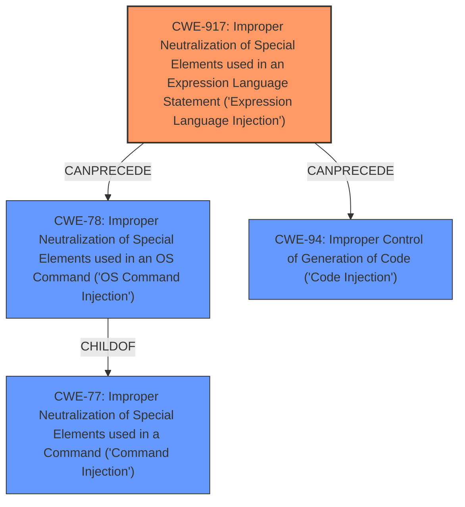

# Analysis Report for CVE-2021-39114

# Vulnerability Analysis Report: CVE-2021-39114

## Description


## Analysis (with Relationship Data)

# Summary

| CWE ID | CWE Name | Confidence | CWE Abstraction Level | CWE Vulnerability Mapping Label | CWE-Vulnerability Mapping Notes |
|---|---|---|---|---|---|
| CWE-917 | Improper Neutralization of Special Elements used in an Expression Language Statement ('Expression Language Injection') | 1.0 | Base | Allowed | Primary CWE |
| CWE-78 | Improper Neutralization of Special Elements used in an OS Command ('OS Command Injection') | 0.7 | Base | Allowed | Secondary Candidate |
| CWE-77 | Improper Neutralization of Special Elements used in a Command ('Command Injection') | 0.6 | Class | Allowed-with-Review | Secondary Candidate |
| CWE-94 | Improper Control of Generation of Code ('Code Injection') | 0.5 | Base | Allowed-with-Review | Secondary Candidate |

## Evidence and Confidence

*   **Confidence Score:** 0.9
*   **Evidence Strength:** HIGH

## Relationship Analysis

The primary CWE is CWE-917, which is a base-level CWE detailing the **improper neutralization of special elements used in an expression language statement**. This is directly applicable because the vulnerability involves OGNL injection. CWE-78, CWE-77, and CWE-94 are related due to the resulting **command injection** or **code injection** that can occur from the improper neutralization, but the root cause is directly related to the OGNL injection.



## Vulnerability Chain

The vulnerability chain starts with the **improper neutralization of special elements** in the OGNL expression, which is then used to inject commands to be executed at the OS level, allowing for arbitrary command execution.
  - **Root Cause:** CWE-917: Improper Neutralization of Special Elements used in an Expression Language Statement ('Expression Language Injection')
  - **Impact:** CWE-78: Improper Neutralization of Special Elements used in an OS Command ('OS Command Injection') or CWE-94: Improper Control of Generation of Code ('Code Injection')

## Summary of Analysis

The initial assessment identified CWE-917 as the primary weakness, which aligns with the vulnerability description and the "CVE Reference Links Content Summary". The vulnerability is due to the **improper neutralization of special elements** within an OGNL payload, which allows attackers to execute arbitrary code.

The evidence for CWE-917 is strong, based on the vulnerability description, which explicitly mentions OGNL injection: "users with a valid account on a Confluence Data Center instance to execute arbitrary Java code or run arbitrary system commands by injecting an OGNL payload." The "CVE Reference Links Content Summary" confirms that the root cause is the "OGNL injection vulnerability." This aligns perfectly with the description of CWE-917, which states: "The product constructs all or part of an expression language (EL) statement in a framework such as a Java Server Page (JSP) using externally-influenced input from an upstream component, but it does not neutralize or incorrectly neutralizes special elements that could modify the intended EL statement before it is executed."

The relationships between CWEs further influenced the selection. While command injection (CWE-78) and code injection (CWE-94) are potential impacts of the OGNL injection, the root cause is the **improper neutralization** in the expression language statement. Therefore, CWE-917 is the most specific and appropriate CWE to represent this vulnerability.

The MITRE mapping guidance for CWE-917 states: "This CWE entry is at the Base level of abstraction, which is a preferred level of abstraction for mapping to the root causes of vulnerabilities." This confirms that CWE-917 is the correct level of specificity for this vulnerability.

Other CWEs considered but not used:

*   CWE-79 (Improper Neutralization of Input During Web Page Generation ('Cross-site Scripting')): While injection is involved, this is not specifically related to web page generation, so it is not the best fit.
*   CWE-78 (Improper Neutralization of Special Elements used in an OS Command ('OS Command Injection')): This could be a consequence of the OGNL injection, but the root cause is the OGNL injection itself.

Relevant CWE Information:

## CWE-917: Improper Neutralization of Special Elements used in an Expression Language Statement ('Expression Language Injection')
**Abstraction Level**: Base
**Similarity Score**: 0.78
**Source**: dense

**Description**:
The product constructs all or part of an expression language (EL) statement in a framework such as a Java Server Page (JSP) using externally-influenced input from an upstream component, but it does not neutralize or incorrectly neutralizes special elements that could modify the intended EL statement before it is executed.

**Mapping Guidance**:
- Usage: Allowed
- Rationale: This CWE entry is at the Base level of abstraction, which is a preferred level of abstraction for mapping to the root causes of vulnerabilities.


## CWE Relationship Analysis

Current CWEs represent these abstraction levels: .


### Vulnerability Chain Analysis

**Chain starting from CWE-79:**
- 79 (Improper Neutralization of Input During Web Page Generation ('Cross-site Scripting')) - ROOT


**Chain starting from CWE-78:**
- 78 (Improper Neutralization of Special Elements used in an OS Command ('OS Command Injection')) - ROOT


### CWE Relationship Diagram

```mermaid
graph TD
    classDef primary fill:#f96,stroke:#333,stroke-width:2px
    classDef secondary fill:#69f,stroke:#333
    classDef tertiary fill:#9e9,stroke:#333
```


*Report generated on 2025-04-02 00:00:46*
