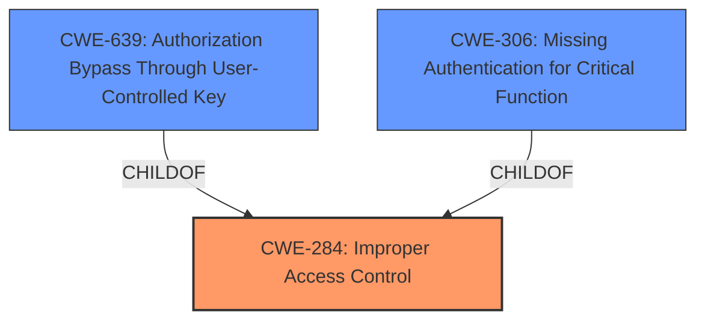

# Enhanced Analysis for CVE-2021-39127

# Summary
| CWE ID  | CWE Name                                                                                            | Confidence | CWE Abstraction Level | CWE Vulnerability Mapping Label | CWE-Vulnerability Mapping Notes |
| :-------- | :-------------------------------------------------------------------------------------------------- | :---------- | :----------------------- | :-------------------------------- | :------------------------------ |
| CWE-284   | Improper Access Control                                                                           | 0.75       | Pillar                   | Primary                             | Discouraged                    |
| CWE-639 | Authorization Bypass Through User-Controlled Key | 0.65       | Base                   | Secondary                              | Allowed                    |
| CWE-306   | Missing Authentication for Critical Function                                                        | 0.6       | Base                   | Secondary                             | Allowed                    |

## Evidence and Confidence

*   **Confidence Score:** 0.7
*   **Evidence Strength:** MEDIUM

## Relationship Analysis
The primary relationship influencing the CWE selection is the hierarchical relationship. CWE-284 is a Pillar, with CWE-639 and CWE-306 being potential children. The vulnerability is rooted in **broken access control**, which is a broad term. While CWE-284 is discouraged due to its high-level nature, it accurately captures the fundamental issue. CWE-639 (Authorization Bypass Through User-Controlled Key) is a base CWE, which is more specific, but might not be the exact fit since the access isn't necessarily "bypassing" through a user-controlled *key*, but rather missing an authorization check altogether for anonymous users. CWE-306 (Missing Authentication for Critical Function) captures the scenario where no authentication is required. This aligns well with the fact that the JQL endpoint allows anonymous access, effectively missing authentication altogether.



## Vulnerability Chain
The vulnerability chain is straightforward:
1.  **Root Cause:** **Broken Access Control** due to missing authentication or improper authorization.
2.  **Weakness:** Unauthenticated access to the JQL endpoint.
3.  **Impact:** Anonymous remote attackers can access the query component.

## Summary of Analysis
The initial analysis focused on the **root cause** of the vulnerability, which is described as a **broken access control** (BAC) vulnerability. The evidence from the vulnerability description and CVE Reference Links Content Summary clearly points to this. The selection process involved evaluating several CWEs related to access control and authentication.

The provided evidence states:
*   "Affected versions of Atlassian Jira Server and Data Center allow anonymous remote attackers to the query component JQL endpoint via a **Broken Access Control** vulnerability (BAC) vulnerability."
*   "**Root cause of vulnerability**: **Broken Access Control** (BAC) vulnerability in the query component JQL endpoint."
*   "**Weaknesses/vulnerabilities present**: Unauthenticated/anonymous access to the JQL endpoint."

The retriever results suggested several potential CWEs. CWE-284, CWE-639, and CWE-306 were considered.

CWE-284 is a high-level class (Pillar), which is discouraged, but it's the only one that is close to the **rootcause** **broken access control**. The specific nature of **broken access control** in this case seems to be closer to not having access control for anonymous user.

CWE-639 is "Authorization Bypass Through User-Controlled Key". This is a Base level CWE, and more specific. However, the vulnerability description does not mention a user-controlled key. The vulnerability is that anonymous user can access the JQL endpoint without any authentication. This CWE might be applicable if an attacker is bypassing authorization by manipulating keys, which is not explicitly stated in the vulnerability description.

CWE-306 is "Missing Authentication for Critical Function". This CWE directly addresses the issue where authentication is missing for a critical function. The JQL endpoint is accessible without any authentication, allowing anonymous remote attackers to access it. This aligns directly with the description of CWE-306.

The graph relationships highlight the hierarchical structure, showing that CWE-639 and CWE-306 are children of the more general CWE-284.

The final decision favors CWE-284 as the primary mapping due to it representing the term **broken access control** from the vulnerability description and CWE-306 as a secondary mapping because it is a specific type of access control that is missing, authentication.

Relevant CWE Information:

# Enhanced Context (25 CWEs)
The following CWEs were identified as potentially relevant to this vulnerability:

## CWE-303: Incorrect Implementation of Authentication Algorithm
**Abstraction Level**: Base
**Similarity Score**: 0.78
**Source**: dense

**Description**:
The requirements for the product dictate the use of an established authentication algorithm, but the implementation of the algorithm is incorrect.

**Mapping Guidance**:
- Usage: Allowed
- Rationale: This CWE entry is at the Base level of abstraction, which is a preferred level of abstraction for mapping to the root causes of vulnerabilities.

## CWE-1391: Use of Weak Credentials
**Abstraction Level**: Class
**Similarity Score**: 0.77
**Source**: dense

**Description**:
The product uses weak credentials (such as a default key or hard-coded password) that can be calculated, derived, reused, or guessed by an attacker.

**Mapping Guidance**:
- Usage: Allowed-with-Review
- Rationale: This CWE entry is a Class and might have Base-level children that would be more appropriate

## CWE-345: Insufficient Verification of Data Authenticity
**Abstraction Level**: Class
**Similarity Score**: 0.77
**Source**: dense

**Description**:
The product does not sufficiently verify the origin or authenticity of data, in a way that causes it to accept invalid data.

**Mapping Guidance**:
- Usage: Discouraged
- Rationale: This CWE entry is a level-1 Class (i.e., a child of a Pillar). It might have lower-level children that would be more appropriate

## CWE-1240: Use of a Cryptographic Primitive with a Risky Implementation
**Abstraction Level**: Base
**Similarity Score**: 0.77
**Source**: dense

**Description**:
To fulfill the need for a cryptographic primitive, the product implements a cryptographic algorithm using a non-standard, unproven, or disallowed/non-compliant cryptographic implementation.

**Mapping Guidance**:
- Usage: Allowed
- Rationale: This CWE entry is at the Base level of abstraction, which is a preferred level of abstraction for mapping to the root causes of vulnerabilities.

## CWE-328: Use of Weak Hash
**Abstraction Level**: Base
**Similarity Score**: 0.77
**Source**: dense

**Description**:
The product uses an algorithm that produces a digest (output value) that does not meet security expectations for a hash function that allows an adversary to reasonably determine the original input (preimage attack), find another input that can produce the same hash (2nd preimage attack), or find multiple inputs that evaluate to the same hash (birthday attack).

**Mapping Guidance**:
- Usage: Allowed
- Rationale: This CWE entry is at the Base level of abstraction, which is a preferred level of abstraction for mapping to the root causes of vulnerabilities.

## CWE-807: Reliance on Untrusted Inputs in a Security Decision
**Abstraction Level**: Base
**Similarity Score**: 0.77
**Source**: dense

**Description**:
The product uses a protection mechanism that relies on the existence or values of an input, but the input can be modified by an untrusted actor in a way that bypasses the protection mechanism.

**Mapping Guidance**:
- Usage: Allowed
- Rationale: This CWE entry is at the Base level of abstraction, which is a preferred level of abstraction for mapping to the root causes of vulnerabilities.

## CWE-319: Cleartext Transmission of Sensitive Information
**Abstraction Level**: Base
**Similarity Score**: 0.77
**Source**: dense

**Description**:
The product transmits sensitive or security-critical data in cleartext in a communication channel that can be sniffed by unauthorized actors.

**Mapping Guidance**:
- Usage: Allowed
- Rationale: This CWE entry is at the Base level of abstraction, which is a preferred level of abstraction for mapping to the root causes of vulnerabilities.

## CWE-330: Use of Insufficiently Random Values
**Abstraction Level**: Class
**Similarity Score**: 0.76
**Source**: dense

**Description**:
The product uses insufficiently random numbers or values in a security context that depends on unpredictable numbers.

**Mapping Guidance**:
- Usage: Discouraged
- Rationale: This CWE entry is a level-1 Class (i.e., a child of a Pillar


## CWE Relationship Analysis

Current CWEs represent these abstraction levels: .


### Vulnerability Chain Analysis

**Chain starting from CWE-306:**
- 306 (Missing Authentication for Critical Function) - ROOT


**Chain starting from CWE-303:**
- 303 (Incorrect Implementation of Authentication Algorithm) - ROOT


### CWE Relationship Diagram

```mermaid
graph TD
    classDef primary fill:#f96,stroke:#333,stroke-width:2px
    classDef secondary fill:#69f,stroke:#333
    classDef tertiary fill:#9e9,stroke:#333
```