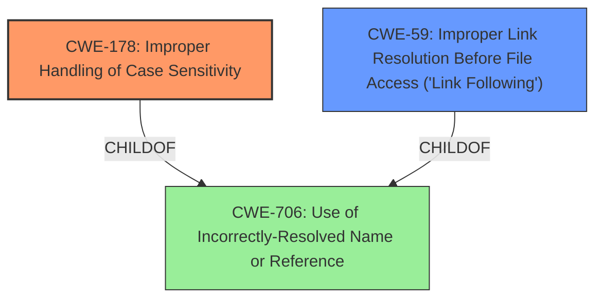

# Raw Analyzer Response for CVE-2021-39134

# Summary
| CWE ID | CWE Name | Confidence | CWE Abstraction Level | CWE Vulnerability Mapping Label | CWE-Vulnerability Mapping Notes |
|---|---|---|---|---|---|
| CWE-178 | Improper Handling of Case Sensitivity | 0.9 | Base | Allowed | Primary CWE. The vulnerability stems from the product's failure to properly handle case sensitivity when accessing or determining the properties of a resource. |
| CWE-59 | Improper Link Resolution Before File Access ('Link Following') | 0.8 | Base | Allowed | Secondary CWE. The vulnerability is exacerbated by the use of symlink dependencies. |

## Evidence and Confidence

*   **Confidence Score:** 0.85
*   **Evidence Strength:** HIGH

## Relationship Analysis
The primary weakness is **CWE-178 (Improper Handling of Case Sensitivity)**, a Base level CWE. The secondary contributing factor is **CWE-59 (Improper Link Resolution Before File Access ('Link Following'))**, also a Base level CWE. **CWE-178** describes the core problem of the application not properly distinguishing between filenames based on case, leading to incorrect file access or property determination. **CWE-59** comes into play because the case insensitivity allows a symlink to be followed to an unintended location. Both are independent issues that when combined, lead to the vulnerability.

## Vulnerability Chain
The vulnerability chain begins with the **IMPROPER HANDLING OF CASE SENSITIVITY (CWE-178)**. This allows the application to treat two different package names (differing only in case) as the same. This, combined with a **SYMLINK DEPENDENCY (CWE-59)**, allows the attacker to write to an arbitrary location on the file system. The final impact is arbitrary file overwrite.

## Summary of Analysis
The initial assessment identified **CWE-178** as the primary weakness due to the description stating that the **root cause** is the **case-insensitive filesystem** behavior and the incorrect handling of package names that differ only in case. The vulnerability allows the **attacker** to write arbitrary contents to any location on the filesystem. The retriever results also listed **CWE-178** as one of the top candidates. The **CVE Reference Links Content Summary** also mentions that the vulnerability stems from `@npmcli/arborist` incorrectly handling dependencies with names differing only in case. This evidence supports **CWE-178** as the primary weakness. The **CVE Reference Links Content Summary** also explicitly mentioned **Symlink Following**, further supporting the selection of **CWE-59** as a secondary weakness.

I did not select CWE-61 despite its relevance because **CWE-61** is a compound weakness, and it is more accurate to identify the individual weaknesses that contribute to the overall vulnerability.
I did not select CWE-427 despite its relevance because while it is related to path resolution, it is more focused on the search path itself being compromised. In this case, the issue is not with the search path, but with the way the application handles case sensitivity and symlinks.
I did not select CWE-22 because it is more about restricting a pathname to a directory which is not the case here.

Based on the evidence and the CWE descriptions, **CWE-178** and **CWE-59** are the most appropriate classifications for this vulnerability. They are at the optimal level of specificity, accurately representing the root cause and contributing factors.