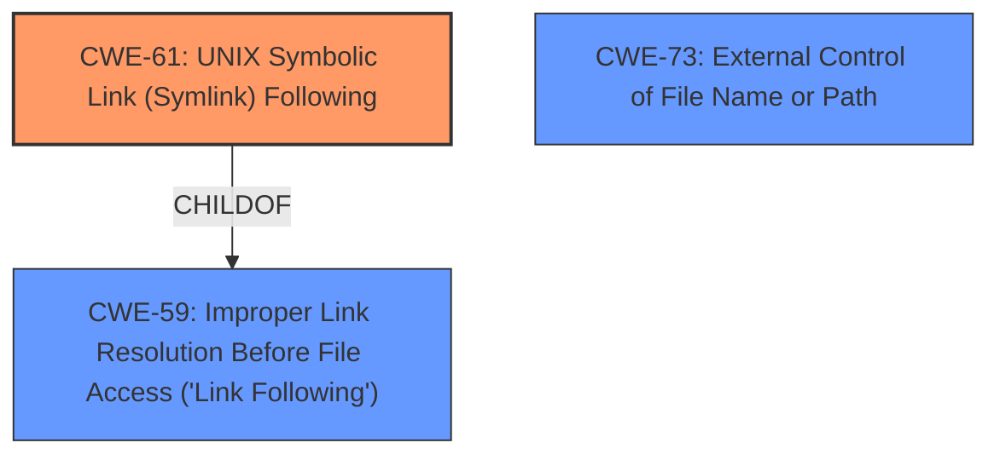

# Raw Analyzer Response for CVE-2021-39135

# Summary
| CWE ID | CWE Name | Confidence | CWE Abstraction Level | CWE Vulnerability Mapping Label | CWE-Vulnerability Mapping Notes |
|---|---|---|---|---|---|
| CWE-61 | UNIX Symbolic Link (Symlink) Following | 0.9 | Compound | Allowed | Primary CWE |
| CWE-59 | Improper Link Resolution Before File Access ('Link Following') | 0.8 | Base | Allowed | Secondary Candidate |
| CWE-73 | External Control of File Name or Path | 0.7 | Base | Allowed | Secondary Candidate |

## Evidence and Confidence

*   **Confidence Score:** 0.9
*   **Evidence Strength:** HIGH

## Relationship Analysis
The primary CWE selected is CWE-61, a Compound weakness describing insufficient accounting for symbolic links resolving outside the intended control sphere. CWE-61 is a child of CWE-59. CWE-59 focuses on the product's attempt to access a file without preventing the filename from resolving to an unintended resource, which is related. CWE-73 captures the external control of file names or paths, which is also relevant but less specific.

## Vulnerability Chain
The vulnerability chain starts with the **improper input validation** of the `node_modules` folder, followed by the ability to replace it with a symbolic link. This leads to the arborist library writing package dependencies to an arbitrary location.

## Summary of Analysis
The initial analysis pointed towards CWE-61 as the primary weakness, which the criticism supports. The vulnerability description explicitly mentions the replacement of `node_modules` with a symbolic link, allowing Arborist to write package dependencies to arbitrary locations.

>   "If the `node_modules` folder of the root project or any of its dependencies is somehow replaced with a symbolic link, it could allow Arborist to write package dependencies to any arbitrary location on the file system."

The CVE reference link content summary also confirms this:

>   "The `@npmcli/arborist` library, which manages the `node_modules` folder hierarchy, did not properly verify if the `node_modules` folder was a real directory before extracting package contents. This allowed an attacker to replace the `node_modules` folder with a symbolic link, causing the library to write package dependencies to any arbitrary location on the file system."

The graph relationships and the evidence both support selecting CWE-61 as the primary weakness. This is at an appropriate level of specificity, as it directly describes the core issue of symlink following leading to arbitrary file writes.

Relevant CWE Information:

# Enhanced Context (25 CWEs)

## CWE-59: Improper Link Resolution Before File Access ('Link Following')
**Abstraction Level**: Base
**Similarity Score**: 0.81
**Source**: dense

**Description**:
The product attempts to access a file based on the filename, but it does not properly prevent that filename from identifying a link or shortcut that resolves to an unintended resource.

**Mapping Guidance**:
- Usage: Allowed
- Rationale: This CWE entry is at the Base level of abstraction, which is a preferred level of abstraction for mapping to the root causes of vulnerabilities.

## CWE-61: UNIX Symbolic Link (Symlink) Following
**Abstraction Level**: Compound
**Similarity Score**: 0.79
**Source**: dense

**Description**:
The product, when opening a file or directory, does not sufficiently account for when the file is a symbolic link that resolves to a target outside of the intended control sphere. This could allow an attacker to cause the product to operate on unauthorized files.

**Mapping Guidance**:
- Usage: Allowed
- Rationale: This is a well-known Composite of multiple weaknesses that must all occur simultaneously, although it is attack-oriented in nature.

## CWE-73: External Control of File Name or Path
**Abstraction Level**: Base
**Similarity Score**: 0.79
**Source**: dense

**Description**:
The product allows user input to control or influence paths or file names that are used in filesystem operations.

**Mapping Guidance**:
- Usage: Allowed
- Rationale: This CWE entry is at the Base level of abstraction, which is a preferred level of abstraction for mapping to the root causes of vulnerabilities.

CWE-427, CWE-22, CWE-88, CWE-41, CWE-732, CWE-23, and CWE-78 were considered but deemed less relevant as they represent related but not directly applicable weaknesses. For example, CWE-427 (Uncontrolled Search Path Element) is about using a search path with attacker-controlled elements, while this vulnerability is about symlink following. CWE-22 (Improper Limitation of a Pathname to a Restricted Directory) and CWE-23 (Relative Path Traversal) are about path traversal, which is a related but distinct issue. CWE-78 (Improper Neutralization of Special Elements used in an OS Command) is about command injection, which is not the primary issue here.