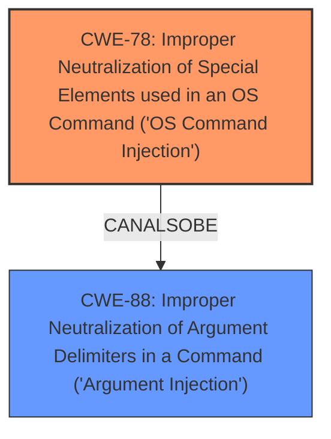

# Analysis for CVE-2021-39159

# Summary
| CWE ID | CWE Name | Confidence | CWE Abstraction Level | CWE Vulnerability Mapping Label | CWE-Vulnerability Mapping Notes |
|---|---|---|---|---|---|
| CWE-78 | Improper Neutralization of Special Elements used in an OS Command ('OS Command Injection') | 1.0 | Base | Primary | Allowed |
| CWE-88 | Improper Neutralization of Argument Delimiters in a Command ('Argument Injection') | 0.7 | Base | Secondary | Allowed |

## Evidence and Confidence

*   **Confidence Score:** 0.9
*   **Evidence Strength:** HIGH

## Relationship Analysis
The primary CWE is CWE-78, which represents the core vulnerability: **Improper Neutralization of Special Elements used in an OS Command ('OS Command Injection')**. This is a base-level CWE that accurately describes the **root cause**.

CWE-88, **Improper Neutralization of Argument Delimiters in a Command ('Argument Injection')**, is a closely related CWE. It's a PeerOf and CanAlsoBe relationship to CWE-78, suggesting it could be present in conjunction with the primary weakness.

## Vulnerability Chain
The vulnerability chain starts with **improper input handling** where the application receives maliciously crafted input. This leads to **CWE-78, OS Command Injection**, because the input is not properly sanitized when constructing the `git ls-remote` command. The successful exploitation of this weakness results in **Remote Code Execution (RCE)**, allowing an attacker to execute arbitrary code on the BinderHub server and potentially steal credentials.

## Summary of Analysis
Initially, the analysis focused on identifying the **root cause** of the vulnerability based on the provided description and the CVE reference summary. The key evidence is:

*   Vulnerability Description Key Phrases: "**impact:** execute code in the BinderHub context", "**vector:** maliciously crafted input".
*   CVE Reference Links Content Summary: "The vulnerability stems from the way BinderHub constructs and executes the `git ls-remote` command... User-controlled input (`self.repo` and `self.unresolved_ref`) could be injected into the command without proper sanitization, allowing for command injection."
*   CVE Reference Links Content Summary: "The fix introduces `--` to the `git ls-remote` command. This separates options from positional arguments."

This evidence strongly suggests that the application is vulnerable to **OS Command Injection (CWE-78)** due to the **lack of proper input sanitization** when constructing the OS command.

The Retriever Results also list CWE-78 as the top candidate.

CWE-88 was considered as a secondary weakness. The description of CWE-88, **Improper Neutralization of Argument Delimiters in a Command ('Argument Injection')**, is relevant because the injected input modifies the arguments of the `git ls-remote` command. However, the primary issue is the ability to inject entire commands, making CWE-78 the more accurate classification. The relationship between CWE-78 and CWE-88 (CanAlsoBe) supports the possibility of CWE-88 being a contributing factor.

The selection of CWE-78 is at the optimal level of specificity because it directly addresses the **root cause** of the vulnerability. It's a Base-level CWE, which is the preferred level of abstraction according to MITRE's mapping guidance.

Other CWEs Considered:

*   CWE-532: Insertion of Sensitive Information into Log File was considered, but the primary issue is not the logging of sensitive data, but rather the command injection vulnerability.
*   CWE-668: Exposure of Resource to Wrong Sphere is too high-level and doesn't accurately represent the specific weakness.
*   CWE-306: Missing Authentication for Critical Function is not relevant as the vulnerability is not due to missing authentication.
*   CWE-863: Incorrect Authorization is not relevant as the vulnerability is not due to incorrect authorization.
*   CWE-277: Insecure Inherited Permissions is not relevant to the described vulnerability.
*   CWE-942: Permissive Cross-domain Policy with Untrusted Domains is not relevant to the described vulnerability.
*   CWE-61: UNIX Symbolic Link (Symlink) Following is not relevant to the described vulnerability.
*   CWE-923: Improper Restriction of Communication Channel to Intended Endpoints is not relevant to the described vulnerability.
*   CWE-287: Improper Authentication is not relevant to the described vulnerability.