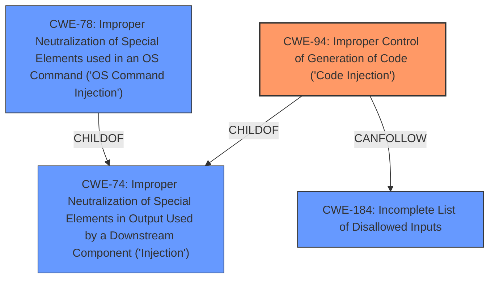

# Analysis Report for CVE-2021-39160

# Vulnerability Analysis Report: CVE-2021-39160

## Description


## Analysis (with Relationship Data)

# Summary
| CWE ID | CWE Name | Confidence | CWE Abstraction Level | CWE Vulnerability Mapping Label | CWE-Vulnerability Mapping Notes |
|---|---|---|---|---|---|
| CWE-94 | Improper Control of Generation of Code ('Code Injection') | 0.9 | Base | Allowed-with-Review | Primary CWE |
| CWE-74 | Improper Neutralization of Special Elements in Output Used by a Downstream Component ('Injection') | 0.7 | Class | Discouraged | Secondary Candidate |
| CWE-78 | Improper Neutralization of Special Elements used in an OS Command ('OS Command Injection') | 0.6 | Base | Allowed | Secondary Candidate |
| CWE-184 | Incomplete List of Disallowed Inputs | 0.5 | Base | Allowed | Secondary Candidate |

## Evidence and Confidence

*   **Confidence Score:** 0.9
*   **Evidence Strength:** HIGH

## Relationship Analysis
The primary CWE is CWE-94, which is a base class for code injection vulnerabilities. CWE-74 is a parent class of CWE-94, representing a broader category of injection issues, which is less specific. CWE-78 is a specific type of command injection, but the description does not explicitly state that an OS command is being directly injected. CWE-184 is also related, as it describes the **incomplete list of disallowed inputs**, contributing to the **unsanitized input**.



## Vulnerability Chain
The vulnerability chain starts with **unsanitized input**, specifically the `git_url` parameter. This **unsanitized input** leads to code injection, allowing for arbitrary code execution.

Root Cause: **Unsanitized input**
Weakness: CWE-94 Improper Control of Generation of Code ('Code Injection')
Impact: Arbitrary code execution

## Summary of Analysis
The initial analysis pointed towards CWE-94 due to the arbitrary code execution stemming from **unsanitized input**. The "CVE Reference Links Content Summary" section explicitly mentions the lack of sanitization of the `git_url` parameter leading to code injection.

> Root Cause:
> The vulnerability stems from **unsanitized input** in `nbgitpuller`. Specifically, the `git_url` parameter was not properly sanitized before being passed to subprocess calls. This allowed an attacker to inject arbitrary commands into the `git` command execution.
>
> Weaknesses/Vulnerabilities Present:
> - **Code Injection:** The primary vulnerability is code injection due to the lack of sanitization of the `git_url` parameter in `nbgitpuller`. This allowed an attacker to manipulate the command line arguments passed to `git` commands.
> - **Unsanitized Input:** The application failed to sanitize the `git_url` input, leading to the injection vulnerability.

The graph relationships confirm that CWE-94 is a child of the more general CWE-74, which is relevant but less specific.

CWE-94 is at the optimal level of specificity as it directly addresses the code injection aspect of the vulnerability, which aligns with the vulnerability description and the provided evidence. While the retriever suggested other CWEs such as CWE-74, CWE-78 and CWE-184, CWE-94 best captures the **rootcause** and impact of the vulnerability. CWE-94 is rated Allowed-with-Review, and the vulnerability description directly indicates that the product constructs a code segment using externally-influenced input, making it a fitting classification.

Relevant CWE Information:

# Enhanced Context (25 CWEs)
The following CWEs were identified as potentially relevant to this vulnerability:

## CWE-74: Improper Neutralization of Special Elements in Output Used by a Downstream Component ('Injection')
**Abstraction Level**: Class
**Similarity Score**: 0.75
**Source**: dense

**Description**:
The product constructs all or part of a command, data structure, or record using externally-influenced input from an upstream component, but it does not neutralize or incorrectly neutralizes special elements that could modify how it is parsed or interpreted when it is sent to a downstream component.

**Mapping Guidance**:
- Usage: Discouraged
- Rationale: CWE-74 is high-level and often misused when lower-level weaknesses are more appropriate.

*Technical Explanation:* CWE-74 is a broad class for injection vulnerabilities. While applicable, it's less specific than CWE-94 as it encompasses various types of injection, not just code injection. The vulnerability description explicitly states "arbitrary code execution", making CWE-94 a better fit.

*Justification:* While CWE-74 is relevant, the "Mapping Guidance" discourages its use when lower-level weaknesses are more appropriate. Since the vulnerability leads to code execution, CWE-94 is a more precise classification.

## CWE-78: Improper Neutralization of Special Elements used in an OS Command ('OS Command Injection')
**Abstraction Level**: base
**Similarity Score**: 3.57
**Source**: graph

**Description**:
CWE-78: Improper Neutralization of Special Elements used in an OS Command ('OS Command Injection')

**Mapping Guidance**:
- Usage: Allowed
- Rationale: This CWE entry is at the Base level of abstraction, which is a preferred level of abstraction for mapping to the root causes of vulnerabilities.

*Technical Explanation:* CWE-78 focuses specifically on OS command injection. While the `git_url` parameter is used in `git` commands, the vulnerability description does not explicitly state that the injected code is directly executed as an OS command. The injected code could potentially manipulate other aspects of the `git` command execution.

*Justification:* CWE-78 is a possible, but it is less precise than CWE-94 because the vulnerability description is about code injection that leads to arbitrary code execution, and not specifically OS command injection.

## CWE-184: Incomplete List of Disallowed Inputs
**Abstraction Level**: Base
**Similarity Score**: 0.73
**Source**: dense

**Description**:
The product implements a protection mechanism that relies on a list of inputs (or properties of inputs) that are not allowed by policy or otherwise require other action to neutralize before additional processing takes place, but the list is incomplete.

**Mapping Guidance**:
- Usage: Allowed
- Rationale: This CWE entry is at the Base level of abstraction, which is a preferred level of abstraction for mapping to the root causes of vulnerabilities.

*Technical Explanation:* This CWE relates to the **unsanitized input** from the `git_url` parameter. The **rootcause** is related to the incomplete validation that lead to the **unsanitized input** and therefore injection.

*Justification:* CWE-184 is a valid consideration, but it is less descriptive of the actual vulnerability. The primary issue is not just an incomplete list, but the resulting code injection, which is better captured by CWE-94.


## CWE Relationship Analysis

Current CWEs represent these abstraction levels: .


### Vulnerability Chain Analysis

**Chain starting from CWE-78:**
- 78 (Improper Neutralization of Special Elements used in an OS Command ('OS Command Injection')) - ROOT


**Chain starting from CWE-94:**
- 94 (Improper Control of Generation of Code ('Code Injection')) - ROOT


### CWE Relationship Diagram

```mermaid
graph TD
    classDef primary fill:#f96,stroke:#333,stroke-width:2px
    classDef secondary fill:#69f,stroke:#333
    classDef tertiary fill:#9e9,stroke:#333
```


*Report generated on 2025-04-01 22:33:24*
