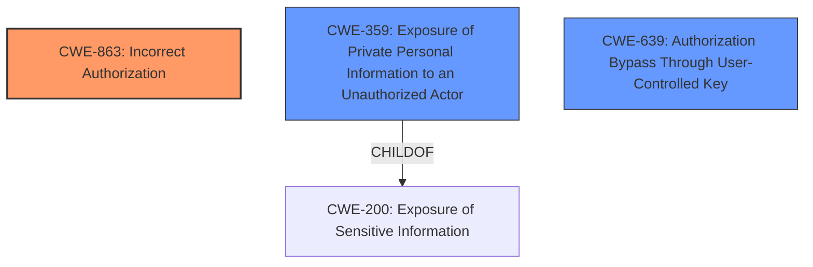

# Analysis Report for CVE-2021-39163

# Vulnerability Analysis Report: CVE-2021-39163

## Description


## Analysis (with Relationship Data)

# Summary
| CWE ID | CWE Name | Confidence | CWE Abstraction Level | CWE Vulnerability Mapping Label | CWE-Vulnerability Mapping Notes |
|---|---|---|---|---|---|
| CWE-863 | Incorrect Authorization | 0.9 | Class | Primary | Allowed-with-Review |
| CWE-359 | Exposure of Private Personal Information to an Unauthorized Actor | 0.7 | Base | Secondary | Allowed |
| CWE-639 | Authorization Bypass Through User-Controlled Key | 0.6 | Base | Secondary | Allowed |

## Evidence and Confidence

*   **Confidence Score:** 0.8
*   **Evidence Strength:** HIGH

## Relationship Analysis
The primary CWE is CWE-863 (**Incorrect Authorization**), which is a Class-level CWE. The vulnerability involves unauthorized access to room metadata due to **incorrect** authorization checks. While a more specific Base-level CWE would be ideal, CWE-863 accurately reflects the core issue.

CWE-359 (**Exposure of Private Personal Information to an Unauthorized Actor**) is a secondary CWE because the vulnerability directly leads to the exposure of sensitive room information (name, avatar, topic, number of members) to unauthorized users. CWE-359 is a ChildOf CWE-200 (**Exposure of Sensitive Information**).

CWE-639 (**Authorization Bypass Through User-Controlled Key**) is considered since the attacker needs to know the Room ID, which could be considered a "key" that the attacker uses to gain access to the room metadata.



## Vulnerability Chain
The vulnerability chain starts with **incorrect authorization** (CWE-863), leading to **exposure of private personal information** (CWE-359). The attacker knowing the Room ID can be considered **Authorization Bypass Through User-Controlled Key** (CWE-639).

## Summary of Analysis
The initial analysis identified CWE-863 (**Incorrect Authorization**) as the primary weakness, stemming from the **lack of proper access control** when displaying room metadata within groups. This aligns with the CVE description which explicitly states that the server was not correctly verifying user permissions.

The secondary weakness is CWE-359 (**Exposure of Private Personal Information to an Unauthorized Actor**), the impact of which is the unauthorized disclosure of room metadata.

CWE-639 (**Authorization Bypass Through User-Controlled Key**) is considered since the attacker needs to know the Room ID.

The vulnerability description states, "unauthorised users can access the name, avatar, topic and number of members of a room if they know the ID of the room." This statement directly supports the mapping to both CWE-863 and CWE-359.

The selection of CWE-863 is at the Class level, but it is the most accurate representation of the core issue, with the caveat that a Base-level CWE would be preferred, but no other Base-level CWEs capture the **incorrect** authorization aspect as well. CWE-359 is included to reflect the information exposure aspect.

Relevant CWE Information:

# Enhanced Context (25 CWEs)

## CWE-80: Improper Neutralization of Script-Related HTML Tags in a Web Page (Basic XSS)
**Abstraction Level**: Variant
**Similarity Score**: 0.79
**Source**: dense
- Considered, but not relevant as there is no indication of XSS.

## CWE-639: Authorization Bypass Through User-Controlled Key
**Abstraction Level**: Base
**Similarity Score**: 0.79
**Source**: dense
- Considered as a secondary CWE. The attacker needs to know the Room ID, which could be considered a "key" that the attacker uses to gain access to the room metadata.

## CWE-74: Improper Neutralization of Special Elements in Output Used by a Downstream Component ('Injection')
**Abstraction Level**: Class
**Similarity Score**: 0.78
**Source**: dense
- Considered, but not relevant as there is no indication of injection.

## CWE-116: Improper Encoding or Escaping of Output
**Abstraction Level**: Class
**Similarity Score**: 0.78
**Source**: dense
- Considered, but not relevant as there is no indication of encoding or escaping issues.

## CWE-319: Cleartext Transmission of Sensitive Information
**Abstraction Level**: Base
**Similarity Score**: 0.78
**Source**: dense
- Considered, but not relevant as there is no mention of cleartext transmission.

## CWE-472: External Control of Assumed-Immutable Web Parameter
**Abstraction Level**: Base
**Similarity Score**: 0.77
**Source**: dense
- Considered, but not relevant as there is no mention of immutable web parameters.

## CWE-201: Insertion of Sensitive Information Into Sent Data
**Abstraction Level**: Base
**Similarity Score**: 0.77
**Source**: dense
- Considered, but CWE-359 is more specific.

## CWE-425: Direct Request ('Forced Browsing')
**Abstraction Level**: Base
**Similarity Score**: 0.77
**Source**: dense
- Considered, but not relevant as there is no mention of forced browsing.

## CWE-212: Improper Removal of Sensitive Information Before Storage or Transfer
**Abstraction Level**: Base
**Similarity Score**: 0.77
**Source**: dense
- Considered, but not relevant as there is no mention of improper removal of sensitive information.

## CWE-290: Authentication Bypass by Spoofing
**Abstraction Level**: Base
**Similarity Score**: 0.76
**Source**: dense
- Considered, but authentication is not bypassed.

## CWE-79: Improper Neutralization of Input During Web Page Generation ('Cross-site Scripting')
**Abstraction Level**: Base
**Similarity Score**: 6989.31
**Source**: sparse
- Considered, but not relevant as there is no indication of XSS.

## CWE-863: Incorrect Authorization
**Abstraction Level**: Class
**Similarity Score**: 6949.53
**Source**: sparse
- Primary CWE selection.

## CWE-923: Improper Restriction of Communication Channel to Intended Endpoints
**Abstraction Level**: Class
**Similarity Score**: 6716.44
**Source**: sparse
- Considered, but not relevant as there is no mention of communication channels.

## CWE-639: Authorization Bypass Through User-Controlled Key
**Abstraction Level**: Base
**Similarity Score**: 6640.31
**Source**: sparse
- Considered as a secondary CWE.

## CWE-1390: Weak Authentication
**Abstraction Level**: Class
**Similarity Score**: 6623.35
**Source**: sparse
- Considered, but authentication is not bypassed.

## CWE-494: Download of Code Without Integrity Check
**Abstraction Level**: base
**Similarity Score**: 4.33
**Source**: graph
- Considered, but not relevant as there is no mention of downloading code.

## CWE-1284: Improper Validation of Specified Quantity in Input
**Abstraction Level**: base
**Similarity Score**: 4.33
**Source**: graph
- Considered, but not relevant as there is no mention of quantity validation.

## CWE-789: Memory Allocation with Excessive Size Value
**Abstraction Level**: variant
**Similarity Score**: 3.88
**Source**: graph
- Considered, but not relevant as there is no indication of memory allocation issues.

## CWE-770: Allocation of Resources Without Limits or Throttling
**Abstraction Level**: base
**Similarity Score**: 3.65
**Source**: graph
- Considered, but not relevant as there is no mention of resource allocation.

## CWE-836: Use of Password Hash Instead of Password for Authentication
**Abstraction Level**: base
**Similarity Score**: 3.64
**Source**: graph
- Considered, but not relevant as there is no mention of password hashes.

## CWE-202: Exposure of Sensitive Information Through Data Queries
**Abstraction Level**: base
**Similarity Score**: 3.64
**Source**: graph
- Considered, but CWE-359 is more specific.

## CWE-178: Improper Handling of Case Sensitivity
**Abstraction Level**: base
**Similarity Score**: 3.64
**Source**: graph
- Considered, but not relevant as there is no mention of case sensitivity.

## CWE-1289: Improper Validation of Unsafe Equivalence in Input
**Abstraction Level**: base
**Similarity Score**: 3.64
**Source**:


## CWE Relationship Analysis

Current CWEs represent these abstraction levels: .


### Vulnerability Chain Analysis

**Chain starting from CWE-359:**
- 359 (Exposure of Private Personal Information to an Unauthorized Actor) - ROOT


**Chain starting from CWE-116:**
- 116 (Improper Encoding or Escaping of Output) - ROOT


### CWE Relationship Diagram

```mermaid
graph TD
    classDef primary fill:#f96,stroke:#333,stroke-width:2px
    classDef secondary fill:#69f,stroke:#333
    classDef tertiary fill:#9e9,stroke:#333
```


*Report generated on 2025-04-02 16:18:20*
