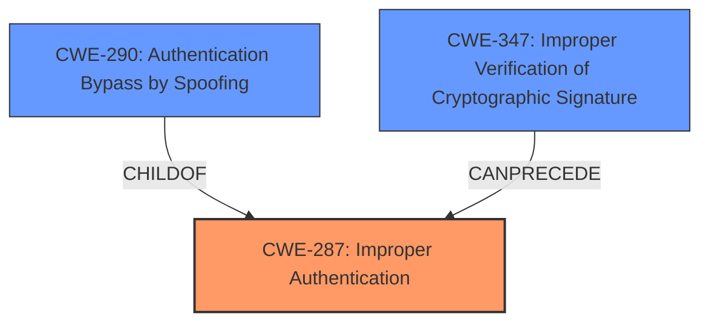

# Enhanced Analysis for CVE-2021-39177

# Summary

| CWE ID | CWE Name | Confidence | CWE Abstraction Level | CWE Vulnerability Mapping Label | CWE-Vulnerability Mapping Notes |
|---|---|---|---|---|---|
| CWE-287 | Improper Authentication | 0.9 | Class | Primary | Discouraged |
| CWE-290 | Authentication Bypass by Spoofing | 0.8 | Base | Secondary | Allowed |
| CWE-347 | Improper Verification of Cryptographic Signature | 0.7 | Base | Secondary | Allowed |

## Evidence and Confidence

*   **Confidence Score:** 0.8
*   **Evidence Strength:** HIGH

## Relationship Analysis
The primary CWE selected is CWE-287 [Improper Authentication], which is a Class-level CWE. While it is discouraged, the description aligns with the vulnerability where the product insufficiently proves a user's claimed identity. CWE-290 [Authentication Bypass by Spoofing] and CWE-347 [Improper Verification of Cryptographic Signature] are related as they can be potential causes of improper authentication. CWE-290 [Authentication Bypass by Spoofing] is a child of CWE-287 [Improper Authentication], representing a specific method of bypassing authentication. CWE-347 [Improper Verification of Cryptographic Signature] is related to the **manipulated JWT token** aspect of the vulnerability, where the signature of the JWT is not properly validated, leading to potential spoofing. These relationships help to understand how the vulnerabilities are connected and how the primary weakness can be exploited through specific mechanisms.



## Vulnerability Chain
The vulnerability chain starts with the **insufficient JWT validation**, leading to the ability to **forge a LoginPacket with a manipulated JWT token**. This then allows an attacker to achieve **user impersonation**, ultimately leading to unauthorized access and actions performed under the impersonated user's identity.

## Summary of Analysis
The analysis indicates that the GeyserMC connector is vulnerable to user impersonation due to **insufficient JWT validation**. The **weakness** allows attackers to **forge LoginPackets with manipulated JWT tokens**, leading to **improper authentication** and the ability to impersonate any user.

The selection of CWE-287 [Improper Authentication] as the primary CWE is based on the core issue of the product not sufficiently proving the claimed identity of the user. The "Vulnerability Description Key Phrases" mention the ability to "**forge LoginPacket with manipulated JWT token**" which directly relates to an authentication bypass. The "CVE Reference Links Content Summary" also states that the root cause is the "incorrect handling of the login JWT (JSON Web Token) within the GeyserMC connector" and the "**insufficient JWT validation**".

CWE-290 [Authentication Bypass by Spoofing] and CWE-347 [Improper Verification of Cryptographic Signature] are included as secondary CWEs to provide a more detailed picture of the attack mechanism. The "CVE Reference Links Content Summary" clearly indicates that the forged JWT allows for bypassing authentication, thus justifying CWE-290 [Authentication Bypass by Spoofing]. The **lack of proper verification of the JWT** also points towards CWE-347 [Improper Verification of Cryptographic Signature].

Although CWE-287 [Improper Authentication] is discouraged due to being a Class-level CWE, the provided information does not give enough information to choose a more specific child CWE. Therefore, CWE-287 [Improper Authentication] is the most appropriate choice given the available evidence.

Relevant CWE Information:

# Enhanced Context (25 CWEs)
The following CWEs were identified as potentially relevant to this vulnerability:

## CWE-1391: Use of Weak Credentials
**Abstraction Level**: Class
**Similarity Score**: 0.81
**Source**: dense

**Description**:
The product uses weak credentials (such as a default key or hard-coded password) that can be calculated, derived, reused, or guessed by an attacker.
**NOT USED:** Not applicable as the vulnerability does not involve weak credentials. The issue is with JWT validation, not the credentials themselves.

## CWE-1240: Use of a Cryptographic Primitive with a Risky Implementation
**Abstraction Level**: Base
**Similarity Score**: 0.81
**Source**: dense

**Description**:
To fulfill the need for a cryptographic primitive, the product implements a cryptographic algorithm using a non-standard, unproven, or disallowed/non-compliant cryptographic implementation.
**NOT USED:** While cryptography is involved, the vulnerability is not due to a risky cryptographic implementation. It's about improper validation, not the algorithm used.

## CWE-303: Incorrect Implementation of Authentication Algorithm
**Abstraction Level**: Base
**Similarity Score**: 0.80
**Source**: dense

**Description**:
The requirements for the product dictate the use of an established authentication algorithm, but the implementation of the algorithm is incorrect.
**NOT USED:** This is too specific. The issue isn't necessarily the implementation of the *algorithm* but the *validation* of the JWT.

## CWE-345: Insufficient Verification of Data Authenticity
**Abstraction Level**: Class
**Similarity Score**: 0.80
**Source**: dense

**Description**:
The product does not sufficiently verify the origin or authenticity of data, in a way that causes it to accept invalid data.
**NOT USED:** This is a broader category. CWE-347 is more specific to cryptographic signatures.

## CWE-319: Cleartext Transmission of Sensitive Information
**Abstraction Level**: Base
**Similarity Score**: 0.80
**Source**: dense

**Description**:
The product transmits sensitive or security-critical data in cleartext in a communication channel that can be sniffed by unauthorized actors.
**NOT USED:** Not applicable as the vulnerability does not involve cleartext transmission of sensitive information.

## CWE-328: Use of Weak Hash
**Abstraction Level**: Base
**Similarity Score**: 0.79
**Source**: dense

**Description**:
The product uses an algorithm that produces a digest (output value) that does not meet security expectations for a hash function that allows an adversary to reasonably determine the original input (preimage attack), find another input that can produce the same hash (2nd preimage attack), or find multiple inputs that evaluate to the same hash (birthday attack).
**NOT USED:** Not applicable as the vulnerability is not due to a weak hash function.

## CWE-330: Use of Insufficiently Random Values
**Abstraction Level**: Class
**Similarity Score**: 0.79
**Source**: dense

**Description**:
The product uses insufficiently random numbers or values in a security context that depends on unpredictable numbers.
**NOT USED:** Not applicable as the vulnerability does not involve random number generation.

## CWE-203: Observable Discrepancy
**Abstraction Level**: Base
**Similarity Score**: 0.78
**Source**: dense

**Description**:
The product behaves differently or sends different responses under different circumstances in a way that is observable to an unauthorized actor, which exposes security-relevant information about the state of the product, such as whether a particular operation was successful or not.
**NOT USED:** Not applicable as the vulnerability does not involve observable discrepancies in behavior.

## CWE-327: Use of a Broken or Risky Cryptographic Algorithm
**Abstraction Level**: Class
**Similarity Score**: 0.78
**Source**: dense

**Description**:
The product uses a broken or risky cryptographic algorithm or protocol.
**NOT USED:** While cryptography is involved, the vulnerability is not due to the use of a broken or risky algorithm, but rather the **insufficient JWT validation**.

## CWE-807: Reliance on Untrusted Inputs in a Security Decision
**Abstraction Level**: Base
**Similarity Score**: 0.78
**Source**: dense

**Description**:
The product uses a protection mechanism that relies on the existence or values of an input, but the input can be modified by an untrusted actor in a way that bypasses the protection mechanism.
**NOT USED:** While relevant, the core issue is the lack of validation, not necessarily reliance on untrusted inputs.

## CWE-941: Incorrectly Specified Destination in a Communication Channel
**Abstraction Level**: Base
**Similarity Score**: 5648.08
**Source**: sparse

**Description**:
The product creates a communication channel to initiate an outgoing request to an actor, but it does not correctly specify the intended destination for that actor.
**NOT USED:** Not relevant to this vulnerability.

## CWE-863: Incorrect Authorization
**Abstraction Level**: Class
**Similarity Score**: 5566.37
**Source**:


## CWE Relationship Analysis

Current CWEs represent these abstraction levels: .


### Vulnerability Chain Analysis

**Chain starting from CWE-303:**
- 303 (Incorrect Implementation of Authentication Algorithm) - ROOT


**Chain starting from CWE-290:**
- 290 (Authentication Bypass by Spoofing) - ROOT


### CWE Relationship Diagram

```mermaid
graph TD
    classDef primary fill:#f96,stroke:#333,stroke-width:2px
    classDef secondary fill:#69f,stroke:#333
    classDef tertiary fill:#9e9,stroke:#333
```