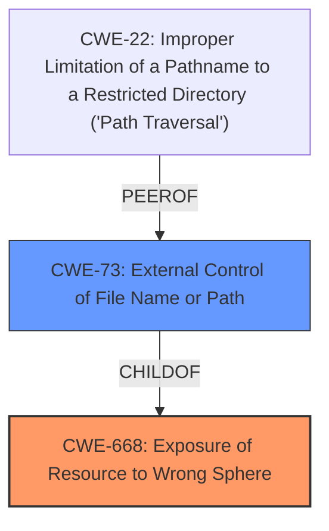

# Analysis for CVE-2021-39184

# Summary
| CWE ID | CWE Name | Confidence | CWE Abstraction Level | CWE Vulnerability Mapping Label | CWE-Vulnerability Mapping Notes |
|---|---|---|---|---|---|
| CWE-668 | Exposure of Resource to Wrong Sphere | 0.8 | Class | Primary | Allowed |
| CWE-73 | External Control of File Name or Path | 0.6 | Base | Secondary | Allowed |

## Evidence and Confidence

*   **Confidence Score:** 0.7
*   **Evidence Strength:** MEDIUM

## Relationship Analysis
The primary relationship influencing the decision is that CWE-668 is a Class-level CWE and a parent of more specific Base-level CWEs. While CWE-668 is a good starting point, a more precise CWE should be identified if the evidence supports it. CWE-73 is related as it involves external control over file paths, which directly relates to the vulnerability's ability to access arbitrary files via the thumbnail creation API.

## Vulnerability Chain
The vulnerability chain involves the following:
1.  **Root Cause:** **Insufficient Sandboxing** of the `createThumbnailFromPath` API.
2.  The `createThumbnailFromPath` API allows a sandboxed renderer to **request a thumbnail image of an arbitrary file**.
3.  **Impact:** The thumbnail can potentially include significant parts of the original file, leading to **Information Disclosure**.

## Summary of Analysis
Initially, the vulnerability was associated with CWE-668, which is a Class-level CWE. However, after a more thorough analysis and by considering the **root cause** and the specific mechanism of the vulnerability, it became evident that a more specific CWE could be assigned to capture the vulnerability's essence accurately.

The vulnerability allows a sandboxed renderer to **request a thumbnail image of an arbitrary file**, thus exposing the resource (the file) to the wrong sphere (the sandboxed renderer). This aligns well with CWE-668.

However, the ability to **request a thumbnail image of an arbitrary file** also means the attacker has some control of the file name or path. This is why CWE-73 is also considered.

Ultimately, the assessment is based on the evidence provided in the "CVE Reference Links Content Summary" section, which states that the **root cause** is the **insufficient sandboxing** of the `createThumbnailFromPath` API, leading to potential **information disclosure**.

Relevant CWE Information:

# Enhanced Context (25 CWEs)
The following CWEs were identified as potentially relevant to this vulnerability:

## CWE-41: Improper Resolution of Path Equivalence
**Abstraction Level**: Base
**Similarity Score**: 0.80

## CWE-23: Relative Path Traversal
**Abstraction Level**: Base
**Similarity Score**: 0.80

## CWE-59: Improper Link Resolution Before File Access ('Link Following')
**Abstraction Level**: Base
**Similarity Score**: 0.79

## CWE-36: Absolute Path Traversal
**Abstraction Level**: Base
**Similarity Score**: 0.79

## CWE-73: External Control of File Name or Path
**Abstraction Level**: Base
**Similarity Score**: 0.78

## CWE-184: Incomplete List of Disallowed Inputs
**Abstraction Level**: Base
**Similarity Score**: 0.78

## CWE-74: Improper Neutralization of Special Elements in Output Used by a Downstream Component ('Injection')
**Abstraction Level**: Class
**Similarity Score**: 0.77

## CWE-1289: Improper Validation of Unsafe Equivalence in Input
**Abstraction Level**: Base
**Similarity Score**: 0.77

## CWE-427: Uncontrolled Search Path Element
**Abstraction Level**: Base
**Similarity Score**: 0.77

## CWE-668: Exposure of Resource to Wrong Sphere
**Abstraction Level**: Class
**Similarity Score**: 0.77

## CWE-451: User Interface (UI) Misrepresentation of Critical Information
**Abstraction Level**: Class
**Similarity Score**: 8869.52

## CWE-79: Improper Neutralization of Input During Web Page Generation ('Cross-site Scripting')
**Abstraction Level**: Base
**Similarity Score**: 8702.50

## CWE-22: Improper Limitation of a Pathname to a Restricted Directory ('Path Traversal')
**Abstraction Level**: Base
**Similarity Score**: 8606.31

## CWE-1336: Improper Neutralization of Special Elements Used in a Template Engine
**Abstraction Level**: Base
**Similarity Score**: 8434.96

## CWE-116: Improper Encoding or Escaping of Output
**Abstraction Level**: Class
**Similarity Score**: 8325.55

## CWE-79: Improper Neutralization of Input During Web Page Generation ('Cross-site Scripting')
**Abstraction Level**: base
**Similarity Score**: 5.03

## CWE-22: Improper Limitation of a Pathname to a Restricted Directory ('Path Traversal')
**Abstraction Level**: base
**Similarity Score**: 4.33

## CWE-494: Download of Code Without Integrity Check
**Abstraction Level**: base
**Similarity Score**: 4.33

## CWE-787: Out-of-bounds Write
**Abstraction Level**: base
**Similarity Score**: 4.33

## CWE-125: Out-of-bounds Read
**Abstraction Level**: base
**Similarity Score**: 4.33

## CWE-825: Expired Pointer Dereference
**Abstraction Level**: base
**Similarity Score**: 4.33

## CWE-252: Unchecked Return Value
**Abstraction Level**: base
**Similarity Score**: 4.33

## CWE-476: NULL Pointer Dereference
**Abstraction Level**: base
**Similarity Score**: 4.33

## CWE-94: Improper Control of Generation of Code ('Code Injection')
**Abstraction Level**: base
**Similarity Score**: 3.65

## CWE-611: Improper Restriction of XML External Entity Reference
**Abstraction Level**: base
**Similarity Score**: 3.64

**CWE-668: Exposure of Resource to Wrong Sphere**

*   **How the vulnerability's details match the CWE's characteristics:** A sandboxed renderer gains unintended access to files on the user's system through the `createThumbnailFromPath` API.
*   **The security implications and potential impact:** This leads to information disclosure, as the renderer can extract parts of the file content through thumbnails.
*   **Any parent-child relationships or chain patterns that influenced your mapping:** The primary relationship considered was the need for a more specific child CWE.
*   **Whether the weakness is primary or secondary in the vulnerability:** Primary.
*   **How the official MITRE mapping guidance influenced your decision:** Followed the guidance to consider more specific Base-level CWEs if applicable.

**CWE-73: External Control of File Name or Path**

*   **How the vulnerability's details match the CWE's characteristics:** The `createThumbnailFromPath` API effectively allows external (renderer process) control over the file path for which a thumbnail is generated.
*   **The security implications and potential impact:** This enables the renderer to access and create thumbnails for arbitrary files, potentially exposing sensitive information.
*   **Any parent-child relationships or chain patterns that influenced your mapping:** Child of CWE-668
*   **Whether the weakness is primary or secondary in the vulnerability:** Secondary. The primary issue is the exposure, but the path control is a contributing factor.
*   **How the official MITRE mapping guidance influenced your decision:** Allowed usage for Base-level CWEs.

**CWEs Considered But Not Used:**

*   CWE-22: Improper Limitation of a Pathname to a Restricted Directory ('Path Traversal'): While path traversal could be a potential exploitation vector, the vulnerability doesn't explicitly involve bypassing directory restrictions through path manipulation. Therefore, this CWE is not the most accurate representation of the root cause.
*   CWE-79: Improper Neutralization of Input During Web Page Generation ('Cross-site Scripting'): This CWE is not applicable as the vulnerability does not involve injecting malicious script into a web page.
*   CWE-863: Incorrect Authorization: This is less relevant as the primary issue isn't about incorrect authorization checks but about the ability of a sandboxed renderer to access files it should not have access to