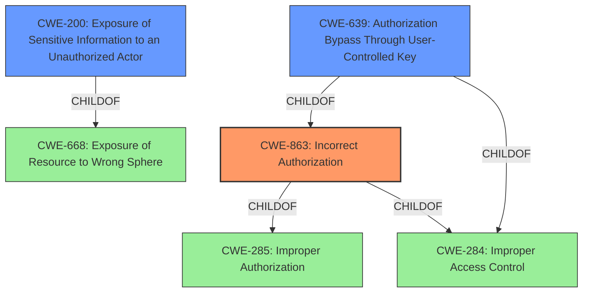

# Enhanced Analysis for CVE-2021-39192

# Summary
| CWE ID | CWE Name | Confidence | CWE Abstraction Level | CWE Vulnerability Mapping Label | CWE-Vulnerability Mapping Notes |
|---|---|---|---|---|---|
| CWE-863 | Incorrect Authorization | 0.9 | Class | Allowed-with-Review | Primary CWE |
| CWE-200 | Exposure of Sensitive Information to an Unauthorized Actor | 0.7 | Class | Discouraged | Secondary Candidate |
| CWE-639 | Authorization Bypass Through User-Controlled Key | 0.6 | Base | Allowed | Secondary Candidate |

## Evidence and Confidence

*   **Confidence Score:** 0.8
*   **Evidence Strength:** HIGH

## Relationship Analysis
The primary CWE identified is CWE-863, Incorrect Authorization, which is a Class-level CWE. It relates to the vulnerability because the **error in the implementation of the limits service** allows authenticated users to access admin-level API keys, indicating an incorrect authorization check. CWE-863 is a child of CWE-285 (Improper Authorization) and CWE-284 (Improper Access Control). CWE-200, Exposure of Sensitive Information to an Unauthorized Actor, is a Class-level CWE and a child of CWE-668 (Exposure of Resource to Wrong Sphere); however, it is less specific than CWE-863 as the root cause is more related to the incorrect authorization mechanism rather than just general information exposure. CWE-639, Authorization Bypass Through User-Controlled Key, is a Base-level CWE and a child of CWE-863 and CWE-284. It describes a scenario where a user can access another user's data by modifying a key value, which is a possible mechanism, but not explicitly detailed in the vulnerability description.



## Vulnerability Chain
The vulnerability chain starts with an **error in the implementation of the limits service** which leads to **incorrect authorization**, allowing authenticated users to **view admin-level API keys**. The root cause is the implementation error, the weakness is the incorrect authorization, and the impact is the exposure of sensitive information.

## Summary of Analysis
The initial assessment, based on the vulnerability description and retriever results, points to CWE-863 (Incorrect Authorization) as the primary weakness. The vulnerability description mentions "**error in implementation of limits service**" which allows authenticated users to view admin-level API keys. This directly relates to performing an authorization check incorrectly, which is the core of CWE-863.

The description of CVE-2021-39192 includes "An **error in the implementation of the limits service** in Ghost versions 4.0.0 to 4.9.4." and "All authenticated users, including contributors with limited privileges, can access Admin-level API keys through the integrations API endpoint." These statements support the assignment of CWE-863, as the system **incorrectly authorizes** users to access resources they should not have access to.

CWE-200 (Exposure of Sensitive Information to an Unauthorized Actor) was considered but deemed less specific. While the viewing of API keys is indeed sensitive information exposure, the root cause is the **incorrect authorization** mechanism, not the act of exposure itself. The mapping guidance for CWE-200 also discourages its use when a more specific error or mistake can be identified.

CWE-639 (Authorization Bypass Through User-Controlled Key) was also considered. This CWE relates to modifying a key value to access another user's data. Although technically possible, there is no specific evidence in the vulnerability description to support this mechanism. The description doesn't detail that the API keys were accessed through manipulating a user-controlled key.

The selection of CWE-863 is at the optimal level of specificity because it directly addresses the **incorrect authorization** issue. It is a Class-level CWE, and the available information doesn't point to a more specific Base or Variant. The decision is supported by the retriever results, which list CWE-863 as the top candidate, and the relationship analysis, which shows its connection to broader authorization concepts.


## CWE Relationship Analysis

Current CWEs represent these abstraction levels: .


### Vulnerability Chain Analysis

**Chain starting from CWE-284:**
- 284 (Improper Access Control) - ROOT


**Chain starting from CWE-285:**
- 285 (Improper Authorization) - ROOT


### CWE Relationship Diagram

```mermaid
graph TD
    classDef primary fill:#f96,stroke:#333,stroke-width:2px
    classDef secondary fill:#69f,stroke:#333
    classDef tertiary fill:#9e9,stroke:#333
```