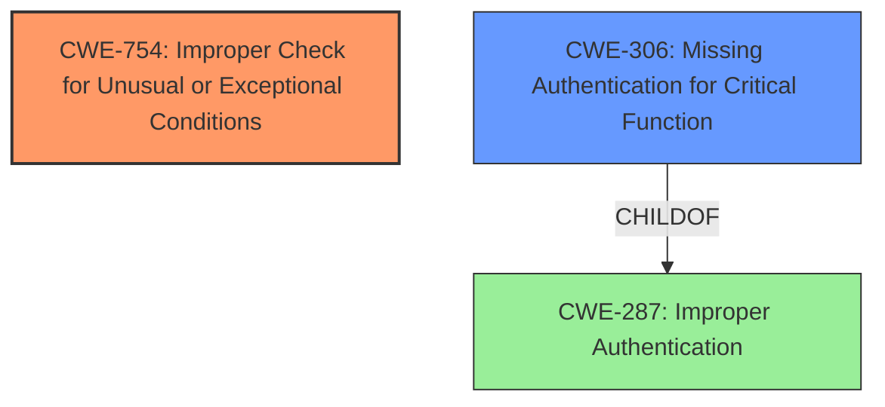

# Raw Analyzer Response for CVE-2021-39196

# Summary
| CWE ID | CWE Name | Confidence | CWE Abstraction Level | CWE Vulnerability Mapping Label | CWE-Vulnerability Mapping Notes |
|---|---|---|---|---|---|
| CWE-754 | Improper Check for Unusual or Exceptional Conditions | 0.8 | Class | Allowed-with-Review | Primary CWE |
| CWE-306 | Missing Authentication for Critical Function | 0.6 | Base | Allowed | Secondary CWE |

## Evidence and Confidence

*   **Confidence Score:** 0.7
*   **Evidence Strength:** MEDIUM

## Relationship Analysis
The primary CWE selected is CWE-754 (Improper Check for Unusual or Exceptional Conditions), which is a Class-level CWE. It was selected because the application **fails to validate the `url_suffix` parameter**, leading to a null filter. This missing check results in the program allowing unfiltered packet capture. CWE-754 is a parent of more specific Base-level CWEs, but none of them fit as precisely as CWE-754.

CWE-306 (Missing Authentication for Critical Function) is a base-level CWE and a child of CWE-287 (Improper Authentication). It was considered because the vulnerability allows an authenticated but unprivileged user to perform actions they shouldn't be able to. However, the main issue is not a complete lack of authentication but rather a missing check that allows bypassing the capture filter.

## Vulnerability Chain
The chain of events is as follows:
1.  The application **fails to validate the `url_suffix` parameter.**
2.  This results in a null filter being returned by `CaptureTypeService.findFilter(String url_suffix)`.
3.  The null filter bypasses intended access controls, allowing unfiltered packet capture.
4.  An authenticated user can capture all network traffic accessible to the application.

CWE-754 represents the root cause of the missing validation, leading to the security bypass.

## Summary of Analysis
The analysis identified CWE-754 as the primary weakness because the application **fails to validate the `url_suffix` parameter**, allowing an authenticated user to bypass intended capture filters. This is supported by the "CVE Reference Links Content Summary" section, which states: "**Inadequate input validation:** The application fails to validate the `url_suffix` parameter, which results in a null filter being returned."

CWE-306 was considered because the vulnerability allows an authenticated user to perform unauthorized actions. However, it's more accurate to describe the issue as a **missing or improper check** (CWE-754) rather than a complete lack of authentication.

The chosen CWEs are at an appropriate level of specificity. CWE-754 is a Class, but the available evidence does not support mapping to a more specific Base or Variant.

Other CWEs Considered and Rejected:

*   CWE-319 (Cleartext Transmission of Sensitive Information): Rejected because the vulnerability is not directly related to transmitting data in cleartext.
*   CWE-770 (Allocation of Resources Without Limits or Throttling): Rejected because the vulnerability is not related to resource allocation.
*   CWE-94 (Improper Control of Generation of Code ('Code Injection')): Rejected because the vulnerability does not involve code injection.
*   CWE-294 (Authentication Bypass by Capture-replay): Rejected because it is not a capture-replay vulnerability.
*   CWE-923 (Improper Restriction of Communication Channel to Intended Endpoints): Rejected because the vulnerability does not involve restricting communication channels.
*   CWE-201 (Insertion of Sensitive Information Into Sent Data): Rejected because the vulnerability does not involve sending sensitive information.
*   CWE-287 (Improper Authentication): Discouraged as per MITRE guidance, the problem isn't that authentication is missing, but there is **missing validation** that leads to the issue.
Relevant CWE Information:

# Enhanced Context (25 CWEs)
The following CWEs were identified as potentially relevant to this vulnerability:

## CWE-807: Reliance on Untrusted Inputs in a Security Decision
**Abstraction Level**: Base
**Similarity Score**: 0.77
**Source**: dense

**Description**:
The product uses a protection mechanism that relies on the existence or values of an input, but the input can be modified by an untrusted actor in a way that bypasses the protection mechanism.

**Mapping Guidance**:
- Usage: Allowed
- Rationale: This CWE entry is at the Base level of abstraction, which is a preferred level of abstraction for mapping to the root causes of vulnerabilities.

## CWE-294: Authentication Bypass by Capture-replay
**Abstraction Level**: Base
**Similarity Score**: 0.77
**Source**: dense

**Description**:
A capture-replay flaw exists when the design of the product makes it possible for a malicious user to sniff network traffic and bypass authentication by replaying it to the server in question to the same effect as the original message (or with minor changes).

**Mapping Guidance**:
- Usage: Allowed
- Rationale: This CWE entry is at the Base level of abstraction, which is a preferred level of abstraction for mapping to the root causes of vulnerabilities.

## CWE-303: Incorrect Implementation of Authentication Algorithm
**Abstraction Level**: Base
**Similarity Score**: 0.76
**Source**: dense

**Description**:
The requirements for the product dictate the use of an established authentication algorithm, but the implementation of the algorithm is incorrect.

**Mapping Guidance**:
- Usage: Allowed
- Rationale: This CWE entry is at the Base level of abstraction, which is a preferred level of abstraction for mapping to the root causes of vulnerabilities.

## CWE-799: Improper Control of Interaction Frequency
**Abstraction Level**: Class
**Similarity Score**: 0.76
**Source**: dense

**Description**:
The product does not properly limit the number or frequency of interactions that it has with an actor, such as the number of incoming requests.

**Mapping Guidance**:
- Usage: Allowed-with-Review
- Rationale: This CWE entry is a Class and might have Base-level children that would be more appropriate

## CWE-319: Cleartext Transmission of Sensitive Information
**Abstraction Level**: Base
**Similarity Score**: 0.76
**Source**: dense

**Description**:
The product transmits sensitive or security-critical data in cleartext in a communication channel that can be sniffed by unauthorized actors.

**Mapping Guidance**:
- Usage: Allowed
- Rationale: This CWE entry is at the Base level of abstraction, which is a preferred level of abstraction for mapping to the root causes of vulnerabilities.

## CWE-74: Improper Neutralization of Special Elements in Output Used by a Downstream Component ('Injection')
**Abstraction Level**: Class
**Similarity Score**: 0.76
**Source**: dense

**Description**:
The product constructs all or part of a command, data structure, or record using externally-influenced input from an upstream component, but it does not neutralize or incorrectly neutralizes special elements that could modify how it is parsed or interpreted when it is sent to a downstream component.

**Mapping Guidance**:
- Usage: Discouraged
- Rationale: CWE-74 is high-level and often misused when lower-level weaknesses are more appropriate.

## CWE-941: Incorrectly Specified Destination in a Communication Channel
**Abstraction Level**: Base
**Similarity Score**: 0.75
**Source**: dense

**Description**:
The product creates a communication channel to initiate an outgoing request to an actor, but it does not correctly specify the intended destination for that actor.

**Mapping Guidance**:
- Usage: Allowed
- Rationale: This CWE entry is at the Base level of abstraction, which is a preferred level of abstraction for mapping to the root causes of vulnerabilities.

## CWE-668: Exposure of Resource to Wrong Sphere
**Abstraction Level**: Class
**Similarity Score**: 0.75
**Source**: dense

**Description**:
The product exposes a resource to the wrong control sphere, providing unintended actors with inappropriate access to the resource.

**Mapping Guidance**:
- Usage: Discouraged
- Rationale: CWE-668 is high-level and is often misused as a catch-all when lower-level CWE IDs might be applicable. It is sometimes used for low-information vulnerability reports [REF-1287]. It is a level-1 Class (i.e., a child of a Pillar). It is not useful for trend analysis.

## CWE-1391: Use of Weak Credentials
**Abstraction Level**: Class
**Similarity Score**: 0.75
**Source**: dense

**Description