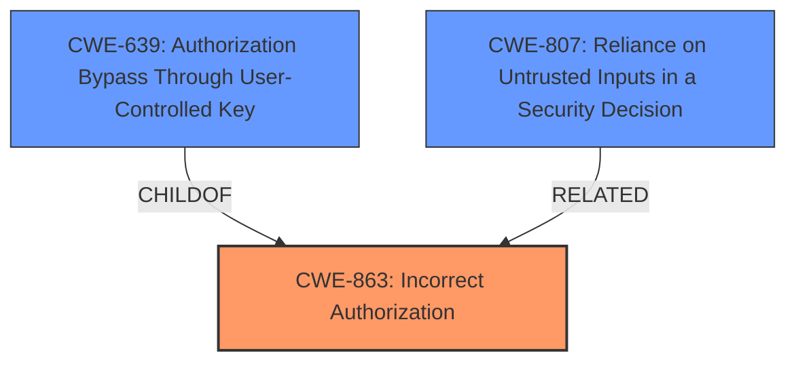

# Enhanced Analysis for CVE-2021-39213

# Summary
| CWE ID  | CWE Name                                                                                                                              | Confidence | CWE Abstraction Level | CWE Vulnerability Mapping Label | CWE-Vulnerability Mapping Notes |
| :-------- | :------------------------------------------------------------------------------------------------------------------------------------- | :----------- | :---------------------- | :------------------------------ | :------------------------------ |
| CWE-863   | Incorrect Authorization                                                                                                              | 0.9          | Class                     | Primary                         | Allowed-with-Review             |
| CWE-639   | Authorization Bypass Through User-Controlled Key                                                                                     | 0.7          | Base                      | Secondary                       | Allowed                         |
| CWE-807   | Reliance on Untrusted Inputs in a Security Decision                                                                               | 0.6          | Base                      | Secondary                       | Allowed                         |

## Evidence and Confidence

*   **Confidence Score:** 0.8
*   **Evidence Strength:** HIGH

## Relationship Analysis
The primary weakness is **CWE-863 (Incorrect Authorization)**, a Class-level CWE indicating a general failure in the authorization process. **CWE-639 (Authorization Bypass Through User-Controlled Key)** and **CWE-807 (Reliance on Untrusted Inputs in a Security Decision)** are both Base-level CWEs and are related as they represent specific ways the authorization can be bypassed. **CWE-639** is a child of **CWE-863**. The attack vector of "custom header injection" suggests a reliance on untrusted inputs (**CWE-807**) to make a security decision.



## Vulnerability Chain
The vulnerability chain starts with the application's **reliance on untrusted inputs (CWE-807)**, specifically HTTP headers, for making authorization decisions. This leads to an **authorization bypass (CWE-639)**, where attackers can modify the key value identifying the data to gain unauthorized access. Ultimately, the **incorrect authorization (CWE-863)** allows attackers to perform actions they should not be allowed to.

## Summary of Analysis
Initially, several CWEs were considered based on the retriever results, including **CWE-74 (Improper Neutralization of Special Elements in Output Used by a Downstream Component ('Injection'))**, **CWE-470 (Use of Externally-Controlled Input to Select Classes or Code ('Unsafe Reflection'))**, and **CWE-306 (Missing Authentication for Critical Function)**. However, after analyzing the vulnerability description and the CVE reference summary, **CWE-863 (Incorrect Authorization)** was determined to be the most appropriate primary CWE, as the root cause of the vulnerability is an authorization issue.

The CVE reference link summary states that the "vulnerability stems from the ability to bypass IP restrictions on the GLPI API by injecting custom headers" and that "the core issue is that the IP restrictions implemented for the GLPI API can be circumvented through custom header injection. This indicates a flaw in how the application validates the source IP address of incoming requests, potentially trusting headers that can be manipulated by the attacker."

The selection of **CWE-863** is further supported by the mapping guidance, which suggests reviewing its children for a more specific fit. **CWE-639** and **CWE-807** were selected as secondary CWEs to capture the specifics of the bypass mechanism. **CWE-639** describes the modification of a key value to gain access, and **CWE-807** describes the reliance on untrusted inputs in a security decision.

Relevant CWE Information:

# Enhanced Context (25 CWEs)

## CWE-74: Improper Neutralization of Special Elements in Output Used by a Downstream Component ('Injection')
**Abstraction Level**: Class
**Similarity Score**: 0.76
**Source**: dense

**Description**:
The product constructs all or part of a command, data structure, or record using externally-influenced input from an upstream component, but it does not neutralize or incorrectly neutralizes special elements that could modify how it is parsed or interpreted when it is sent to a downstream component.

**Mapping Guidance**:
- Usage: Discouraged
- Rationale: CWE-74 is high-level and often misused when lower-level weaknesses are more appropriate.

## CWE-639: Authorization Bypass Through User-Controlled Key
**Abstraction Level**: Base
**Similarity Score**: 0.75
**Source**: dense

**Description**:
The system's authorization functionality does not prevent one user from gaining access to another user's data or record by modifying the key value identifying the data.

**Mapping Guidance**:
- Usage: Allowed
- Rationale: This CWE entry is at the Base level of abstraction, which is a preferred level of abstraction for mapping to the root causes of vulnerabilities.

## CWE-807: Reliance on Untrusted Inputs in a Security Decision
**Abstraction Level**: Base
**Similarity Score**: 0.75
**Source**: dense

**Description**:
The product uses a protection mechanism that relies on the existence or values of an input, but the input can be modified by an untrusted actor in a way that bypasses the protection mechanism.

**Mapping Guidance**:
- Usage: Allowed
- Rationale: This CWE entry is at the Base level of abstraction, which is a preferred level of abstraction for mapping to the root causes of vulnerabilities.

### Technical Explanation for CWE-863: Incorrect Authorization
*   **How the vulnerability's details match the CWE's characteristics:** The GLPI application performs an authorization check based on IP restrictions but fails to correctly validate the source IP address due to the ability to inject custom headers.
*   **The security implications and potential impact:** This allows attackers to bypass the intended IP-based access control, potentially leading to unauthorized access and control over the API.
*   **Any parent-child relationships or chain patterns that influenced your mapping:** **CWE-639** is a child of **CWE-863**, further supporting this classification.
*   **Whether the weakness is primary or secondary in the vulnerability:** Primary.
*   **How the official MITRE mapping guidance influenced your decision:** The guidance for **CWE-863** suggests examining its children for a more specific fit, leading to the consideration of **CWE-639**.

### Technical Explanation for CWE-639: Authorization Bypass Through User-Controlled Key
*   **How the vulnerability's details match the CWE's characteristics:** Attackers can inject custom headers, effectively modifying the key (source IP address) used for authorization.
*   **The security implications and potential impact:** This allows attackers to bypass the IP restrictions, gaining unauthorized access to the API.
*   **Any parent-child relationships or chain patterns that influenced your mapping:** Child of **CWE-863**.
*   **Whether the weakness is primary or secondary in the vulnerability:** Secondary.
*   **How the official MITRE mapping guidance influenced your decision:** The mapping guidance supports the selection of this base-level CWE.

### Technical Explanation for CWE-807: Reliance on Untrusted Inputs in a Security Decision
*   **How the vulnerability's details match the CWE's characteristics:** The application relies on the source IP address from the HTTP header to make an authorization decision, but this input can be controlled by the attacker through custom header injection.
*   **The security implications and potential impact:** This allows attackers to bypass the IP restrictions, gaining unauthorized access to the API.
*   **Any parent-child relationships or chain patterns that influenced your mapping:** Related to **CWE-863** as a contributing factor to the incorrect authorization.
*   **Whether the weakness is primary or secondary in the vulnerability:** Secondary.
*   **How the official MITRE mapping guidance influenced your decision:** The mapping guidance supports the selection of this base-level CWE.

### Summary of Other CWEs Considered But Not Used:
*   **CWE-74 (Improper Neutralization of Special Elements in Output Used by a Downstream Component ('Injection')):** While header injection is involved, this CWE focuses on output neutralization, which is not the primary issue here. The core problem is the incorrect authorization due to reliance on an attacker-controlled input.
*   **CWE-470 (Use of Externally-Controlled Input to Select Classes or Code ('Unsafe Reflection')):** This CWE is related to reflection, which is not explicitly mentioned in the vulnerability description.
*   **CWE-306 (Missing Authentication for Critical Function):** This CWE is not appropriate as authentication is not missing. IP restrictions are used for authorization.

The selected CWEs are at the optimal level of specificity,


## CWE Relationship Analysis

Current CWEs represent these abstraction levels: .


### Vulnerability Chain Analysis

**Chain starting from CWE-306:**
- 306 (Missing Authentication for Critical Function) - ROOT


**Chain starting from CWE-807:**
- 807 (Reliance on Untrusted Inputs in a Security Decision) - ROOT


### CWE Relationship Diagram

```mermaid
graph TD
    classDef primary fill:#f96,stroke:#333,stroke-width:2px
    classDef secondary fill:#69f,stroke:#333
    classDef tertiary fill:#9e9,stroke:#333
```