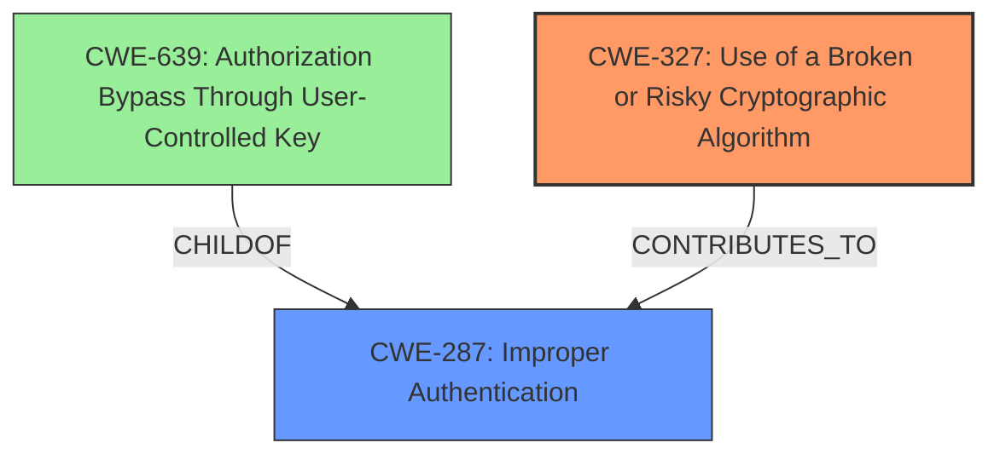

# Analysis Report for CVE-2021-39215

# Vulnerability Analysis Report: CVE-2021-39215

## Description


## Analysis (with Relationship Data)

# Summary
| CWE ID | CWE Name | Confidence | CWE Abstraction Level | CWE Vulnerability Mapping Label | CWE-Vulnerability Mapping Notes |
|---|---|---|---|---|---|
| CWE-327 | Use of a Broken or Risky Cryptographic Algorithm | 0.9 | Class | Primary | Allowed-with-Review |
| CWE-287 | Improper Authentication | 0.7 | Class | Secondary | Discouraged |

## Evidence and Confidence

*   **Confidence Score:** 0.8
*   **Evidence Strength:** HIGH

## Relationship Analysis
The primary CWE selected is CWE-327 **(Use of a Broken or Risky Cryptographic Algorithm)**, which is a Class-level CWE. While a more specific Base or Variant CWE would be ideal, the available information doesn't provide enough detail to pinpoint the exact cryptographic flaw. CWE-327 is related to CWE-287 **(Improper Authentication)**, as using a weak cryptographic algorithm often leads to authentication vulnerabilities. CWE-287 is a parent of CWE-639 (Authorization Bypass Through User-Controlled Key). Although not directly related via ChildOf relationships, CWE-327 can contribute to authentication bypass scenarios if the weak algorithm is used in the authentication process.



## Vulnerability Chain
The chain of events starts with the **use of symmetrical algorithms to validate JSON web tokens** (CWE-327), which leads to the ability to bypass authentication (CWE-287) and ultimately gain unauthorized access to protected rooms.

## Summary of Analysis
The analysis is based on the provided vulnerability description and the CVE reference summary. The key evidence is the **rootcause** which is the "**use of symmetrical algorithms to validate JSON web tokens**." This points towards CWE-327 (Use of a Broken or Risky Cryptographic Algorithm) as the primary weakness. The resulting impact of gaining unauthorized access to protected rooms is related to authentication bypass, which suggests CWE-287 (Improper Authentication). However, CWE-287 is a class-level CWE and the guidance says it might be misused when lower-level CWE entries are likely to be applicable, therefore it is secondary in this instance.

The graph relationships influenced the selection by highlighting the connection between using weak cryptography and potential authentication issues. CWE-327 is at the optimal level of specificity given the available information. While a more detailed CWE describing the specific cryptographic flaw would be ideal, the description only mentions the use of symmetric algorithms without specifying the exact algorithm or its weaknesses.

Relevant CWE Information:

# Enhanced Context (25 CWEs)
The following CWEs were identified as potentially relevant to this vulnerability:

## CWE-312: Cleartext Storage of Sensitive Information
**Abstraction Level**: Base
**Similarity Score**: 0.79

**Description**:
The product stores sensitive information in cleartext within a resource that might be accessible to another control sphere.
- *Not Selected*: Not relevant, vulnerability is about JWT validation, not storage.

## CWE-319: Cleartext Transmission of Sensitive Information
**Abstraction Level**: Base
**Similarity Score**: 0.79

**Description**:
The product transmits sensitive or security-critical data in cleartext in a communication channel that can be sniffed by unauthorized actors.
- *Not Selected*: Not relevant, vulnerability is about JWT validation, not transmission.

## CWE-226: Sensitive Information in Resource Not Removed Before Reuse
**Abstraction Level**: Base
**Similarity Score**: 0.78

**Description**:
The product releases a resource such as memory or a file so that it can be made available for reuse, but it does not clear or "zeroize" the information contained in the resource before the product performs a critical state transition or makes the resource available for reuse by other entities.
- *Not Selected*: Not relevant, vulnerability is about JWT validation, not resource reuse.

## CWE-311: Missing Encryption of Sensitive Data
**Abstraction Level**: Class
**Similarity Score**: 0.78

**Description**:
The product does not encrypt sensitive or critical information before storage or transmission.
- *Not Selected*: While related to cryptography, this is about missing encryption, not using a broken algorithm.

## CWE-345: Insufficient Verification of Data Authenticity
**Abstraction Level**: Class
**Similarity Score**: 0.78

**Description**:
The product does not sufficiently verify the origin or authenticity of data, in a way that causes it to accept invalid data.
- *Not Selected*: This is a broader category and CWE-327 is a more specific fit.

## CWE-212: Improper Removal of Sensitive Information Before Storage or Transfer
**Abstraction Level**: Base
**Similarity Score**: 0.77

**Description**:
The product stores, transfers, or shares a resource that contains sensitive information, but it does not properly remove that information before the product makes the resource available to unauthorized actors.
- *Not Selected*: Not relevant, vulnerability is about JWT validation, not information removal.

## CWE-303: Incorrect Implementation of Authentication Algorithm
**Abstraction Level**: Base
**Similarity Score**: 0.76

**Description**:
The requirements for the product dictate the use of an established authentication algorithm, but the implementation of the algorithm is incorrect.
- *Not Selected*: While this could be applicable, CWE-327 describes the **use of symmetrical algorithms** not the incorrect implementation.

## CWE-1391: Use of Weak Credentials
**Abstraction Level**: Class
**Similarity Score**: 0.76

**Description**:
The product uses weak credentials (such as a default key or hard-coded password) that can be calculated, derived, reused, or guessed by an attacker.
- *Not Selected*: The vulnerability stems from algorithm, not credentials.

## CWE-668: Exposure of Resource to Wrong Sphere
**Abstraction Level**: Class
**Similarity Score**: 0.76

**Description**:
The product exposes a resource to the wrong control sphere, providing unintended actors with inappropriate access to the resource.
- *Not Selected*: This is too broad and not directly related to the **rootcause**.

## CWE-807: Reliance on Untrusted Inputs in a Security Decision
**Abstraction Level**: Base
**Similarity Score**: 0.76

**Description**:
The product uses a protection mechanism that relies on the existence or values of an input, but the input can be modified by an untrusted actor in a way that bypasses the protection mechanism.
- *Not Selected*: While related, CWE-327 better describes the crypto issue.

## CWE-639: Authorization Bypass Through User-Controlled Key
**Abstraction Level**: Base
**Similarity Score**: 6834.77

**Description**:
The system's authorization functionality does not prevent one user from gaining access to another user's data or record by modifying the key value identifying the data.
- *Not Selected*: This is more about the authorization process itself, not the algorithm used.

## CWE-863: Incorrect Authorization
**Abstraction Level**: Class
**Similarity Score**: 6559.39

**Description**:
The product performs an authorization check when an actor attempts to access a resource or perform an action, but it does not correctly perform the check.
- *Not Selected*: The authorization is incorrect due to the weak crypto and is therefore not primary.

## CWE-327: Use of a Broken or Risky Cryptographic Algorithm
**Abstraction Level**: Class
**Similarity Score**: 6552.96

**Description**:
The product uses a broken or risky cryptographic algorithm or protocol.
- *Selected*: This accurately reflects the **rootcause** of the vulnerability. The **use of symmetrical algorithms to validate JSON web tokens** is the primary weakness.

## CWE-347: Improper Verification of Cryptographic Signature
**Abstraction Level**: Base
**Similarity Score**: 6509.99

**Description**:
The product does not verify, or incorrectly verifies, the cryptographic signature for data.
- *Not Selected*: While related to JWT, the problem is in the choice of algorithm.

## CWE-287: Improper Authentication
**Abstraction Level**: Class
**Similarity Score**: 6406.65

**Description**:
When an actor claims to have a given identity, the product does not prove or insufficiently proves that the claim is correct.
- *Selected*: This is a consequence of the weak cryptographic algorithm.

## CWE-201: Insertion of Sensitive Information Into Sent Data
**Abstraction Level**: base
**Similarity Score**: 5.


## CWE Relationship Analysis

Current CWEs represent these abstraction levels: .


### Vulnerability Chain Analysis

**Chain starting from CWE-303:**
- 303 (Incorrect Implementation of Authentication Algorithm) - ROOT


**Chain starting from CWE-312:**
- 312 (Cleartext Storage of Sensitive Information) - ROOT


### CWE Relationship Diagram

```mermaid
graph TD
    classDef primary fill:#f96,stroke:#333,stroke-width:2px
    classDef secondary fill:#69f,stroke:#333
    classDef tertiary fill:#9e9,stroke:#333
```


*Report generated on 2025-04-01 22:24:43*
