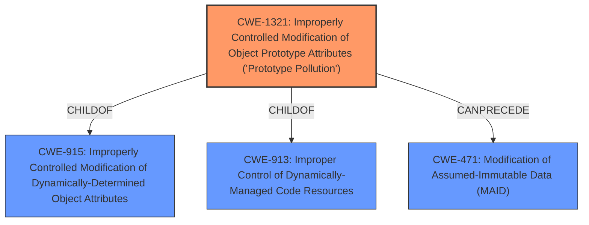

# Analysis for CVE-2021-39227

# Summary
| CWE ID  | CWE Name                                                                                    | Confidence | CWE Abstraction Level | CWE Vulnerability Mapping Label | CWE-Vulnerability Mapping Notes |
| :-------- | :------------------------------------------------------------------------------------------ | :----------- | :---------------------- | :------------------------------ | :-------------------------------- |
| CWE-1321 | Improperly Controlled Modification of Object Prototype Attributes ('Prototype Pollution') | 1          | Variant                 | Primary                         | Allowed                           |

## Evidence and Confidence

*   **Confidence Score:** 1
*   **Evidence Strength:** HIGH

## Relationship Analysis
The primary CWE is CWE-1321, which is a Variant-level CWE. It is related to CWE-915 (Improperly Controlled Modification of Dynamically-Determined Object Attributes) and CWE-913 (Improper Control of Dynamically-Managed Code Resources). CWE-1321 can precede CWE-471 (Modification of Assumed-Immutable Data (MAID)). These relationships indicate that prototype pollution can lead to modification of assumed immutable data.

## Vulnerability Chain
The vulnerability chain starts with the **improper handling of object attributes** in the `merge` and `clone` helper methods, leading to **prototype pollution**.

## Summary of Analysis
The vulnerability is a **prototype pollution** issue in the ZRender library. The `merge` and `clone` helper methods in `src/core/util.ts` do not properly sanitize input, allowing an attacker to inject properties into the prototype of the base object.

The vulnerability description states: "using `merge` and `clone` helper methods in the `src/core/util.ts` module results in **prototype pollution**." The CVE Reference Links Content Summary confirms this, stating: "The vulnerability stems from prototype pollution in the `merge` and `clone` helper methods... These methods, when used to merge or clone objects, don't properly sanitize the input, allowing an attacker to inject properties into the prototype of the base object." The summary also states: "The vulnerability is tracked as CWE-1321 (Improperly Controlled Modification of Object Prototype)."

The best match is CWE-1321 (Improperly Controlled Modification of Object Prototype Attributes ('Prototype Pollution')). The description of CWE-1321 aligns perfectly with the vulnerability description. "The product receives input from an upstream component that specifies attributes that are to be initialized or updated in an object, but it does not properly control modifications of attributes of the object prototype."

I considered other CWEs, but they were not as specific as CWE-1321. For example, CWE-79 (Improper Neutralization of Input During Web Page Generation ('Cross-site Scripting')) is a broader category that does not specifically address prototype pollution. CWE-639 (Authorization Bypass Through User-Controlled Key) is related to authorization issues, which is not the primary concern in this vulnerability.
The assigned CWE is at the optimal level of specificity (Variant) and accurately represents the weakness.