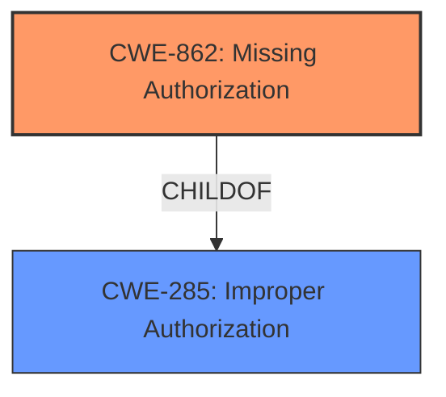

# Analysis Report for CVE-2021-39233

# Vulnerability Analysis Report: CVE-2021-39233

## Description


## Analysis (with Relationship Data)

# Summary
| CWE ID | CWE Name | Confidence | CWE Abstraction Level | CWE Vulnerability Mapping Label | CWE-Vulnerability Mapping Notes |
|---|---|---|---|---|---|
| CWE-862 | Missing Authorization | 1.0 | Base | Primary | Allowed |
| CWE-285 | Improper Authorization | 0.5 | Class | Secondary Candidate | Discouraged |

## Evidence and Confidence

*   **Confidence Score:** 1.0
*   **Evidence Strength:** HIGH

## Relationship Analysis
The primary CWE selected is CWE-862, which is a child of CWE-285. This parent-child relationship was considered because CWE-285 is a higher-level class, and CWE-862 provides a more specific description of the vulnerability. No other relationships influenced the decision.



## Vulnerability Chain
The vulnerability chain starts with the **missing authorization** check, leading to unauthorized access to container-related datanode operations. This can then lead to potential manipulation or access of container data.

## Summary of Analysis
The assessment is strongly based on the provided evidence, specifically:
- "Container related Datanode requests of Ozone Datanode were **not properly authorized** and can be called by any client."
- "**Missing Authorization:** The core weakness is the lack of proper authorization mechanisms for container-related datanode operations. This allows any client to invoke these operations, bypassing intended access controls."

The primary selection is CWE-862, which is at the Base level, and accurately reflects the **missing authorization** issue. The relationship graph shows that CWE-862 is a child of CWE-285. While CWE-285 was considered, the MITRE mapping guidance discourages using it due to its high-level nature, favoring its children such as CWE-862.

Relevant CWE Information:

# Enhanced Context (25 CWEs)

## CWE-862: Missing Authorization
**Abstraction:** Base
**Status:** Draft

### Description
When an actor attempts to access a resource or perform an action, the product does not perform an authorization check.

### Extended Description


Authorization determines if the actor is allowed to access the resource or perform the action. An authorization check determines if the actor is trusted, has the proper permissions, or is in a privileged role. Missing this check could allow an attacker to perform unauthorized activities and/or gain access to sensitive information.


There are several reasons why the authorization check may be missing, including:

  * The code was never written to include an authorization check.
  * The authorization check was removed during debugging, but never re-enabled.
  * The authorization check exists in a different part of the code, but is not called in this particular situation.


### Alternative Terms
None

### Relationships
ChildOf -> CWE-285
ChildOf -> CWE-284

### Mapping Guidance
**Usage:** Allowed
**Rationale:** This CWE entry is at the Base level of abstraction, which is a preferred level of abstraction for mapping to the root causes of vulnerabilities.
**Comments:** Carefully read both the name and description to ensure that this mapping is an appropriate fit. Do not try to 'force' a mapping to a lower-level Base/Variant simply to comply with this preferred level of abstraction.
**Reasons:**
- Acceptable-Use

### Observed Examples
- **CVE-2023-24921:** Chain: A security risk exists in the form of a missing authorization check (CWE-862) in the setCustomValidity() function of the FileStorage class. This vulnerability allows a malicious actor to manipulate the values of files, which in turn causes a stored cross-site scripting (XSS) attack (CWE-79) to occur.
- **CVE-2023-24920:** Chain: A security risk exists in the form of a missing authorization check (CWE-862) in the renameFile() function of the FileStorage class. This vulnerability allows a malicious actor to manipulate the values of files, which in turn causes a stored cross-site scripting (XSS) attack (CWE-79) to occur.
- **CVE-2022-41946:** The "Test Execution" page is missing an authorization check, allowing any authenticated user to view other users' sensitive test information.

## CWE-285: Improper Authorization
**Abstraction:** Class
**Status:** Draft

### Description
The product does not perform or incorrectly performs an authorization check when an actor attempts to access a resource or perform an action.

### Extended Description


Assuming a user with a given identity, authorization is the process of determining whether that user can access a given resource, based on the user's privileges and any permissions or other access-control specifications that apply to the resource.


When access control checks are not applied consistently - or not at all - users are able to access data or perform actions that they should not be allowed to perform. This can lead to a wide range of problems, including information exposures, denial of service, and arbitrary code execution.


### Alternative Terms
AuthZ: "AuthZ" is typically used as an abbreviation of "authorization" within the web application security community. It is distinct from "AuthN" (or, sometimes, "AuthC") which is an abbreviation of "authentication." The use of "Auth" as an abbreviation is discouraged, since it could be used for either authentication or authorization.

### Relationships
ChildOf -> CWE-284
ChildOf -> CWE-284

### Mapping Guidance
**Usage:** Discouraged
**Rationale:** CWE-285 is high-level and lower-level CWEs can frequently be used instead. It is a level-1 Class (i.e., a child of a Pillar).
**Comments:** Look at CWE-285's children and consider mapping to CWEs such as CWE-862: Missing Authorization, CWE-863: Incorrect Authorization, CWE-732: Incorrect Permission Assignment for Critical Resource, or others.
**Reasons:**
- Abstraction
**Suggested Alternatives:**
- CWE-862: Missing Authorization
- CWE-863: Incorrect Authorization
- CWE-732: Incorrect Permission Assignment for Critical Resource

### Observed Examples
- **CVE-2022-24730:** Go-based continuous deployment product does not check that a user has certain privileges to update or create an app, allowing adversaries to read sensitive repository information
- **CVE-2009-3168:** Web application does not restrict access to admin scripts, allowing authenticated users to reset administrative passwords.
- **CVE-2009-2960:** Web application does not restrict access to admin scripts, allowing authenticated users to modify passwords of other users.

CWE-285 was considered but not selected as the primary CWE due to the MITRE mapping guidance discouraging its use because it is high-level. The description of CWE-862 aligns more precisely with the vulnerability, as it specifically mentions the absence of authorization checks.


## CWE Relationship Analysis

Current CWEs represent these abstraction levels: .


### Vulnerability Chain Analysis

**Chain starting from CWE-732:**
- 732 (Incorrect Permission Assignment for Critical Resource) - ROOT


**Chain starting from CWE-79:**
- 79 (Improper Neutralization of Input During Web Page Generation ('Cross-site Scripting')) - ROOT


### CWE Relationship Diagram

```mermaid
graph TD
    classDef primary fill:#f96,stroke:#333,stroke-width:2px
    classDef secondary fill:#69f,stroke:#333
    classDef tertiary fill:#9e9,stroke:#333
```


*Report generated on 2025-04-02 11:06:43*
