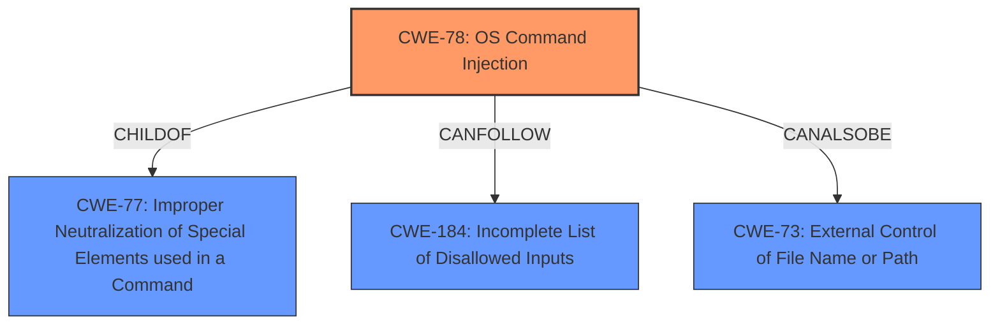

# Enhanced Analysis for CVE-2021-39244

# Summary
| CWE ID | CWE Name | Confidence | CWE Abstraction Level | CWE Vulnerability Mapping Label | CWE-Vulnerability Mapping Notes |
|---|---|---|---|---|---|
| **CWE-78** | **Improper Neutralization of Special Elements used in an OS Command ('OS Command Injection')** | 1.0 | Base | Primary | Allowed |
| CWE-73 | External Control of File Name or Path | 0.5 | Base | Secondary | Allowed |
| CWE-184 | Incomplete List of Disallowed Inputs | 0.5 | Base | Secondary | Allowed |

## Evidence and Confidence

*   **Confidence Score:** 1.0
*   **Evidence Strength:** HIGH

## Relationship Analysis
The primary relationship impacting the decision is the ChildOf relationship between CWE-78 and CWE-77. CWE-78 is more specific ("OS Command Injection") than CWE-77 ("Command Injection"), and given the vulnerability involves OS commands, CWE-78 is a better fit. CWE-78 can also be related to CWE-184 (Incomplete List of Disallowed Inputs) and CWE-88 (Improper Neutralization of Argument Delimiters in a Command), and CWE-73 which are considered as secondary issues.



## Vulnerability Chain
The vulnerability chain starts with **external control of input** which leads to **improper neutralization of special elements**, finally resulting in **OS command injection**:
1.  The `getlogs.cgi` script receives user-controlled input via URL parameters.
2.  The script **fails to sanitize** this input.
3.  This **improper neutralization** allows an attacker to inject arbitrary OS commands.
4.  The injected commands are executed, leading to potential system compromise.

## Summary of Analysis
The primary weakness is **CWE-78: Improper Neutralization of Special Elements used in an OS Command ('OS Command Injection')**. This is strongly supported by the vulnerability description and the CVE Reference Links Content Summary. The summary explicitly states that the root cause is the **lack of sanitization** of user-provided input, allowing for **command injection**. The `getlogs.cgi` script takes user-provided input for `tcpdump` parameters directly from the URL query string and uses them in a command without proper sanitization which allows for command injection. The impact of successful exploitation is arbitrary code execution on the device.

The evidence is clearly present in the "CVE Reference Links Content Summary":

> The vulnerability stems from the `getlogs.cgi` script, which allows authenticated users to initiate `tcpdump` on the device. The script takes user-provided input for `tcpdump` parameters (`tcpdump_iface` and `tcpdump_count`) directly from the URL query string and uses them in a command without proper sanitization. This **lack of sanitization** allows for **command injection**.

CWE-78 is at the Base level of abstraction, which is preferred. The mapping guidance for CWE-78 states that it is "Allowed" and that the name and description should be carefully read to ensure an appropriate fit. This is clearly the case here.

CWE-77 ("Improper Neutralization of Special Elements used in a Command ('Command Injection')") was considered as a possible primary CWE. While command injection is present, the commands injected are OS commands. Therefore, the more specific CWE-78 is a better fit. The mapping guidance for CWE-77 even suggests CWE-78 as an alternative.

CWE-73 ("External Control of File Name or Path") and CWE-184 ("Incomplete List of Disallowed Inputs") were also considered as contributing factors because the filenames and tcpdump options are externally controlled and there may be an incomplete list of disallowed inputs, making them secondary to the main injection vulnerability.

Relevant CWE Information:

# Enhanced Context (25 CWEs)
The following CWEs were identified as potentially relevant to this vulnerability:

## CWE-1236: Improper Neutralization of Formula Elements in a CSV File
**Abstraction Level**: Base
**Similarity Score**: 0.81
**Source**: dense

**Description**:
The product saves user-provided information into a Comma-Separated Value (CSV) file, but it does not neutralize or incorrectly neutralizes special elements that could be interpreted as a command when the file is opened by a spreadsheet product.

**Mapping Guidance**:
- Usage: Allowed
- Rationale: This CWE entry is at the Base level of abstraction, which is a preferred level of abstraction for mapping to the root causes of vulnerabilities.


## CWE-74: Improper Neutralization of Special Elements in Output Used by a Downstream Component ('Injection')
**Abstraction Level**: Class
**Similarity Score**: 0.77
**Source**: dense

**Description**:
The product constructs all or part of a command, data structure, or record using externally-influenced input from an upstream component, but it does not neutralize or incorrectly neutralizes special elements that could modify how it is parsed or interpreted when it is sent to a downstream component.

**Mapping Guidance**:
- Usage: Discouraged
- Rationale: CWE-74 is high-level and often misused when lower-level weaknesses are more appropriate.


## CWE-184: Incomplete List of Disallowed Inputs
**Abstraction Level**: Base
**Similarity Score**: 0.75
**Source**: dense

**Description**:
The product implements a protection mechanism that relies on a list of inputs (or properties of inputs) that are not allowed by policy or otherwise require other action to neutralize before additional processing takes place, but the list is incomplete.

**Mapping Guidance**:
- Usage: Allowed
- Rationale: This CWE entry is at the Base level of abstraction, which is a preferred level of abstraction for mapping to the root causes of vulnerabilities.


## CWE-138: Improper Neutralization of Special Elements
**Abstraction Level**: Class
**Similarity Score**: 0.75
**Source**: dense

**Description**:
The product receives input from an upstream component, but it does not neutralize or incorrectly neutralizes special elements that could be interpreted as control elements or syntactic markers when they are sent to a downstream component.

**Mapping Guidance**:
- Usage: Discouraged
- Rationale: This CWE entry is a level-1 Class (i.e., a child of a Pillar). It might have lower-level children that would be more appropriate


## CWE-23: Relative Path Traversal
**Abstraction Level**: Base
**Similarity Score**: 0.74
**Source**: dense

**Description**:
The product uses external input to construct a pathname that should be within a restricted directory, but it does not properly neutralize sequences such as ".." that can resolve to a location that is outside of that directory.

**Mapping Guidance**:
- Usage: Allowed
- Rationale: This CWE entry is at the Base level of abstraction, which is a preferred level of abstraction for mapping to the root causes of vulnerabilities.


## CWE-116: Improper Encoding or Escaping of Output
**Abstraction Level**: Class
**Similarity Score**: 0.74
**Source**: dense

**Description**:
The product prepares a structured message for communication with another component, but encoding or escaping of the data is either missing or done incorrectly. As a result, the intended structure of the message is not preserved.

**Mapping Guidance**:
- Usage: Allowed-with-Review
- Rationale: This CWE entry is a Class and might have Base-level children that would be more appropriate


## CWE-73: External Control of File Name or Path
**Abstraction Level**: Base
**Similarity Score**: 0.74
**Source**: dense

**Description**:
The product allows user input to control or influence paths or file names that are used in filesystem operations.

**Mapping Guidance**:
- Usage: Allowed
- Rationale: This CWE entry is at the Base level of abstraction, which is a preferred level of abstraction for mapping to the root causes of vulnerabilities.


## CWE-917: Improper Neutralization of Special Elements used in an Expression Language Statement ('Expression Language Injection')
**Abstraction Level**: Base
**Similarity Score**: 0.73
**Source**: dense

**Description**:
The product constructs all or part of an expression language (EL) statement in a framework such as a Java Server Page (JSP) using externally-influenced input from an upstream component, but it does not neutralize or incorrectly neutralizes special elements that could modify the intended EL statement before it is executed.

**


## CWE Relationship Analysis

Current CWEs represent these abstraction levels: .


### Vulnerability Chain Analysis

**Chain starting from CWE-88:**
- 88 (Improper Neutralization of Argument Delimiters in a Command ('Argument Injection')) - ROOT


**Chain starting from CWE-73:**
- 73 (External Control of File Name or Path) - ROOT


### CWE Relationship Diagram

```mermaid
graph TD
    classDef primary fill:#f96,stroke:#333,stroke-width:2px
    classDef secondary fill:#69f,stroke:#333
    classDef tertiary fill:#9e9,stroke:#333
```