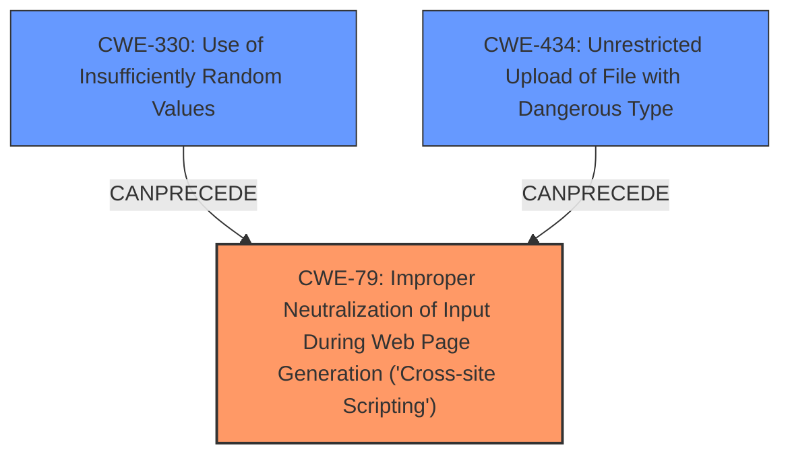

# Enhanced Analysis for CVE-2021-39249

# Summary
| CWE ID | CWE Name | Confidence | CWE Abstraction Level | CWE Vulnerability Mapping Label | CWE-Vulnerability Mapping Notes |
|---|---|---|---|---|---|
| CWE-79 | Improper Neutralization of Input During Web Page Generation ('Cross-site Scripting') | 1.0 | Base | Allowed | Primary CWE |
| CWE-330 | Use of Insufficiently Random Values | 0.9 | Class | Discouraged | Secondary Candidate |
| CWE-434 | Unrestricted Upload of File with Dangerous Type | 0.7 | Base | Allowed | Secondary Candidate |

## Evidence and Confidence

*   **Confidence Score:** 0.9
*   **Evidence Strength:** HIGH

## Relationship Analysis
The primary CWE is **CWE-79** [Improper Neutralization of Input During Web Page Generation ('Cross-site Scripting')], representing the **cross-site scripting** vulnerability. This is enabled by **CWE-330** [Use of Insufficiently Random Values], which makes the filenames predictable and **CWE-434** [Unrestricted Upload of File with Dangerous Type], which allows files of `text/html` to be served.



## Vulnerability Chain
The vulnerability chain starts with the **ROOTCAUSE** of **CWE-330** [Use of Insufficiently Random Values] which leads to predictable filenames, then **CWE-434** [Unrestricted Upload of File with Dangerous Type] allows uploading files without extensions, which are served as `text/html`. Finally, **CWE-79** [Improper Neutralization of Input During Web Page Generation ('Cross-site Scripting')] occurs because the application does not properly neutralize user-controllable input before placing it in a web page served to other users.

## Summary of Analysis
The primary vulnerability is **CWE-79** [Improper Neutralization of Input During Web Page Generation ('Cross-site Scripting')], which is a **cross-site scripting** vulnerability. The exploit is made possible by insecure filename generation (**CWE-330** [Use of Insufficiently Random Values]) and serving files without extensions as `text/html` (**CWE-434** [Unrestricted Upload of File with Dangerous Type]).

The **Vulnerability Description Key Phrases** section states "**weakness:** **cross-site scripting**".

The **CVE Reference Links Content Summary** section describes:
*   **Insecure Filename Randomization:** The use of `mt_rand()` for generating the MD5 hash in filenames makes them predictable.
*   **Default Content-Type Vulnerability:** When a file without an extension is accessed directly, the webserver serves it with a `text/html` Content-Type, leading to an XSS vulnerability.
*   **Stored XSS:** The combination of predictable filenames, default content type, and iframe embedding leads to a stored XSS vulnerability.

The selected CWEs are at the optimal level of specificity because **CWE-79** [Improper Neutralization of Input During Web Page Generation ('Cross-site Scripting')] directly addresses the XSS vulnerability, **CWE-330** [Use of Insufficiently Random Values] addresses the predictable filename issue, and **CWE-434** [Unrestricted Upload of File with Dangerous Type] addresses the unrestricted file upload issue.

**CWE-330** [Use of Insufficiently Random Values] was considered because the filenames are predictable due to the use of `mt_rand()`. It is a Class-level CWE, and there might be more specific children, but the description matches the vulnerability. The Mapping Guidance discourages its use because it is a Class.
**CWE-434** [Unrestricted Upload of File with Dangerous Type] was considered because the application allows uploading files without extensions and serves them as `text/html`. The description matches the vulnerability.

Other CWEs were not selected because they didn't directly address the root causes described in the vulnerability description.


## CWE Relationship Analysis

Current CWEs represent these abstraction levels: .


### Vulnerability Chain Analysis

**Chain starting from CWE-434:**
- 434 (Unrestricted Upload of File with Dangerous Type) - ROOT


**Chain starting from CWE-79:**
- 79 (Improper Neutralization of Input During Web Page Generation ('Cross-site Scripting')) - ROOT


### CWE Relationship Diagram

```mermaid
graph TD
    classDef primary fill:#f96,stroke:#333,stroke-width:2px
    classDef secondary fill:#69f,stroke:#333
    classDef tertiary fill:#9e9,stroke:#333
```