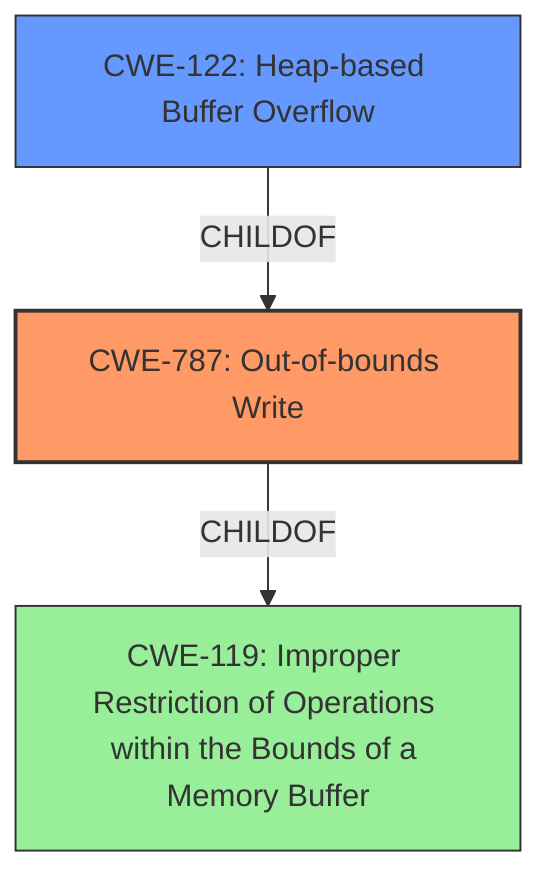

# Analysis for CVE-2021-39263

# Summary
| CWE ID  | CWE Name                                                                   | Confidence | CWE Abstraction Level | CWE Vulnerability Mapping Label | CWE-Vulnerability Mapping Notes |
| :-------- | :------------------------------------------------------------------------- | :---------- | :---------------------- | :------------------------------ | :------------------------------ |
| CWE-787 | Out-of-bounds Write                                                        | 1          | Base                     | Primary CWE                    | Allowed                       |
| CWE-122 | Heap-based Buffer Overflow                                                 | 0.9         | Variant                  | Secondary CWE                   | Allowed                       |
| CWE-119 | Improper Restriction of Operations within the Bounds of a Memory Buffer | 0.6         | Class                     | Secondary CWE                  | Discouraged                    |

## Evidence and Confidence

*   **Confidence Score:** 0.9
*   **Evidence Strength:** HIGH

## Relationship Analysis
The primary CWE, CWE-787, is a base-level CWE and a child of CWE-119. CWE-122 is a variant of CWE-787 describing the specific location of the buffer. CWE-119 is a class-level CWE that is too general for this vulnerability, but it is related as it describes the general class of buffer errors. The selection of CWE-787 is due to the clear evidence of an out-of-bounds write, while CWE-122 provides further specificity about the heap location.



## Vulnerability Chain
The vulnerability chain starts with a crafted NTFS image containing an **unsanitized attribute**, leading to a **heap-based buffer overflow** due to an out-of-bounds write.

## Summary of Analysis
The initial analysis focused on identifying the root cause and the specific type of buffer overflow. The vulnerability description and CVE details clearly point to a **heap-based buffer overflow** caused by an **unsanitized attribute**. The analysis confirms that CWE-787 (Out-of-bounds Write) is the most appropriate primary CWE, as it accurately describes the **root cause** of writing data beyond the intended buffer boundary. CWE-122 (Heap-based Buffer Overflow) is included as a secondary CWE to specify the memory location of the overflow.

The evidence from the vulnerability description: "A crafted NTFS image can trigger a **heap-based buffer overflow**, caused by an **unsanitized attribute** in ntfs_get_attribute_value, in NTFS-3G < 2021.8.22."

The graph relationships confirm the hierarchical relationship, and the selected CWEs are at the optimal level of specificity, with CWE-787 being the base and CWE-122 being a variant providing additional context.

Relevant CWE Information:

# Enhanced Context (25 CWEs)

## CWE-191: Integer Underflow (Wrap or Wraparound)
**Abstraction Level**: Base
**Similarity Score**: 0.77
**Source**: dense

**Description**:
The product subtracts one value from another, such that the result is less than the minimum allowable integer value, which produces a value that is not equal to the correct result.

**Mapping Guidance**:
- Usage: Allowed
- Rationale: This CWE entry is at the Base level of abstraction, which is a preferred level of abstraction for mapping to the root causes of vulnerabilities.

## CWE-131: Incorrect Calculation of Buffer Size
**Abstraction Level**: Base
**Similarity Score**: 0.76
**Source**: dense

**Description**:
The product does not correctly calculate the size to be used when allocating a buffer, which could lead to a buffer overflow.

**Mapping Guidance**:
- Usage: Allowed
- Rationale: This CWE entry is at the Base level of abstraction, which is a preferred level of abstraction for mapping to the root causes of vulnerabilities.

## CWE-125: Out-of-bounds Read
**Abstraction Level**: Base
**Similarity Score**: 0.75
**Source**: dense

**Description**:
The product reads data past the end, or before the beginning, of the intended buffer.

**Mapping Guidance**:
- Usage: Allowed
- Rationale: This CWE entry is at the Base level of abstraction, which is a preferred level of abstraction for mapping to the root causes of vulnerabilities.

## CWE-126: Buffer Over-read
**Abstraction Level**: Variant
**Similarity Score**: 0.75
**Source**: dense

**Description**:
The product reads from a buffer using buffer access mechanisms such as indexes or pointers that reference memory locations after the targeted buffer.

**Mapping Guidance**:
- Usage: Allowed
- Rationale: This CWE entry is at the Variant level of abstraction, which is a preferred level of abstraction for mapping to the root causes of vulnerabilities.

## CWE-124: Buffer Underwrite ('Buffer Underflow')
**Abstraction Level**: Base
**Similarity Score**: 0.74
**Source**: dense

**Description**:
The product writes to a buffer using an index or pointer that references a memory location prior to the beginning of the buffer.

**Mapping Guidance**:
- Usage: Allowed
- Rationale: This CWE entry is at the Base level of abstraction, which is a preferred level of abstraction for mapping to the root causes of vulnerabilities.

## CWE-681: Incorrect Conversion between Numeric Types
**Abstraction Level**: Base
**Similarity Score**: 0.74
**Source**: dense

**Description**:
When converting from one data type to another, such as long to integer, data can be omitted or translated in a way that produces unexpected values. If the resulting values are used in a sensitive context, then dangerous behaviors may occur.

**Mapping Guidance**:
- Usage: Allowed
- Rationale: This CWE entry is at the Base level of abstraction, which is a preferred level of abstraction for mapping to the root causes of vulnerabilities.

## CWE-190: Integer Overflow or Wraparound
**Abstraction Level**: Base
**Similarity Score**: 0.74
**Source**: dense

**Description**:
The product performs a calculation that can
         produce an integer overflow or wraparound when the logic
         assumes that the resulting value will always be larger than
         the original value. This occurs when an integer value is
         incremented to a value that is too large to store in the
         associated representation. When this occurs, the value may
         become a very small or negative number.

**Mapping Guidance**:
- Usage: Allowed
- Rationale: This CWE entry is at the Base level of abstraction, which is a preferred level of abstraction for mapping to the root causes of vulnerabilities.

## CWE-197: Numeric Truncation Error
**Abstraction Level**: Base
**Similarity Score**: 0.74
**Source**: dense

**Description**:
Truncation errors occur when a primitive is cast to a primitive of a smaller size and data is lost in the conversion.

**Mapping Guidance**:
- Usage: Allowed
- Rationale: This CWE entry is at the Base level of abstraction, which is a preferred level of abstraction for mapping to the root causes of vulnerabilities.

## CWE-129: Improper Validation of Array Index
**Abstraction Level**: Variant
**Similarity Score**: 0.74
**Source**: dense

**Description**:
The product uses untrusted input when calculating or using an array index, but the product does not validate or incorrectly validates the index to ensure the index references a valid position within the array.

**Mapping Guidance**:
- Usage: Allowed
- Rationale: This CWE entry is at the Variant level of abstraction, which is a preferred level of abstraction for mapping to the root causes of vulnerabilities.

## CWE-805: Buffer Access with Incorrect Length Value
**Abstraction Level**: Base
**Similarity Score**: 0.74
**Source**: dense

**Description**:
The product uses a sequential operation to read or write a buffer, but it uses an incorrect length value that causes it to access memory that is outside of the bounds of the buffer.

**Mapping Guidance**:
- Usage: Allowed
- Rationale: This CWE entry is at the Base level of abstraction, which is a preferred level of abstraction for mapping to the root causes of vulnerabilities.

## CWE-190: Integer Overflow or Wraparound
**Abstraction Level**: Base
**Similarity Score**: 8543.74
**Source**: sparse

**Description**:
The product performs a calculation that can
         produce an integer overflow or wraparound when the logic
         assumes that the resulting value will always be larger than
         the original value. This occurs when an integer value is
         incremented to

# Enhanced Query for CVE-2021-39263

## Vulnerability Description
A crafted NTFS image can trigger a **heap-based buffer overflow**, caused by an unsanitized attribute in ntfs_get_attribute_value, in NTFS-3G < 2021.8.22.

### Vulnerability Description Key Phrases
- **weakness:** **heap-based buffer overflow**
- **vector:** crafted NTFS image
- **product:** NTFS-3G
- **version:** < 2021.8.22
- **component:** ntfs_get_attribute_value

## CVE Reference Links Content Summary
```
{
  "CVE-2021-39263": {
    "description": "A crafted NTFS image can trigger a heap-based buffer overflow, caused by an unsanitized attribute in ntfs_get_attribute_value, in NTFS-3G < 2021.8.22.",
    "vulnerability_details": {
      "root_cause": "An unsanitized attribute in ntfs_get_attribute_value leads to a heap-based buffer overflow.",
      "weaknesses": [
        "CWE-787"
      ],
      "impact": "A heap-based buffer overflow can occur.",
      "attack_vector": "Local",
      "required_capabilities": "A crafted NTFS image."
    }
  },
  "CVE-2021-39258": {
    "description": "A crafted NTFS image can cause out-of-bounds reads in ntfs_attr_find and ntfs_external_attr_find in NTFS-3G < 2021.8.22.",
     "vulnerability_details": {
       "root_cause": "A crafted NTFS image can cause out-of-bounds reads in ntfs_attr_find and ntfs_external_attr_find.",
       "weaknesses": [
         "CWE-125"
       ],
       "impact": "Out-of-bounds read.",
        "attack_vector": "Local",
        "required_capabilities": "A crafted NTFS image."
      }
  },
  "CVE-2021-39253": {
     "description": "A crafted NTFS image can cause an out-of-bounds read in ntfs_runlists_merge_i in NTFS-3G < 2021.8.22.",
      "vulnerability_details": {
        "root_cause": "A crafted NTFS image can cause an out-of-bounds read in ntfs_runlists_merge_i.",
        "weaknesses": [
          "CWE-125"
        ],
        "impact": "Out-of-bounds read.",
         "attack_vector": "Local",
        "required_capabilities": "A crafted NTFS image."
      }
    },
  "CVE-2021-35267": {
      "description": "In Tuxera NTFS-3G versions < 2021.8.22, a stack buffer overflow can occur when correcting differences in the MFT and MFTMirror allowing for code execution or escalation of privileges when setuid-root.",
        "vulnerability_details": {
        "root_cause": "A stack buffer overflow can occur when correcting differences in the MFT and MFTMirror.",
        "weaknesses": [
          "CWE-787"
        ],
        "impact": "Code execution or escalation of privileges when setuid-root.",
        "attack_vector": "Local",
        "required_capabilities": "A crafted NTFS image."
      }
    },
    "CVE-2021-39255": {
      "description": "A crafted NTFS image can trigger an out-of-bounds read, caused by an invalid attribute in ntfs_attr_find_in_attrdef, in NTFS-3G < 2021.8.22.",
       "vulnerability_details": {
        "root_cause": "An invalid attribute in ntfs_attr_find_in_attrdef causes an out-of-bounds read.",
        "weaknesses": [
          "CWE-125"
        ],
        "impact": "Out-of-bounds read.",
        "attack_vector": "Local",
         "required_capabilities": "A crafted NTFS image."
      }
    },
  "CVE-2021-33286": {
    "description": "In Tuxera NTFS-3G versions < 2021.8.22, when a specially crafted unicode string is supplied in an NTFS image a heap buffer overflow can occur and allow for code execution.",
       "vulnerability_details": {
        "root_cause": "A specially crafted unicode string in an NTFS image causes a heap buffer overflow.",
        "weaknesses": [
          "CWE-787"
        ],
         "impact": "Code execution.",
          "attack_vector": "Local",
          "required_capabilities": "A crafted NTFS image with a unicode string."
      }
  },
   "CVE-2021-39251": {
      "description": "A crafted NTFS image can cause a NULL pointer dereference in ntfs_extent_inode_open in NTFS-3G < 2021.8.22.",
     "vulnerability_details": {
        "root_cause": "A crafted NTFS image can cause a NULL pointer dereference in ntfs_extent_inode_open.",
       "weaknesses": [
          "CWE-476"
        ],
        "impact": "NULL pointer dereference.",
         "attack_vector": "Local",
        "required_capabilities": "A crafted NTFS image."
      }
    },
  "CVE-2021-39260": {
    "description": "A crafted NTFS image can cause an out-of-bounds access in ntfs_inode_sync_standard_information in NTFS-3G < 2021.8.22.",
       "vulnerability_details": {
         "root_cause": "A crafted NTFS image can cause an out-of-bounds access in ntfs_inode_sync_standard_information.",
         "weaknesses": [
           "CWE-119",
           "CWE-787"
        ],
         "impact": "Out-of-bounds access.",
          "attack_vector": "Local",
        "required_capabilities": "A crafted NTFS image."
      }
  },
  "CVE-2021-39254": {
     "description": "A crafted NTFS image can cause an integer overflow in memmove, leading to a heap-based buffer overflow in the function ntfs_attr_record_resize, in NTFS-3G < 2021.8.22.",
        "vulnerability_details": {
         "root_cause": "A crafted NTFS image can cause an integer overflow in memmove, leading to a heap-based buffer overflow in ntfs_attr_record_resize.",
        "weaknesses": [
          "CWE-190"
        ],
          "impact": "Heap-based buffer overflow.",
           "attack_vector": "Local",
        "required_capabilities": "A crafted NTFS image."
      }
    },
    "CVE-2021-39261": {
      "description": "A crafted NTFS image can cause a heap-based buffer overflow in ntfs_compressed_pwrite in NTFS-3G < 2021.8.22.",
        "vulnerability_details": {
          "root_cause": "A crafted NTFS image can cause a heap-based buffer overflow in ntfs_compressed_pwrite.",
          "weaknesses": [
            "CWE-787"
          ],
         "impact": "Heap-based buffer overflow.",
         "attack_vector": "Local",
          "required_capabilities": "A crafted NTFS image."
      }
    },
   "CVE-2021-39252": {
      "description": "A crafted NTFS image can cause an out-of-bounds read in ntfs_ie_lookup in NTFS-3G < 2021.8.22.",
        "vulnerability_details": {
         "root_cause": "A crafted NTFS image can cause an out-of-bounds read in ntfs_ie_lookup.",
         "weaknesses": [
           "CWE-125"
        ],
         "impact": "Out-of-bounds read.",
          "attack_vector": "Local",
         "required_capabilities": "A crafted NTFS image."
      }
   },
  "CVE-2021-35269": {
       "description": "Tuxera NTFS-3G versions < 2021.8.22, when a specially crafted NTFS attribute from the MFT is setup in the function ntfs_attr_setup_flag, a heap buffer overflow can occur allowing for code execution and escalation of privileges.",
      "vulnerability_details": {
       "root_cause": "A specially crafted NTFS attribute from the MFT is setup in ntfs_attr_setup_flag, a heap buffer overflow can occur.",
        "weaknesses": [
           "CWE-269",
          "CWE-787"
        ],
        "impact": "Code execution and escalation of privileges.",
         "attack_vector": "Local",
        "required_capabilities": "A crafted NTFS image with a specific attribute."
      }
    },
   "CVE-2021-39262": {
      "description": "A crafted NTFS image can cause an out-of-bounds access in ntfs_decompress in NTFS-3G < 2021.8.22.",
       "vulnerability_details": {
         "root_cause": "A crafted NTFS image can cause an out-of-bounds access in ntfs_decompress.",
         "weaknesses": [
           "CWE-119",
           "CWE-787"
        ],
        "impact": "Out-of-bounds access.",
          "attack_vector": "Local",
        "required_capabilities": "A crafted NTFS image."
      }
    },
  "CVE-2021-39256": {
        "description": "A crafted NTFS image can cause a heap-based buffer overflow in ntfs_inode_lookup_by_name in NTFS-3G < 2021.8.22.",
        "vulnerability_details": {
        "root_cause": "A crafted NTFS image can cause a heap-based buffer overflow in ntfs_inode_lookup_by_name.",
        "weaknesses": [
          "CWE-787"
        ],
          "impact": "Heap-based buffer overflow.",
         "attack_vector": "Local",
        "required_capabilities": "A crafted NTFS image."
      }
  },
    "CVE-2021-39257": {
        "description": "A crafted NTFS image with an unallocated bitmap can lead to a endless recursive function call chain (starting from ntfs_attr_pwrite), causing stack consumption in NTFS-3G < 2021.8.22.",
        "vulnerability_details": {
        "root_cause": "A crafted NTFS image with an unallocated bitmap can lead to a endless recursive function call chain (starting from ntfs_attr_pwrite).",
        "weaknesses": [
          "CWE-674"
        ],
          "impact": "Stack consumption.",
          "attack_vector": "Local",
        "required_capabilities": "A crafted NTFS image with an unallocated bitmap."
      }
    },
    "CVE-2021-35268": {
       "description": "Tuxera NTFS-3G versions < 2021.8.22, when a specially crafted NTFS inode is loaded in the function ntfs_inode_real_open, a heap buffer overflow can occur allowing for code execution and escalation of privileges.",
       "vulnerability_details": {
         "root_cause": "A specially crafted NTFS inode loaded in ntfs_inode_real_open causes a heap buffer overflow.",
        "weaknesses": [
          "CWE-787"
        ],
         "impact": "Code execution and escalation of privileges.",
          "attack_vector": "Local",
         "required_capabilities": "A crafted NTFS image with a specific inode."
       }
    },
  "CVE-2021-35266": {
        "description": "In Tuxera NTFS-3G versions < 2021.8.22, when a specially crafted NTFS inode pathname is supplied in an NTFS image a heap buffer overflow can occur resulting in memory disclosure, denial of service and even code execution.",
       "vulnerability_details": {
        "root_cause": "A specially crafted NTFS inode pathname in an NTFS image causes a heap buffer overflow.",
        "weaknesses": [
          "CWE-787"
        ],
         "impact": "Memory disclosure, denial of service, and code execution.",
        "attack_vector": "Local",
          "required_capabilities": "A crafted NTFS image with a specific pathname."
      }
    },
    "CVE-2021-33289": {
       "description": "In Tuxera NTFS-3G versions < 2021.8.22, when a specially crafted MFT section is supplied in an NTFS image a heap buffer overflow can occur and allow for code execution.",
       "vulnerability_details": {
          "root_cause": "A specially crafted MFT section in an NTFS image causes a heap buffer overflow.",
          "weaknesses": [
            "CWE-787"
          ],
         "impact": "Code execution.",
         "attack_vector": "Local",
          "required_capabilities": "A crafted NTFS image with a specific MFT section."
      }
   },
   "CVE-2021-33287": {
      "description": "Tuxera NTFS-3G versions < 2021.8.22, when specially crafted NTFS attributes are read in the function ntfs_attr_pread_i, a heap buffer overflow can occur and allow for writing to arbitrary memory or denial of service of the application.",
        "vulnerability_details": {
         "root_cause": "Specially crafted NTFS attributes read in ntfs_attr_pread_i cause a heap buffer overflow.",
          "weaknesses": [
           "CWE-787"
        ],
         "impact": "Writing to arbitrary memory or denial of service.",
        "attack_vector": "Local",
        "required_capabilities": "A crafted NTFS image with specific attributes."
       }
    }
}
```

## Retriever Results

### Top Combined Results

| Rank | CWE ID | Name | Abstraction | Usage  | Retrievers | Individual Scores |
|------|--------|------|-------------|-------|------------|-------------------|
| 1 | 119 | Improper Restriction of Operations within the Bounds of a Memory Buffer | Class | Discouraged | alternate_terms | 0.800 |
| 2 | 190 | Integer Overflow or Wraparound | Base | Allowed | alternate_terms | 0.800 |
| 3 | 122 | Heap-based Buffer Overflow | Variant | Allowed | sparse | 0.255 |
| 4 | 193 | Off-by-one Error | Base | Allowed | sparse | 0.190 |
| 5 | 681 | Incorrect Conversion between Numeric Types | Base | Allowed | sparse | 0.182 |
| 6 | 126 | Buffer Over-read | Variant | Allowed | dense | 0.557 |
| 7 | 128 | Wrap-around Error | Base | Allowed | graph | 0.003 |
| 8 | 195 | Signed to Unsigned Conversion Error | Variant | Allowed | sparse | 0.181 |
| 9 | 1284 | Improper Validation of Specified Quantity in Input | Base | Allowed | sparse | 0.179 |
| 10 | 121 | Stack-based Buffer Overflow | Variant | Allowed | sparse | 0.176 |


# Complete CWE Specifications


## CWE-119: Improper Restriction of Operations within the Bounds of a Memory Buffer
**Abstraction:** Class
**Status:** Stable

### Description
The product performs operations on a memory buffer, but it reads from or writes to a memory location outside the buffer's intended boundary. This may result in read or write operations on unexpected memory locations that could be linked to other variables, data structures, or internal program data.

### Extended Description
Not provided

### Alternative Terms
Buffer Overflow: This term has many different meanings to different audiences. From a CWE mapping perspective, this term should be avoided where possible. Some researchers, developers, and tools intend for it to mean "write past the end of a buffer," whereas others use the same term to mean "any read or write outside the boundaries of a buffer, whether before the beginning of the buffer or after the end of the buffer." Others could mean "any action after the end of a buffer, whether it is a read or write." Since the term is commonly used for exploitation and for vulnerabilities, it further confuses things.
buffer overrun: Some prominent vendors and researchers use the term "buffer overrun," but most people use "buffer overflow." See the alternate term for "buffer overflow" for context.
memory safety: Generally used for techniques that avoid weaknesses related to memory access, such as those identified by CWE-119 and its descendants. However, the term is not formal, and there is likely disagreement between practitioners as to which weaknesses are implicitly covered by the "memory safety" term.

### Relationships
ChildOf -> CWE-118
ChildOf -> CWE-20

### Mapping Guidance
**Usage:** Discouraged
**Rationale:** CWE-119 is commonly misused in low-information vulnerability reports when lower-level CWEs could be used instead, or when more details about the vulnerability are available.
**Comments:** Look at CWE-119's children and consider mapping to CWEs such as CWE-787: Out-of-bounds Write, CWE-125: Out-of-bounds Read, or others.
**Reasons:**
- Frequent Misuse


### Additional Notes
**[Applicable Platform]** 

It is possible in any programming languages without memory management support to attempt an operation outside of the bounds of a memory buffer, but the consequences will vary widely depending on the language, platform, and chip architecture.


### Observed Examples
- **CVE-2021-22991:** Incorrect URI normalization in application traffic product leads to buffer overflow, as exploited in the wild per CISA KEV.
- **CVE-2020-29557:** Buffer overflow in Wi-Fi router web interface, as exploited in the wild per CISA KEV.
- **CVE-2009-2550:** Classic stack-based buffer overflow in media player using a long entry in a playlist


## CWE-190: Integer Overflow or Wraparound
**Abstraction:** Base
**Status:** Stable

### Description
The product performs a calculation that can
         produce an integer overflow or wraparound when the logic
         assumes that the resulting value will always be larger than
         the original value. This occurs when an integer value is
         incremented to a value that is too large to store in the
         associated representation. When this occurs, the value may
         become a very small or negative number.

### Extended Description
Not provided

### Alternative Terms
Overflow: The terms "overflow" and "wraparound" are used interchangeably by some people, but they can have more precise distinctions by others. See Terminology Notes.
Wraparound: The terms "overflow" and "wraparound" are used interchangeably by some people, but they can have more precise distinctions by others. See Terminology Notes.
wrap, wrap-around, wrap around: Alternate spellings of "wraparound"

### Relationships
ChildOf -> CWE-682
ChildOf -> CWE-682
ChildOf -> CWE-20
CanPrecede -> CWE-119

### Mapping Guidance
**Usage:** Allowed
**Rationale:** This CWE entry is at the Base level of abstraction, which is a preferred level of abstraction for mapping to the root causes of vulnerabilities.
**Comments:** Be careful of terminology problems with "overflow," "underflow," and "wraparound" - see Terminology Notes. Carefully read both the name and description to ensure that this mapping is an appropriate fit. Do not try to 'force' a mapping to a lower-level Base/Variant simply to comply with this preferred level of abstraction.
**Reasons:**
- Acceptable-Use
**Suggested Alternatives:**
- CWE-191: Integer Underflow (Wrap or Wraparound). Consider CWE-191 when the result is less than the minimum value that can be represented (sometimes called "underflows").


### Additional Notes
**[Relationship]** Integer overflows can be primary to buffer overflows when they cause less memory to be allocated than expected.

**[Terminology]** 

"Integer overflow" is sometimes used to cover several types of errors, including signedness errors, or buffer overflows that involve manipulation of integer data types instead of characters. Part of the confusion results from the fact that 0xffffffff is -1 in a signed context. Other confusion also arises because of the role that integer overflows have in chains.


A "wraparound" is a well-defined, standard behavior that follows specific rules for how to handle situations when the intended numeric value is too large or too small to be represented, as specified in standards such as C11.


"Overflow" is sometimes conflated with "wraparound" but typically indicates a non-standard or undefined behavior.


The "overflow" term is sometimes used to indicate cases where either the maximum or the minimum is exceeded, but others might only use "overflow" to indicate exceeding the maximum while using "underflow" for exceeding the minimum.


Some people use "overflow" to mean any value outside the representable range - whether greater than the maximum, or less than the minimum - but CWE uses "underflow" for cases in which the intended result is less than the minimum.


See [REF-1440] for additional explanation of the ambiguity of terminology.


**[Other]** While there may be circumstances in which the logic intentionally relies on wrapping - such as with modular arithmetic in timers or counters - it can have security consequences if the wrap is unexpected. This is especially the case if the integer overflow can be triggered using user-supplied inputs.


### Observed Examples
- **CVE-2021-43537:** Chain: in a web browser, an unsigned 64-bit integer is forcibly cast to a 32-bit integer (CWE-681) and potentially leading to an integer overflow (CWE-190). If an integer overflow occurs, this can cause heap memory corruption (CWE-122)
- **CVE-2022-21668:** Chain: Python library does not limit the resources used to process images that specify a very large number of bands (CWE-1284), leading to excessive memory consumption (CWE-789) or an integer overflow (CWE-190).
- **CVE-2022-0545:** Chain: 3D renderer has an integer overflow (CWE-190) leading to write-what-where condition (CWE-123) using a crafted image.


## CWE-122: Heap-based Buffer Overflow
**Abstraction:** Variant
**Status:** Draft

### Description
A heap overflow condition is a buffer overflow, where the buffer that can be overwritten is allocated in the heap portion of memory, generally meaning that the buffer was allocated using a routine such as malloc().

### Extended Description
Not provided

### Alternative Terms
None

### Relationships
ChildOf -> CWE-788
ChildOf -> CWE-787

### Mapping Guidance
**Usage:** Allowed
**Rationale:** This CWE entry is at the Variant level of abstraction, which is a preferred level of abstraction for mapping to the root causes of vulnerabilities.
**Comments:** Carefully read both the name and description to ensure that this mapping is an appropriate fit. Do not try to 'force' a mapping to a lower-level Base/Variant simply to comply with this preferred level of abstraction.
**Reasons:**
- Acceptable-Use


### Additional Notes
**[Relationship]** Heap-based buffer overflows are usually just as dangerous as stack-based buffer overflows.


### Observed Examples
- **CVE-2021-43537:** Chain: in a web browser, an unsigned 64-bit integer is forcibly cast to a 32-bit integer (CWE-681) and potentially leading to an integer overflow (CWE-190). If an integer overflow occurs, this can cause heap memory corruption (CWE-122)
- **CVE-2007-4268:** Chain: integer signedness error (CWE-195) passes signed comparison, leading to heap overflow (CWE-122)
- **CVE-2009-2523:** Chain: product does not handle when an input string is not NULL terminated (CWE-170), leading to buffer over-read (CWE-125) or heap-based buffer overflow (CWE-122).


## CWE-193: Off-by-one Error
**Abstraction:** Base
**Status:** Draft

### Description
A product calculates or uses an incorrect maximum or minimum value that is 1 more, or 1 less, than the correct value.

### Extended Description
Not provided

### Alternative Terms
off-by-five: An "off-by-five" error was reported for sudo in 2002 (CVE-2002-0184), but that is more like a "length calculation" error.

### Relationships
ChildOf -> CWE-682
ChildOf -> CWE-682
CanPrecede -> CWE-617
CanPrecede -> CWE-170
CanPrecede -> CWE-119

### Mapping Guidance
**Usage:** Allowed
**Rationale:** This CWE entry is at the Base level of abstraction, which is a preferred level of abstraction for mapping to the root causes of vulnerabilities.
**Comments:** Carefully read both the name and description to ensure that this mapping is an appropriate fit. Do not try to 'force' a mapping to a lower-level Base/Variant simply to comply with this preferred level of abstraction.
**Reasons:**
- Acceptable-Use


### Additional Notes
**[Relationship]** This is not always a buffer overflow. For example, an off-by-one error could be a factor in a partial comparison, a read from the wrong memory location, an incorrect conditional, etc.


### Observed Examples
- **CVE-2003-0252:** Off-by-one error allows remote attackers to cause a denial of service and possibly execute arbitrary code via requests that do not contain newlines.
- **CVE-2001-1391:** Off-by-one vulnerability in driver allows users to modify kernel memory.
- **CVE-2002-0083:** Off-by-one error allows local users or remote malicious servers to gain privileges.


## CWE-681: Incorrect Conversion between Numeric Types
**Abstraction:** Base
**Status:** Draft

### Description
When converting from one data type to another, such as long to integer, data can be omitted or translated in a way that produces unexpected values. If the resulting values are used in a sensitive context, then dangerous behaviors may occur.

### Extended Description
Not provided

### Alternative Terms
None

### Relationships
ChildOf -> CWE-704
ChildOf -> CWE-704
CanPrecede -> CWE-682

### Mapping Guidance
**Usage:** Allowed
**Rationale:** This CWE entry is at the Base level of abstraction, which is a preferred level of abstraction for mapping to the root causes of vulnerabilities.
**Comments:** Carefully read both the name and description to ensure that this mapping is an appropriate fit. Do not try to 'force' a mapping to a lower-level Base/Variant simply to comply with this preferred level of abstraction.
**Reasons:**
- Acceptable-Use


### Observed Examples
- **CVE-2022-2639:** Chain: integer coercion error (CWE-192) prevents a return value from indicating an error, leading to out-of-bounds write (CWE-787)
- **CVE-2021-43537:** Chain: in a web browser, an unsigned 64-bit integer is forcibly cast to a 32-bit integer (CWE-681) and potentially leading to an integer overflow (CWE-190). If an integer overflow occurs, this can cause heap memory corruption (CWE-122)
- **CVE-2007-4268:** Chain: integer signedness error (CWE-195) passes signed comparison, leading to heap overflow (CWE-122)


## CWE-126: Buffer Over-read
**Abstraction:** Variant
**Status:** Draft

### Description
The product reads from a buffer using buffer access mechanisms such as indexes or pointers that reference memory locations after the targeted buffer.

### Extended Description
This typically occurs when the pointer or its index is incremented to a position beyond the bounds of the buffer or when pointer arithmetic results in a position outside of the valid memory location to name a few. This may result in exposure of sensitive information or possibly a crash.

### Alternative Terms
None

### Relationships
ChildOf -> CWE-125
ChildOf -> CWE-788

### Mapping Guidance
**Usage:** Allowed
**Rationale:** This CWE entry is at the Variant level of abstraction, which is a preferred level of abstraction for mapping to the root causes of vulnerabilities.
**Comments:** Carefully read both the name and description to ensure that this mapping is an appropriate fit. Do not try to 'force' a mapping to a lower-level Base/Variant simply to comply with this preferred level of abstraction.
**Reasons:**
- Acceptable-Use


### Additional Notes
**[Relationship]** These problems may be resultant from missing sentinel values (CWE-463) or trusting a user-influenced input length variable.


### Observed Examples
- **CVE-2022-1733:** Text editor has out-of-bounds read past end of line while indenting C code
- **CVE-2014-0160:** Chain: "Heartbleed" bug receives an inconsistent length parameter (CWE-130) enabling an out-of-bounds read (CWE-126), returning memory that could include private cryptographic keys and other sensitive data.
- **CVE-2009-2523:** Chain: product does not handle when an input string is not NULL terminated, leading to buffer over-read or heap-based buffer overflow.


## CWE-128: Wrap-around Error
**Abstraction:** Base
**Status:** Incomplete

### Description
Wrap around errors occur whenever a value is incremented past the maximum value for its type and therefore "wraps around" to a very small, negative, or undefined value.

### Extended Description
Not provided

### Alternative Terms
None

### Relationships
ChildOf -> CWE-682
CanPrecede -> CWE-119
PeerOf -> CWE-190

### Mapping Guidance
**Usage:** Allowed
**Rationale:** This CWE entry is at the Base level of abstraction, which is a preferred level of abstraction for mapping to the root causes of vulnerabilities.
**Comments:** Carefully read both the name and description to ensure that this mapping is an appropriate fit. Do not try to 'force' a mapping to a lower-level Base/Variant simply to comply with this preferred level of abstraction.
**Reasons:**
- Acceptable-Use


### Additional Notes
**[Relationship]** The relationship between overflow and wrap-around needs to be examined more closely, since several entries (including CWE-190) are closely related.


## CWE-195: Signed to Unsigned Conversion Error
**Abstraction:** Variant
**Status:** Draft

### Description
The product uses a signed primitive and performs a cast to an unsigned primitive, which can produce an unexpected value if the value of the signed primitive can not be represented using an unsigned primitive.

### Extended Description


It is dangerous to rely on implicit casts between signed and unsigned numbers because the result can take on an unexpected value and violate assumptions made by the program.


Often, functions will return negative values to indicate a failure. When the result of a function is to be used as a size parameter, using these negative return values can have unexpected results. For example, if negative size values are passed to the standard memory copy or allocation functions they will be implicitly cast to a large unsigned value. This may lead to an exploitable buffer overflow or underflow condition.


### Alternative Terms
None

### Relationships
ChildOf -> CWE-681
ChildOf -> CWE-681
ChildOf -> CWE-681
CanPrecede -> CWE-119

### Mapping Guidance
**Usage:** Allowed
**Rationale:** This CWE entry is at the Variant level of abstraction, which is a preferred level of abstraction for mapping to the root causes of vulnerabilities.
**Comments:** Carefully read both the name and description to ensure that this mapping is an appropriate fit. Do not try to 'force' a mapping to a lower-level Base/Variant simply to comply with this preferred level of abstraction.
**Reasons:**
- Acceptable-Use


### Observed Examples
- **CVE-2007-4268:** Chain: integer signedness error (CWE-195) passes signed comparison, leading to heap overflow (CWE-122)


## CWE-1284: Improper Validation of Specified Quantity in Input
**Abstraction:** Base
**Status:** Incomplete

### Description
The product receives input that is expected to specify a quantity (such as size or length), but it does not validate or incorrectly validates that the quantity has the required properties.

### Extended Description


Specified quantities include size, length, frequency, price, rate, number of operations, time, and others. Code may rely on specified quantities to allocate resources, perform calculations, control iteration, etc. When the quantity is not properly validated, then attackers can specify malicious quantities to cause excessive resource allocation, trigger unexpected failures, enable buffer overflows, etc.


### Alternative Terms
None

### Relationships
ChildOf -> CWE-20
ChildOf -> CWE-20
CanPrecede -> CWE-789

### Mapping Guidance
**Usage:** Allowed
**Rationale:** This CWE entry is at the Base level of abstraction, which is a preferred level of abstraction for mapping to the root causes of vulnerabilities.
**Comments:** Carefully read both the name and description to ensure that this mapping is an appropriate fit. Do not try to 'force' a mapping to a lower-level Base/Variant simply to comply with this preferred level of abstraction.
**Reasons:**
- Acceptable-Use


### Additional Notes
**[Maintenance]** This entry is still under development and will continue to see updates and content improvements.


### Observed Examples
- **CVE-2022-21668:** Chain: Python library does not limit the resources used to process images that specify a very large number of bands (CWE-1284), leading to excessive memory consumption (CWE-789) or an integer overflow (CWE-190).
- **CVE-2008-1440:** lack of validation of length field leads to infinite loop
- **CVE-2008-2374:** lack of validation of string length fields allows memory consumption or buffer over-read


## CWE-121: Stack-based Buffer Overflow
**Abstraction:** Variant
**Status:** Draft

### Description
A stack-based buffer overflow condition is a condition where the buffer being overwritten is allocated on the stack (i.e., is a local variable or, rarely, a parameter to a function).

### Extended Description
Not provided

### Alternative Terms
Stack Overflow: "Stack Overflow" is often used to mean the same thing as stack-based buffer overflow, however it is also used on occasion to mean stack exhaustion, usually a result from an excessively recursive function call. Due to the ambiguity of the term, use of stack overflow to describe either circumstance is discouraged.

### Relationships
ChildOf -> CWE-788
ChildOf -> CWE-787

### Mapping Guidance
**Usage:** Allowed
**Rationale:** This CWE entry is at the Variant level of abstraction, which is a preferred level of abstraction for mapping to the root causes of vulnerabilities.
**Comments:** Carefully read both the name and description to ensure that this mapping is an appropriate fit. Do not try to 'force' a mapping to a lower-level Base/Variant simply to comply with this preferred level of abstraction.
**Reasons:**
- Acceptable-Use


### Additional Notes
**[Other]** Stack-based buffer overflows can instantiate in return address overwrites, stack pointer overwrites or frame pointer overwrites. They can also be considered function pointer overwrites, array indexer overwrites or write-what-where condition, etc.


### Observed Examples
- **CVE-2021-35395:** Stack-based buffer overflows in SFK for wifi chipset used for IoT/embedded devices, as exploited in the wild per CISA KEV.

