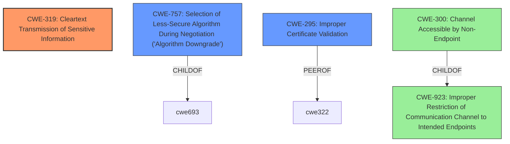

# Raw Analyzer Response for CVE-2021-39272

# Summary
| CWE ID | CWE Name | Confidence | CWE Abstraction Level | CWE Vulnerability Mapping Label | CWE-Vulnerability Mapping Notes |
|---|---|---|---|---|---|
| CWE-319 | Cleartext Transmission of Sensitive Information | 1.0 | Base | Primary | Allowed |
| CWE-757 | Selection of Less-Secure Algorithm During Negotiation ('Algorithm Downgrade') | 0.75 | Base | Secondary | Allowed |
| CWE-295 | Improper Certificate Validation | 0.5 | Base | Secondary | Allowed |

## Evidence and Confidence

*   **Confidence Score:** 0.9
*   **Evidence Strength:** HIGH

## Relationship Analysis
The primary CWE is CWE-319, which is a base-level CWE indicating that sensitive information is transmitted in cleartext. This is directly supported by the vulnerability description stating that fetchmail **fails to enforce STARTTLS session encryption**, leading to unencrypted communication. CWE-757 is a related CWE that describes the selection of a less-secure algorithm during negotiation, which can occur if STARTTLS is not properly enforced. CWE-295 (Improper Certificate Validation) was also considered because certificate validation is part of the TLS handshake, but it's less directly related to the root cause of failing to enforce STARTTLS.

## Vulnerability Chain
The vulnerability chain starts with the **failure to enforce STARTTLS session encryption**, leading to cleartext transmission. This can be viewed as a missing step in the secure communication process. The chain progresses as follows:

1.  **Root Cause:** **Failure to enforce STARTTLS session encryption**.
2.  **Weakness:** Cleartext transmission of sensitive information (CWE-319).
3.  **Impact:** Information disclosure, data modification via MITM attacks.

## Summary of Analysis
The initial analysis focused on the **failure to enforce STARTTLS session encryption** as the root cause. The vulnerability description clearly states that "Fetchmail before 6.4.22 **fails to enforce STARTTLS session encryption** in some circumstances." The CVE Reference Links Content Summary supports this by stating that the vulnerability stems from fetchmail's **failure to enforce TLS encryption**. This directly leads to CWE-319 (Cleartext Transmission of Sensitive Information), as the **failure** results in sensitive data being transmitted without encryption.

CWE-757 was considered because the **failure to enforce STARTTLS** can be seen as a downgrade to a less secure communication method (cleartext). CWE-295 was also considered, but it's less directly applicable as the core issue is the **failure to initiate TLS**, rather than improper validation of a certificate.

The selected CWEs are at the optimal level of specificity because they directly address the root cause (CWE-319) and a contributing factor (CWE-757). CWE-319 is a base-level CWE, which is the preferred level of abstraction.

Relevant CWE Information:

*   **CWE-319 (Cleartext Transmission of Sensitive Information):** This is the primary CWE because the **failure to enforce STARTTLS** directly results in sensitive information being transmitted in cleartext. The description of CWE-319 matches the vulnerability's impact.
*   **CWE-757 (Selection of Less-Secure Algorithm During Negotiation ('Algorithm Downgrade')):** This CWE is relevant because the **failure to enforce STARTTLS** can be viewed as a downgrade from an encrypted session to a cleartext session.
*   **CWE-295 (Improper Certificate Validation):** While certificate validation is related to TLS, it is not the primary issue here. The main problem is the **failure to initiate TLS** in the first place.
*   **CWE-300 (Channel Accessible by Non-Endpoint):** This CWE is too high-level. The root cause is the **failure to enforce TLS**, not simply that the channel is accessible by a non-endpoint.
*   **CWE-325 (Missing Cryptographic Step):** This CWE could be considered, but CWE-319 is more direct. The **failure to enforce STARTTLS** leads directly to cleartext transmission, making CWE-319 a better fit.