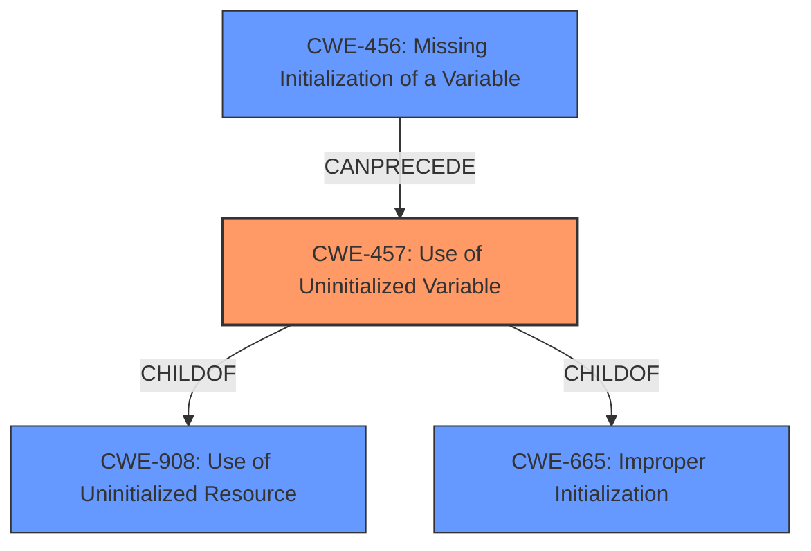

# Raw Analyzer Response for CVE-2021-3928

# Summary
| CWE ID | CWE Name | Confidence | CWE Abstraction Level | CWE Vulnerability Mapping Label | CWE-Vulnerability Mapping Notes |
|---|---|---|---|---|---|
| CWE-457 | Use of Uninitialized Variable | 1 | Variant | Allowed | Primary CWE |
| CWE-908 | Use of Uninitialized Resource | 0.7 | Base | Allowed | Secondary Candidate |
| CWE-456 | Missing Initialization of a Variable | 0.6 | Variant | Allowed | Secondary Candidate |

## Evidence and Confidence

*   **Confidence Score:** 0.9
*   **Evidence Strength:** HIGH

## Relationship Analysis
The primary CWE identified is **CWE-457 (Use of Uninitialized Variable)**, which is a variant of **CWE-908 (Use of Uninitialized Resource)** and **CWE-665 (Improper Initialization)**. **CWE-456 (Missing Initialization of a Variable)** can precede **CWE-457**, indicating a potential chain where a variable is not initialized, leading to its use in an uninitialized state. The selection of **CWE-457** as the primary CWE is based on the explicit mention of "Use of Uninitialized Variable" in both the vulnerability description and the CVE reference summary.

## Vulnerability Chain
The vulnerability chain starts with the **missing initialization** of the `preword` variable (potentially **CWE-456**). This leads to the **use of the uninitialized variable** `preword` within the `suggest_trie_walk` function (**CWE-457**), resulting in undefined behavior when the spell checker is used.

## Summary of Analysis
The analysis is primarily based on the provided evidence, specifically the vulnerability description and the CVE reference summary, which explicitly mention the **use of an uninitialized variable** as the root cause.

The vulnerability description states: "vim is vulnerable to **Use of Uninitialized Variable**"

The CVE Reference Links Content Summary states: "The vulnerability stems from the **use of an uninitialized variable** in the `suggest_trie_walk` function within `src/spellsuggest.c`. Specifically, the `preword` variable might not be properly initialized, leading to the **use of uninitialized memory**."

The graph relationships influenced the consideration of related CWEs such as **CWE-456 (Missing Initialization of a Variable)**, which could precede the **use of the uninitialized variable**. However, **CWE-457** is the most specific and directly addresses the vulnerability.

The selected CWEs are at the optimal level of specificity. **CWE-457** is a Variant-level CWE that accurately describes the vulnerability. While **CWE-908** is a broader Base-level CWE, **CWE-457** provides more specific information about the nature of the weakness.

Relevant CWE Information:

# Enhanced Context (25 CWEs)

## CWE-457: Use of Uninitialized Variable
**Abstraction:** Variant
**Status:** Draft

### Description
The code uses a variable that has not been initialized, leading to unpredictable or unintended results.
## CWE-908: Use of Uninitialized Resource
**Abstraction:** Base
**Status:** Incomplete

### Description
The product uses or accesses a resource that has not been initialized.
## CWE-456: Missing Initialization of a Variable
**Abstraction:** Variant
**Status:** Draft

### Description
The product does not initialize critical variables, which causes the execution environment to use unexpected values.

CWEs Considered but Not Used:

*   **CWE-665 (Improper Initialization):** This is a Class-level CWE and is too general. The vulnerability is more specifically related to the use of an uninitialized variable, not just any improper initialization.
*   **CWE-909 (Missing Initialization of Resource):** While this could be a contributing factor, the core issue is the **use** of the uninitialized variable, making **CWE-457** a more direct match.
*   **CWE-824 (Access of Uninitialized Pointer):** While related, the description explicitly mentions a variable, not necessarily a pointer. Therefore, **CWE-457** is more accurate.
*   **CWE-252 (Unchecked Return Value):** There is no mention of an unchecked return value in the provided information, so it is not applicable.
*   **CWE-120 (Buffer Copy without Checking Size of Input ('Classic Buffer Overflow')):** This is not related to the vulnerability description, which focuses on uninitialized variables.
*   **CWE-1126 (Declaration of Variable with Unnecessarily Wide Scope):** This is not directly related to the vulnerability, as the issue is the use of an uninitialized variable, not the scope of its declaration.