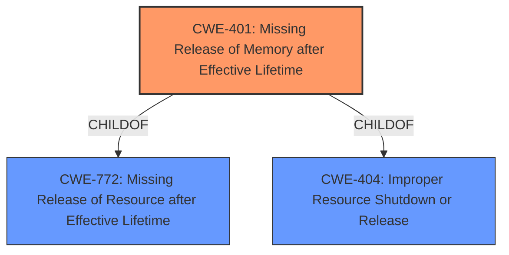

# Analysis for CVE-2021-39282

# Summary
| CWE ID | CWE Name | Confidence | CWE Abstraction Level | CWE Vulnerability Mapping Label | CWE-Vulnerability Mapping Notes |
|---|---|---|---|---|---|
| CWE-401 | Missing Release of Memory after Effective Lifetime | 1.0 | Variant | Allowed | Primary CWE |

## Evidence and Confidence

*   **Confidence Score:** 1.0
*   **Evidence Strength:** HIGH

## Relationship Analysis
The primary relationship influencing the CWE selection is the ChildOf relationship between CWE-401 **Missing Release of Memory after Effective Lifetime** and its parents CWE-772 **Missing Release of Resource after Effective Lifetime** and CWE-404 **Improper Resource Shutdown or Release**. This indicates that CWE-401 is a more specific case of a broader resource management issue. Since the vulnerability description specifically mentions a **memory leak**, choosing the variant CWE-401 is more appropriate than its class-level parents.

## Vulnerability Chain
The vulnerability chain consists of a **missing release** of allocated memory within the AC3AudioStreamParser component of Live555, leading to a **memory leak**.

## Summary of Analysis
The analysis is based on the vulnerability description, which explicitly states a **memory leak** in Live555's AC3AudioStreamParser. The key phrase "**weakness:** **memory leak**" strongly suggests a problem with memory management.

The retriever results list CWE-401 **Missing Release of Memory after Effective Lifetime** as the top candidate, with a score of 1.0 based on alternate_terms. The description of CWE-401, "The product does not sufficiently track and release allocated memory after it has been used, which slowly consumes remaining memory," aligns perfectly with the provided vulnerability description.

The graph relationships confirm that CWE-401 is a variant of CWE-772 **Missing Release of Resource after Effective Lifetime** and CWE-404 **Improper Resource Shutdown or Release**. Since the vulnerability is specifically about memory, selecting CWE-401 is more precise than selecting the class-level CWE-404 or base-level CWE-772.

Therefore, based on the evidence, retriever results, and hierarchical relationships, CWE-401 **Missing Release of Memory after Effective Lifetime** is the most appropriate CWE.

CWEs considered but not used:

*   CWE-772 **Missing Release of Resource after Effective Lifetime**: While related, it's less specific than CWE-401 as it deals with resources in general, not just memory.
*   CWE-404 **Improper Resource Shutdown or Release**: This is a class-level CWE, and a more specific variant (CWE-401) is available.
*   CWE-908 **Use of Uninitialized Resource**: This CWE is related to using resources before initialization, which isn't the case here, where the memory is allocated and used but not released.
*   CWE-911 **Improper Update of Reference Count**: This vulnerability is not specifically related to reference counting.
*   CWE-770 **Allocation of Resources Without Limits or Throttling**: The vulnerability is a **memory leak**, not about allocating excessive memory.
*   CWE-787 **Out-of-bounds Write** and CWE-125 **Out-of-bounds Read**: These relate to writing or reading outside of allocated memory boundaries, not about the allocation and release of memory.