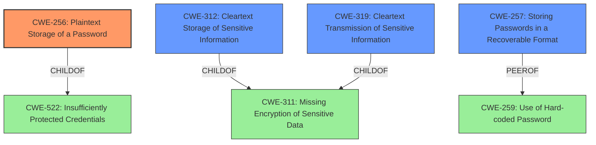

# Raw Analyzer Response for CVE-2021-39289

# Summary
| CWE ID | CWE Name | Confidence | CWE Abstraction Level | CWE Vulnerability Mapping Label | CWE-Vulnerability Mapping Notes |
|---|---|---|---|---|---|
| CWE-256 | Plaintext Storage of a Password | 0.9 | Base | Allowed | Primary CWE |
| CWE-312 | Cleartext Storage of Sensitive Information | 0.8 | Base | Allowed | Secondary CWE |
| CWE-257 | Storing Passwords in a Recoverable Format | 0.7 | Base | Allowed | Secondary CWE |
| CWE-319 | Cleartext Transmission of Sensitive Information | 0.6 | Base | Allowed | Secondary CWE |

## Evidence and Confidence

*   **Confidence Score:** 0.9
*   **Evidence Strength:** HIGH

## Relationship Analysis
The primary focus is on password storage and transmission.
  - **CWE-256** Plaintext Storage of a Password is a base CWE and a child of CWE-522 (Insufficiently Protected Credentials).
  - **CWE-312** Cleartext Storage of Sensitive Information is a base CWE and a child of CWE-311 (Missing Encryption of Sensitive Data).
  - **CWE-257** Storing Passwords in a Recoverable Format is a base CWE and a peer of CWE-259 (Use of Hard-coded Password).
  - **CWE-319** Cleartext Transmission of Sensitive Information is a base CWE and a child of CWE-311 (Missing Encryption of Sensitive Data).

## Vulnerability Chain
The vulnerability chain begins with the **insecure password handling**, leading to:
  1.  **Cleartext storage** of passwords in configuration files.
  2.  **Cleartext transmission** of passwords in HTTP responses.
  3.  **Symmetric encryption with a static key**, which is easily reversible.
  4.  Exposure of sensitive credentials and potential unauthorized access.

## Summary of Analysis
The initial analysis identified **insecure password handling (cleartext or reversible encryption)** as the root cause. The detailed analysis of CVE-2021-39289 further clarifies the weaknesses: passwords stored in cleartext, transmitted in cleartext, or encrypted with a static key.

The primary CWE is **CWE-256 Plaintext Storage of a Password**, as it directly addresses the core issue of passwords being stored without encryption. "Password management issues occur when a password is stored in plaintext in an application's properties, configuration file, or memory." This aligns perfectly with the vulnerability description where passwords are stored in cleartext in `/etc/default/cert-settings`.

Additional CWEs are included to cover the other aspects of the vulnerability:
  - **CWE-312 Cleartext Storage of Sensitive Information** is relevant as it encompasses the broader issue of sensitive data being stored in cleartext.
  - **CWE-257 Storing Passwords in a Recoverable Format** is applicable due to the use of symmetric encryption with a static key, which makes the passwords easily recoverable.
  - **CWE-319 Cleartext Transmission of Sensitive Information** is included because passwords are transmitted in cleartext within HTTP responses.

CWE-798 (Use of Hard-coded Credentials) was considered but not selected, as the primary issue is not the use of hard-coded credentials, but rather the insecure handling of passwords, regardless of whether they are hard-coded or not. Similarly, CWE-321 (Use of Hard-coded Cryptographic Key) was considered since a static key is used for encryption, but CWE-257 more directly addresses the weakness of storing passwords in an easily recoverable format due to this weak encryption.

The selected CWEs are at the optimal level of specificity, with **CWE-256** being the most specific and directly relevant to the vulnerability. The other CWEs provide additional context and cover the other aspects of the **insecure password handling**.