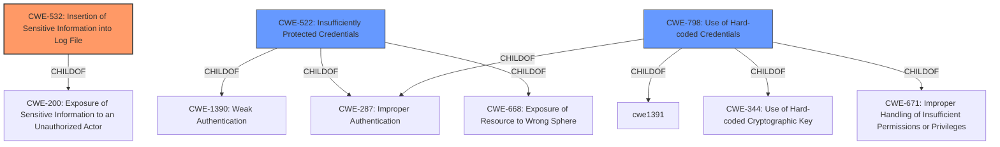

# Raw Analyzer Response for CVE-2021-39291

# Summary
| CWE ID  | CWE Name                                                                                                                               | Confidence | CWE Abstraction Level | CWE Vulnerability Mapping Label | CWE-Vulnerability Mapping Notes |
| :-------- | :--------------------------------------------------------------------------------------------------------------------------------------- | :---------- | :---------------------- | :-------------------------------- | :---------------------------------- |
| CWE-532   | Insertion of Sensitive Information into Log File                                                                                       | 0.9         | Base                    | Primary CWE                        | Allowed                             |
| CWE-522   | Insufficiently Protected Credentials                                                                                                   | 0.8         | Class                   | Secondary Candidate               | Allowed-with-Review               |
| CWE-798   | Use of Hard-coded Credentials                                                                                       | 0.7         | Base                   | Secondary Candidate               | Allowed                             |

## Evidence and Confidence

*   **Confidence Score:** 0.8
*   **Evidence Strength:** HIGH

## Relationship Analysis
The primary CWE is CWE-532 (Insertion of Sensitive Information into Log File), as the credentials being passed via GET requests are likely to be logged. CWE-522 (Insufficiently Protected Credentials) is a parent Class of several Base CWEs regarding credential protection, and is related to the vulnerability because the credentials are not protected during transmission. CWE-798 (Use of Hard-coded Credentials) was considered because the logs may contain hardcoded credentials, but this is not the main issue.

## Vulnerability Chain
The vulnerability chain starts with the **allowing credentials via GET parameters**, leading to the **insertion of sensitive information into log files**, which results in potential **account takeover** and **remote command execution**.

## Summary of Analysis
The initial assessment identified the **allowing credentials via GET parameters** as a primary weakness, which directly leads to credentials being logged. This is supported by the **Vulnerability Description Key Phrases** and the **CVE Reference Links Content Summary**. The selection of CWE-532 is based on the evidence that credentials passed via GET parameters are likely to be logged, potentially exposing them.

The vulnerability description explicitly states that the NetModule devices **allow credentials via GET parameters** to CLI-PHP. The CVE Reference Links Content Summary confirms that URLs are frequently stored in logs, potentially exposing the credentials. Therefore, the most accurate classification is CWE-532, as it directly addresses the insertion of sensitive information (credentials) into log files.

The relationship graph influenced the decision by highlighting the connection between CWE-532 and CWE-200 (Exposure of Sensitive Information to an Unauthorized Actor). While CWE-200 is a parent of CWE-532, CWE-532 is more specific and accurately reflects the vulnerability's root cause.

The selected CWEs are at the optimal level of specificity because they directly address the vulnerability's root cause and mechanism. CWE-532 is a Base CWE that accurately describes the insertion of credentials into log files.

Relevant CWE Information:

# Enhanced Context (25 CWEs)
The following CWEs were identified as potentially relevant to this vulnerability:

## CWE-798: Use of Hard-coded Credentials
**Abstraction Level**: Base
**Similarity Score**: 0.78
**Source**: dense

**Description**:
The product contains hard-coded credentials, such as a password or cryptographic key.

**Mapping Guidance**:
- Usage: Allowed
- Rationale: This CWE entry is at the Base level of abstraction, which is a preferred level of abstraction for mapping to the root causes of vulnerabilities.

## CWE-532: Insertion of Sensitive Information into Log File
**Abstraction Level**: Base
**Similarity Score**: 0.78
**Source**: dense

**Description**:
The product writes sensitive information to a log file.

**Mapping Guidance**:
- Usage: Allowed
- Rationale: This CWE entry is at the Base level of abstraction, which is a preferred level of abstraction for mapping to the root causes of vulnerabilities.

## CWE-522: Insufficiently Protected Credentials
**Abstraction Level**: Class
**Similarity Score**: 0.78
**Source**: dense

**Description**:
The product transmits or stores authentication credentials, but it uses an insecure method that is susceptible to unauthorized interception and/or retrieval.

**Mapping Guidance**:
- Usage: Allowed-with-Review
- Rationale: This CWE entry is a Class and might have Base-level children that would be more appropriate

## CWE-73: External Control of File Name or Path
**Abstraction Level**: Base
**Similarity Score**: 0.77
**Source**: dense

**Description**:
The product allows user input to control or influence paths or file names that are used in filesystem operations.

**Mapping Guidance**:
- Usage: Allowed
- Rationale: This CWE entry is at the Base level of abstraction, which is a preferred level of abstraction for mapping to the root causes of vulnerabilities.

## CWE-78: Improper Neutralization of Special Elements used in an OS Command ('OS Command Injection')
**Abstraction Level**: base
**Similarity Score**: 5.03
**Source**: graph

**Description**:
CWE-78: Improper Neutralization of Special Elements used in an OS Command ('OS Command Injection')

**Mapping Guidance**:
- Usage: Allowed
- Rationale: This CWE entry is at the Base level of abstraction, which is a preferred level of abstraction for mapping to the root causes of vulnerabilities.