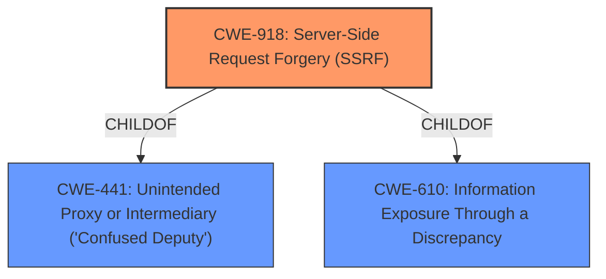

# Enhanced Analysis for CVE-2021-39303

# Summary
| CWE ID | CWE Name | Confidence | CWE Abstraction Level | CWE Vulnerability Mapping Label | CWE-Vulnerability Mapping Notes |
|---|---|---|---|---|---|
| CWE-918 | Server-Side Request Forgery (SSRF) | 1.0 | Base | Allowed | Primary CWE |

## Evidence and Confidence

*   **Confidence Score:** 1.0
*   **Evidence Strength:** HIGH

## Relationship Analysis
The primary relationship that influenced the decision was the direct match of the vulnerability description to the definition of CWE-918. The "Retriever Results" also highly ranked CWE-918 with a score of 1.000, reinforcing this selection. While CWE-918 has parent relationships to CWE-441 (Unintended Proxy or Intermediary ('Confused Deputy')) and CWE-610 (Information Exposure Through a Discrepancy), the vulnerability description focuses on the SSRF aspect directly, making CWE-918 the most specific and relevant choice.



## Vulnerability Chain
The vulnerability chain starts with **unvalidated input** to a web application endpoint which leads to the ability to make arbitrary HTTP requests from the server (**SSRF**). This can then be used for **information disclosure** by reading internal resources, potentially including sensitive credentials.

## Summary of Analysis
The initial analysis pointed strongly towards CWE-918, and a thorough review of the evidence and relationship data confirmed this assessment. The vulnerability description clearly states an **SSRF** vulnerability. The "CVE Reference Links Content Summary" provides detailed evidence of how the `imageUrl` parameter is not properly validated, allowing an attacker to make arbitrary HTTP requests. The fact that the Jamf server can be made to make arbitrary HTTP requests using a vulnerable endpoint is direct evidence for SSRF.

The selection of CWE-918 is based on the following evidence:
- "**weakness:** **SSRF**" from the "Vulnerability Description Key Phrases"
- "The vulnerability is a Server-Side Request Forgery (SSRF) issue found in the Jamf Pro application. Specifically, an authenticated user can make the Jamf server make arbitrary HTTP requests using a vulnerable endpoint." from the "CVE Reference Links Content Summary"

CWE-918 is at the optimal level of specificity because it directly addresses the **SSRF** vulnerability described. The MITRE mapping guidance allows the usage of CWE-918.

CWE-611 (Improper Restriction of XML External Entity Reference) was considered due to its inclusion in the Retriever Results and its relationship to SSRF. However, the vulnerability description and supporting evidence do not involve XML or external entities, so it was not selected.

Relevant CWE Information:

# Enhanced Context (25 CWEs)
The following CWEs were identified as potentially relevant to this vulnerability:

## CWE-754: Improper Check for Unusual or Exceptional Conditions
**Abstraction Level**: Class
**Similarity Score**: 0.78

## CWE-668: Exposure of Resource to Wrong Sphere
**Abstraction Level**: Class
**Similarity Score**: 0.78

## CWE-703: Improper Check or Handling of Exceptional Conditions
**Abstraction Level**: Pillar
**Similarity Score**: 0.78

## CWE-41: Improper Resolution of Path Equivalence
**Abstraction Level**: Base
**Similarity Score**: 0.77

## CWE-755: Improper Handling of Exceptional Conditions
**Abstraction Level**: Class
**Similarity Score**: 0.77

## CWE-404: Improper Resource Shutdown or Release
**Abstraction Level**: Class
**Similarity Score**: 0.76

## CWE-345: Insufficient Verification of Data Authenticity
**Abstraction Level**: Class
**Similarity Score**: 0.76

## CWE-330: Use of Insufficiently Random Values
**Abstraction Level**: Class
**Similarity Score**: 0.76

## CWE-203: Observable Discrepancy
**Abstraction Level**: Base
**Similarity Score**: 0.76

## CWE-807: Reliance on Untrusted Inputs in a Security Decision
**Abstraction Level**: Base
**Similarity Score**: 0.76

## CWE-611: Improper Restriction of XML External Entity Reference
**Abstraction Level**: Base
**Similarity Score**: 6411.73

## CWE-918: Server-Side Request Forgery (SSRF)
**Abstraction Level**: Base
**Similarity Score**: 6283.32

## CWE-941: Incorrectly Specified Destination in a Communication Channel
**Abstraction Level**: Base
**Similarity Score**: 6264.06

## CWE-923: Improper Restriction of Communication Channel to Intended Endpoints
**Abstraction Level**: Class
**Similarity Score**: 5969.75

## CWE-639: Authorization Bypass Through User-Controlled Key
**Abstraction Level**: Base
**Similarity Score**: 5904.63

## CWE-804: Guessable CAPTCHA
**Abstraction Level**: base
**Similarity Score**: 4.33

## CWE-941: Incorrectly Specified Destination in a Communication Channel
**Abstraction Level**: base
**Similarity Score**: 4.33

## CWE-611: Improper Restriction of XML External Entity Reference
**Abstraction Level**: base
**Similarity Score**: 3.64

## CWE-441: Unintended Proxy or Intermediary ('Confused Deputy')
**Abstraction Level**: class
**Similarity Score**: 2.98

## CWE-73: External Control of File Name or Path
**Abstraction Level**: base
**Similarity Score**: 2.87

## CWE-322: Key Exchange without Entity Authentication
**Abstraction Level**: base
**Similarity Score**: 2.87

## CWE-942: Permissive Cross-domain Policy with Untrusted Domains
**Abstraction Level**: variant
**Similarity Score**: 2.68

## CWE-406: Insufficient Control of Network Message Volume (Network Amplification)
**Abstraction Level**: class
**Similarity Score**: 2.55

## CWE-350: Reliance on Reverse DNS Resolution for a Security-Critical Action
**Abstraction Level**: variant
**Similarity Score**: 2.55

## CWE-918: Server-Side Request Forgery (SSRF)
**Abstraction Level**: base
**Similarity Score**: 2.47


## CWE Relationship Analysis

Current CWEs represent these abstraction levels: .


### Vulnerability Chain Analysis

**Chain starting from CWE-754:**
- 754 (Improper Check for Unusual or Exceptional Conditions) - ROOT


**Chain starting from CWE-350:**
- 350 (Reliance on Reverse DNS Resolution for a Security-Critical Action) - ROOT


### CWE Relationship Diagram

```mermaid
graph TD
    classDef primary fill:#f96,stroke:#333,stroke-width:2px
    classDef secondary fill:#69f,stroke:#333
    classDef tertiary fill:#9e9,stroke:#333
```