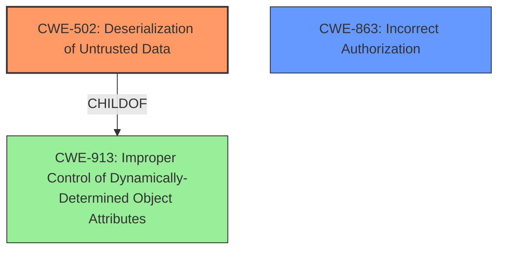

# Enhanced Analysis for CVE-2021-39321

# Summary
| CWE ID | CWE Name | Confidence | CWE Abstraction Level | CWE Vulnerability Mapping Label | CWE-Vulnerability Mapping Notes |
|---|---|---|---|---|---|
| CWE-502 | Deserialization of Untrusted Data | 1.0 | Base | Allowed | Primary CWE |
| CWE-863 | Incorrect Authorization | 0.7 | Class | Allowed-with-Review | Secondary Candidate |

## Evidence and Confidence

*   **Confidence Score:** 0.9
*   **Evidence Strength:** HIGH

## Relationship Analysis
The primary CWE is CWE-502, which describes the **deserialization of untrusted data** without proper validation. The secondary CWE is CWE-863, which addresses the **incorrect authorization** issue that allows underprivileged users to exploit the deserialization vulnerability. CWE-502 is a child of CWE-913 (Improper Control of Dynamically-Determined Object Attributes).



## Vulnerability Chain
1.  **Missing Capability Check:** The `import_config` function lacks authorization checks, allowing unprivileged users to access it.
2.  **Unsafe Deserialization:** The `import_config` function uses `unserialize()` on user-supplied data without proper sanitization.
3.  **PHP Object Injection:** An attacker can inject malicious PHP objects into the application's memory via deserialization of untrusted data.
4.  **Remote Code Execution (RCE):** If another plugin or theme with a vulnerable magic method is installed, an attacker can achieve RCE through a POP chain.

The root cause is the **deserialization of untrusted data** (CWE-502) combined with the **incorrect authorization** (CWE-863). The impact is potential remote code execution.

## Summary of Analysis
The primary vulnerability is the **PHP Object Injection**, which occurs due to the **deserialization of unvalidated user-supplied inputs** using the `unserialize()` function. This aligns perfectly with CWE-502 (Deserialization of Untrusted Data). The description of CWE-502 states: "The product deserializes untrusted data without sufficiently ensuring that the resulting data will be valid." The vulnerability description specifically mentions that the `import_config` function utilizes `unserialize()` on user-supplied data without proper sanitization.

Additionally, the vulnerability is exploitable by underprivileged authenticated users due to a missing capability check on the `import_config` function. This lack of authorization aligns with CWE-863 (Incorrect Authorization). The vulnerability description states: "This can be exploited by underprivileged authenticated users due to a missing capability check on the import_config function."

The evidence from the vulnerability description and the CVE Reference Links Content Summary supports the selection of CWE-502 as the primary CWE and CWE-863 as a secondary contributing factor. The retriever results also list CWE-502 as the top candidate with a high similarity score (0.800).

Other CWEs considered but not used:

*   CWE-79 (Improper Neutralization of Input During Web Page Generation ('Cross-site Scripting')): While the attack involves sending data to a web application, the core issue is not the neutralization of input for web page generation, but rather the unsafe deserialization.
*   CWE-89 (Improper Neutralization of Special Elements used in an SQL Command ('SQL Injection')): SQL Injection is not the cause of the vulnerability.
*   CWE-352 (Cross-Site Request Forgery (CSRF)): While CSRF could potentially be involved in exploiting the vulnerability, the primary issue is the insecure deserialization and missing authorization.

The final CWEs selected are at the optimal level of specificity, with CWE-502 being a Base CWE and CWE-863 being a Class CWE, which accurately represent the root cause and contributing factor of the vulnerability, respectively.


## CWE Relationship Analysis

Current CWEs represent these abstraction levels: .


### Vulnerability Chain Analysis

**Chain starting from CWE-502:**
- 502 (Deserialization of Untrusted Data) - ROOT


**Chain starting from CWE-79:**
- 79 (Improper Neutralization of Input During Web Page Generation ('Cross-site Scripting')) - ROOT


### CWE Relationship Diagram

```mermaid
graph TD
    classDef primary fill:#f96,stroke:#333,stroke-width:2px
    classDef secondary fill:#69f,stroke:#333
    classDef tertiary fill:#9e9,stroke:#333
```